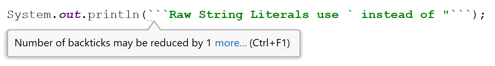


Raw string literals <a href="https://www.infoq.com/news/2018/12/jdk-12-new-features">didn't make it to the Java 12</a>.
The similar functionality is available in Java 13 instead as a preview feature - Text Blocks. For more details see the post below.




Raw Strings were [dropped before the final release](http://mail.openjdk.java.net/pipermail/jdk-dev/2018-December/002402.html) of Java 12 and is now considered obsolete.

> We're of course disappointed that this means it will take slightly longer for this feature to make it into the language, but we think that's the best choice.
>  
>  While we can expect that for any language feature, there will be a nontrivial volume of "I would have preferred it differently" feedback, in reviewing the feedback we have received, I am no longer convinced that we've yet got to the right set of tradeoffs between complexity and expressiveness, or that we've explored enough of the design space to be confident that the current design is the best we can do. By withdrawing, we can continue to refine the design, explore more options, and aim for a preview that actually meets the requirements of the Preview Feature process (JEP 12).

## String Literals
Currently (pre-Java 12), string literals in Java are in many cases unnecessarily hard to deal with and have some limitations.

First of all, Java does not support multi-line strings. If you want your string to span multiple lines, you have to concatenate multiple strings:

```java
String myString = "This is my string" +
        " which I want to be " +
        "on multiple lines.";
```

It gets worse though. If you want your string to actually contain new lines, you need to insert `\n` after each line.

```java
String myString = "This is my string\n" +
        " which I want to be \n" +
        "on multiple lines.";
```

Special characters such as newline are escaped with backslash `\`. This is necessary for double quotes `"` as they would terminate the string and also for backslash `\` character as it would rather indicate escaped character. In addition to that there is a whole bunch of escape sequences in java:

| Sequence | Usage                                 |
|----------|---------------------------------------|
| \t       | Tab                                   |
| \b       | Backspace (remove previous character) |
| \n       | New line                              |
| \r       | Carriage return                       |
| \f       | Form feed                             |
| \\'      | Single quote character                |
| \\"      | Double quote character                |
| \\\      | Backslash character                   |

String literals are usually hard to read because they are plagued with escape sequences:

```java
String myPath = "Open \"C:\\Program Files\\Java\\jdk1.8.0_151\"";
```

It gets especially bad with regular expressions, which can be using a lot of backslashes and are then hard to read because of escaping.

## Raw Strings
Turns out, that other JVM  languages already solved the problem with multiline strings and readability of escaped sequences. They are called Raw Strings. They can span multiple lines without concatenation and they don't use escaped sequences. You can use backslashes or double quotes directly. For example, in Kotlin, in addition to regular string literals, you can use Raw Strings with three double quotes `"""` instead of just one.

```kotlin
val text = """
This is my string
which I want to be
on multiple lines.
It can contain backslash \
Or even double-quotes "
"""
```

On JVM, also Groovy and Scala support raw strings using `"""`. Java is like usually late to the party (similar to introducing [JShell REPL](https://www.vojtechruzicka.com/jshell-repl/)) and only now, in version 12, introduces what is already common both in other JVM and non-JVM languages.

## Raw String Literals in Java
In Java 12, one of the new features will be [JEP 326: Raw String Literals](http://openjdk.java.net/jeps/326). Unlike Kotlin, Groovy or Python, which use `"""` Java decided to use backtick `` ` `` notation, which is currently used by Javascript or Go.

```
String rawString = `This is my string
which I want to be
on multiple lines.
It can contain backslash \
Or even quotes "`;
```

But unlike javascript, backticks inside the string don't need to be escaped. Instead, you can use multiple backticks to start the string and then the same number of backticks to end it:

```
`This uses single backtick`
``This can contain backtick `, see?``
```Can use any number of backticks```
``` 

No matter how many backticks you use or whether you use raw or original string literals, the resulting `.class` file will be the same and both literals will produce `java.lang.String`.

## Formatting
One problem with multiline raw strings is that they interpret all the characters on each line as part of the string. Imagine the following code.

```typescript
public class Main {

    public static void main(String[] args) {
        String myString =
        `This is my string
        which I want to be
        on multiple lines.`;
        System.out.println(myString);
    }
}
```

Each of the lines of the raw string contains some spaces at left as indentation, so the code is nicely formatted - 4 spaces indentation because it is inside a class and another 4 because it is inside the main method. If you run it, you will see this:

```json
This is my string
        which I want to be
        on multiple lines.
```

The string contains the indentation, which was supposed only to format the code to be more readable, but it is not intended to be part of the string.

A quick fix would be to remove the indentation, but it would be hard to read:

```typescript
public class Main {

    public static void main(String[] args) {
        String myString =`This is my string
which I want to be
on multiple lines.`;
        System.out.println(myString);
    }
}
```

There are actually several new methods in the `String` class, which are useful for handling indentation.

The method `align()` trims horizontal and vertical indentation of the string and keeps just relative indentation of the lines. 

```typescript
public class Main {

    public static void main(String[] args) {
        String myString = `
        This is my string
        which I want to be
        on multiple lines.
            Note that after alignment,
                only relative indentation is preserved.
        `.align();
        System.out.println(myString);
    }
}

```

After alignment, the output will be this:

```custom
This is my string
which I want to be
on multiple lines.
    Note that after alignment,
        only relative indentation is preserved.
```

If you don't want to trim whitespace but only increase or decrease alignment, you can use `String.indent(numberOfSpaces)`

```java
// Increase existing indentation of each line by 2
myString.indent(2);
// Decrease existing indentation of each line by 2
myString.indent(-2);
```

As a shorthand, if you call `align()` with an integer parameter instead of with zero parameters, it will align first and then indent by the given number:

```java
// Align and then increase existing indentation of each line by 2
myString.align(2);
``` 

## String Interpolation
Other languages, which currently support Raw String literals usually also support string interpolation. It is basically a fancy name for substituting variable placeholders in the string with values, such as:

```kotlin
val name = "John"
println("Hi, my name is ${name}.")
```

Unfortunately, this is still not possible in Java, not even Java 12. JEP 326 even explicitly states that this is not intended to be part of this proposal. However, it may be introduced by some other proposal in the future.

## IntelliJ IDEA support
The good news is that since version 2018.3, IDEA already supports Raw String Literals.

You can convert from good old string literals to the raw variant and vice versa. IDEA will handle escape sequence conversion and splitting to multiline for you.

<Video src={props.data.mdx.frontmatter.path+"convert-to-raw"} />

IDEA is also able to detect if you are unnecessarily using too many backticks and will be able to remove excess backticks for you.



In addition to this, it now supports actions such as spell-checking or regular expressions detection in Raw String Literals. You can read more in [Preview Raw String Literals in IntelliJ IDEA 2018.3](https://blog.jetbrains.com/idea/2018/10/preview-raw-string-literals-in-intellij-idea-2018-3/).

## Try it yourself
As of 11/2018 Java 12 is not out yet, but you can already download early access build of [JDK 12]( https://jdk.java.net/12/) and try Raw Strings for yourself.