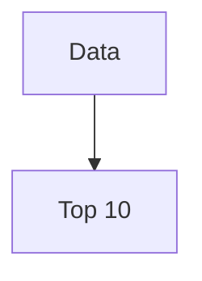

# Mermaid Diagrams — Design Notes & FAQ

How the build-time Mermaid rendering works and why it is built this way. Implementation:
`config/html-transform/mermaid-transform.js` + fence handling in `config/utils/markdown-parser.js`.

## Is it rendering HTML, not SVG images?

It renders **inline SVG embedded in the page's HTML** — there is no separate `.svg` (or `.png`) image file and no
`` tag. The built output looks like:

```html
<div class="mermaid-diagram">
  <svg viewBox="0 0 752 662" width="100%" role="graphics-document document" ...>
    <style>/* theme, scoped to this diagram's id */</style>
    <g>… paths, rects and <text> labels …</g>
  </svg>
</div>
```

One sharp observation behind this question: node labels _were_ initially being emitted as HTML
(`<foreignObject><div><p>…` embedded inside the SVG), because Mermaid 11 ignores the `flowchart.htmlLabels: false`
option unless the **root-level** `htmlLabels: false` is also set. This is now fixed — labels are pure SVG `<text>`
elements, verified by a regression test (`tests/mermaid.test.js` → "renders labels as pure SVG text, not foreignObject
HTML"). Pure-SVG labels matter because `foreignObject` content is stripped or ignored by feed readers, sanitizers, and
any context that treats SVG as an image.

### Why inline SVG is the right trade-off here

| Approach                                    | Verdict                                                                                                                                            |
| ------------------------------------------- | -------------------------------------------------------------------------------------------------------------------------------------------------- |
| **Inline SVG (chosen)**                     | Crisp at any zoom, text is selectable and findable with Ctrl+F, no extra HTTP request, no JS shipped to readers, styleable/themeable at build time |
| External `.svg` files                       | Cacheable across pages, but extra requests, no text selection benefits in `` context, and `foreignObject`/fonts behave worse as images        |
| PNG/raster                                  | Blurry on retina/zoom, unreadable by search and assistive tech, large files                                                                        |
| Client-side mermaid.js (the common default) | Ships ~2 MB of JavaScript to every reader, flash of raw diagram code before render, layout shift, nothing renders without JS                       |

Cost of inlining: the two OWASP-article diagrams add ~26 KB + ~17 KB of markup to that one page (each SVG carries its
own scoped `<style>` block). That is comparable to a single small image, paid only on pages that contain diagrams — and
it gzips very well because the markup is highly repetitive.

## Accessibility

- Diagrams declare `accTitle` and `accDescr` in their source. These render as real `<title id="chart-title-…">` and
  `<desc id="chart-desc-…">` elements wired up via `aria-labelledby` / `aria-describedby` on the `<svg>` root, which
  also carries `role="graphics-document document"`. Screen readers announce the title and read the description — the
  description is written as a prose summary of what the diagram shows, not a list of shapes.
- Labels are real text (not rasterized), so they scale with browser zoom and text-only zoom.
- Theme colors come from the site palette and keep WCAG-comfortable contrast on the dark background: label text
  `#e5e7eb` on node fill `#0b1220` is ≈ 14:1; edge lines `#94a3b8` on the card background `#111827` ≈ 6.5:1. Diagrams
  render inside a surface-1 card (`.mermaid-diagram`), with node fills one step darker (surface-0) and node outlines in
  `--color-bg-highlight` for definition.
- Limitation to keep in mind when authoring: a screen reader gets the _summary_, not the graph structure. Any
  information in a diagram should also be present in the surrounding prose (in the OWASP article, both diagrams
  visualize what the adjacent paragraphs already state).

**Authoring rule:** always give a diagram `accTitle` and `accDescr`. Add the `caption` flag to also show the `accTitle`
as a visible `<figcaption>` (same `<figure>` pattern as the video and codepen shortcodes — muted, centered, below the
diagram):

````markdown

````

Without the `caption` flag the title stays screen-reader-only. The caption text comes from `accTitle`, so the visible
caption and the accessible name never drift apart.

## Responsiveness

Three layers handle it:

1. **Mermaid's own sizing** — the SVG is emitted with `width="100%"`, a `viewBox`, and
   `style="max-width: <natural px>"`. Result: on wide screens the diagram renders at its natural size; on narrow screens
   it scales down proportionally (it's vector, so it stays sharp — text shrinks with it).
2. **Component CSS** (`src/styles/components/_mermaid.scss`) — `.mermaid-diagram` centers the SVG, applies the site's
   vertical rhythm, and has `overflow-x: auto` as a safety net so an unusually wide diagram scrolls instead of breaking
   the layout.
3. **No layout shift** — because the `viewBox` fixes the aspect ratio, the browser reserves the correct height as soon
   as CSS loads; nothing jumps when the page renders.

Authoring guidance: since narrow screens _scale_ rather than scroll, very wide `LR` flowcharts get small text on phones.
Prefer `TD` (top-down) for deep flows, keep node labels short, and use `<br>` to break long labels (see the supply-chain
evolution diagram).

## Why does it need Chromium?

Mermaid is fundamentally a **browser library**. To lay out a diagram it must measure rendered text — it calls SVG
geometry APIs like `getBBox()` and `getComputedTextLength()` to decide how big each node must be and where edges can
route. Those APIs require a real layout engine; Node.js has no implementation, and DOM emulators like jsdom stub them
out (which produces wrong or broken layouts).

So any _faithful_ server-side render needs a real browser engine. `mermaid-isomorphic` launches headless Chromium via
Playwright, runs Mermaid inside it, and extracts the finished SVG string.

Alternatives considered and rejected:

- **Client-side rendering** — no browser needed at build, but every reader pays ~2 MB of JS + render time + layout
  shift, and no-JS readers (and feed readers) get raw diagram source.
- **jsdom / fake DOM** — breaks on text measurement; layouts come out wrong.
- **Remote render APIs (Kroki, mermaid.ink)** — no local browser, but builds depend on a third-party service being up,
  and diagram content is sent to an external host.

What the Chromium dependency actually costs:

- **One-time, per machine:** `npx playwright install chromium` (~114 MB download). Runs automatically as the npm
  `prebuild`/`prebuild:with-drafts` hook (`config/install-chromium.js`) — a fast no-op when the browser is already
  present — so Cloudflare Pages and CI need no extra build-command step.
- **Per build:** the browser launches only when a page actually contains a diagram (~1–2 s), diagrams are rendered in
  one batch per page, and results are cached in-memory by diagram source — identical diagrams and `--serve` incremental
  rebuilds don't re-render.
- **Readers pay nothing.** No JavaScript, no fonts, no network requests — just markup.

## Can't the browser just be an npm dependency?

Not cleanly — and the reasons are worth understanding:

- **A browser is a ~120 MB platform-specific native binary.** Publishing it through npm would mean a separate package
  per OS/architecture and a full copy inside every project's `node_modules`. Both Playwright and Puppeteer therefore
  download the matching binary once into a **shared per-user cache** (`%LOCALAPPDATA%\ms-playwright` on Windows) — ten
  projects share one browser instead of carrying ten copies.
- **Puppeteer only _feels_ like a pure npm dependency.** Its `postinstall` script auto-downloads Chrome during
  `npm install` — the same download, just hidden. This repo blocks dependency install scripts via `allowScripts` (a
  supply-chain mitigation: install scripts are exactly how malicious packages execute code — the very risk the OWASP
  article's Supply Chain section describes). So Puppeteer's auto-download would be blocked here too, requiring an
  explicit allowlist entry — the same manual decision, in a different place.
- **`@sparticuz/chromium`** ships a compressed Chromium _inside_ an npm package, but it is built for Linux serverless
  environments only — it cannot serve as the local dev browser on Windows.

Practical reality: `npx playwright install chromium` is a one-time step per machine and a **fast no-op** when the
browser is already present. The npm `prebuild` hook runs it automatically everywhere. On Cloudflare Pages,
`configurePlaywrightBrowserPath()` (`config/env-utils.js`) detects `CF_PAGES=1` and points `PLAYWRIGHT_BROWSERS_PATH` at
`.cache/ms-playwright` — `.cache` is the directory CF's build cache preserves between deploys for the Eleventy framework
preset (`node_modules` is NOT preserved), so the browser is not re-downloaded on every deploy. No dashboard
configuration needed, everything is versioned in git. See IMAGES.md for the full build-cache picture.

## What about sharing on social media?

**Sharing the article: nothing changes.** When a post URL is shared, platforms (X, LinkedIn, Facebook…) never render the
page or its inline SVG — their crawlers read the Open Graph / Twitter Card meta tags. Those are generated from the
post's `featuredImage` frontmatter (`src/_includes/components/social-metatags.njk` → `og:image` / `twitter:image`, with
`twitter:card: summary_large_image`). The diagrams have no effect on link previews, positive or negative.

**Sharing a diagram itself:** social platforms don't accept SVG uploads, so a reader who wants to post a diagram
screenshots it — which works fine since the diagrams render crisply at full size. If ever needed, `mermaid-isomorphic`
supports a `screenshot: true` option that returns a **PNG buffer** at build time; the transform could emit a PNG
alongside each SVG (e.g. for a "download as image" link or per-diagram `og:image`). Deliberately not built — no current
use case, easy to add later.

**RSS/Atom feeds:** feed readers vary — some render inline SVG, many strip it. Because diagrams supplement rather than
replace the surrounding prose (see Accessibility), feed readers that strip them lose nothing essential. The
pure-SVG-text fix (`htmlLabels: false`) improves compatibility in readers that do allow SVG, since `foreignObject` HTML
is the first thing sanitizers remove.
