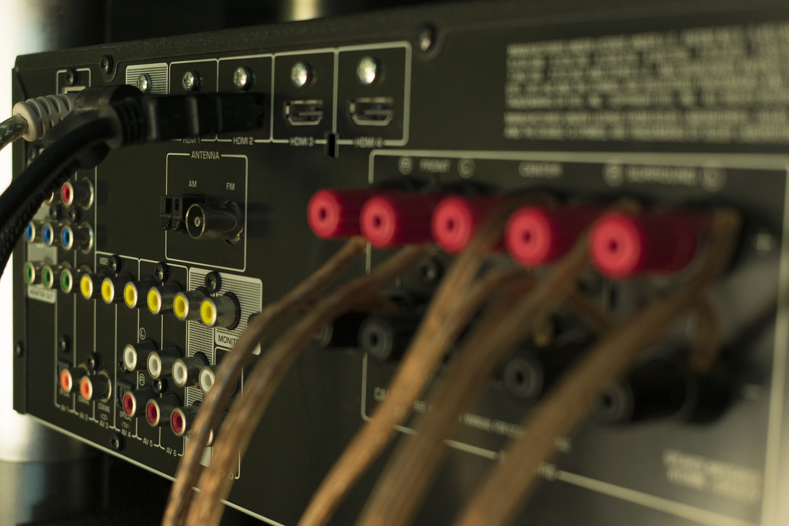

TODO series intro + TOC?

## Inter-component communication

## Input
Let's first cover the situation when a component needs some data from the outside to function properly. In most cases, such data is not static - it would be very useful if we can pass new data to our component whenever it is required.

Does this ring a bell? We already covered (TODO link) data binding in the previous section, which would be a perfect fit for this use case. We could bind a variable to some property of our component, so whenever the variable changes, the component gets new data. So far we covered only data binding to simple elements such as `button`, just a quick reminder:

```
<button [disabled]='isSubmitButtonDisabled'>Submit!</button>
```

This way the `disabled` property of the button would be updated whenever `isSubmitButtonDisabled` changes. With a little work, we can do the same with our components!

Let's assume we have a Shopping Cart component, which displays the number of items in our cart for an e-shop.

```
@Component({
  selector: 'app-shopping-cart',
  template: `
    You have {{itemsInCart}} in your shopping cart
    `
})
export class ShoppingCart {
  itemsInCart = 0
}
```

In our template we use `{{itemsInCart}}` to display the contents of `itemsInCart`. It is 0 by default, which is fine when you start shopping, but eventually you'll add some products to your cart. How does this value get updated then? We need a way to expose this property to the outise and then be able to bind to it like this:

```
<app-shopping-cart [itemsInCart]="order.length"></app-shopping-cart>
```

This way we can pass the current number of items in the cart from the outside and make sure the component gets the fresh value whenever new item is added or removed. The parent component can contain the whole list of items in the `order`array and just pass `order.length` because the cart only cares about displaying the count.

If you try this, it will not work, because by default `itemsInCart` property of our component is not exposed and not available for data-binding. We need to specifically mark it as such.

```
export class ShoppingCart {
  @Input()  
  itemsInCart = 0
}
```

It is enough just to add `Input()` decorator to our property and it will be available for data binding. More specifically one way databinding from the parent component to our component.

The name of our property `itemsInCart` matches the name of the property which will be used for binding with `[]`.

```
export class ShoppingCart {
  @Input()  
  itemsInCart = 0
}

<app-shopping-cart [itemsInCart]="order.length"></app-shopping-cart>
```

This is the default behavior, but it can be changed by passing a string value to the `Input()` decorator:

```
export class ShoppingCart {
  @Input('numberOfItems')  
  itemsInCart = 0
}

<app-shopping-cart [numberOfItems]="order.length"></app-shopping-cart>
```

Tosum it up - you can use `Input()` to mark a component property for data binding. This is just one way -from the outisde to the component. Then you can bind to thisproperty as usual with `[]` in an HTML template where you use your component. Whenever the binded value gets changed, your component property gets updated.

## Output
So far we've covered only flow of the data from the outside into the component. But often we need the other direction as well. Something can happen in our component and other components need to know about it.

Remember how we were able to listen to some events of DOM elements such as clicking a button and then executing some logic?

```
<button (click)='buttonClicked()'>Click me!</button>
```

Here we use regular brackets around the event name `(click)` and after the equals, we defined a method call `buttonClicked()` to be executed whenever the button is clicked. Turns out we can do the same with our own custom components. 

Let's have a simple component for accepting or rejecting cookies on our site. We want to use this nice component on our home page to warn our visitors about cookies. And we need to react on their action - whether they accept or reject cookies. The `cookies-info` component should not, however take any action itself, it should just notify it parent component what happened. The parent component can then decide what is the appropriate action. The cookie info 
 can be just a "dumb" component. It can show the disclaimer and collect the answer, but let the parent component take the responsibility on deciding what to do based on the answer.
 
 ```
 @Component({
   selector: 'app-cookies-info',
   template: `
     <p>This site uses cookies to shamelessly track you. </p>
     <button>Accept</button>
     <button>Decline</button>
   `
 })
 export class CookiesInfoComponent {
 }
 ```

We have two buttons, but they don't do anything on click. Let's change that.

```
@Component({
  selector: 'app-cookies-info',
  template: `
    <p>This site uses cookies to shamelessly track you. </p>
    <button (click)="onAcceptBtnClick()">Accept</button>
    <button (click)="onDeclineBtnClick()">Decline</button>
  `
})
export class CookiesInfoComponent {

  onAcceptBtnClick() {
    // Here notify listeners - cookies accepted
  }

  onDeclineBtnClick() {
    // Here notify listeners - cookies declined
  }
}
```

Nothing new here, we already know how to listen to button clicks, we just call different method based on which of the buttons was clicked. Now we need to somehow expose events to the users of our components.
 
 In our case we can consider two events:
 1. Users accepts cookies - `acceptCookies`
 2. User declines cookies - `declineCookies`
 
Let's define a field for each of them and assign them a new instance of `EventEmmiter`. Later, when a button is clicked, we can use one of our emmitters to `.emit()` an event that cookies were either accepted or rejected.
 
TODO line highlighting 
```
@Component({
  selector: 'app-cookies-info',
  template: `
    <p>This site uses cookies to shamelessly track you. </p>
    <button (click)="onAcceptBtnClick()">Accept</button>
    <button (click)="onDeclineBtnClick()">Decline</button>
  `
})
export class CookiesInfoComponent {

  acceptCookies = new EventEmitter();
  declineCookies = new EventEmitter();

  onAcceptBtnClick() {
    this.acceptCookies.emit();
  }

  onDeclineBtnClick() {
    this.declineCookies.emit();
  }
}
```

The last step is to mark our events as available for data binding. Remember that we needed to mark our field with `@Input()` to make if available for property data binding? This is very similar, but since we are firing events to the outside of the component, we need to use `@Output()`.
 
 TODO line highlighting.
 ```
 @Component({
   selector: 'app-cookies-info',
   template: `
     <p>This site uses cookies to shamelessly track you. </p>
     <button (click)="onAcceptBtnClick()">Accept</button>
     <button (click)="onDeclineBtnClick()">Decline</button>
   `
 })
 export class CookiesInfoComponent {
 
   @Output()
   acceptCookies = new EventEmitter();
   @Output()
   declineCookies = new EventEmitter();
 
   onAcceptBtnClick() {
     this.acceptCookies.emit();
   }
 
   onDeclineBtnClick() {
     this.declineCookies.emit();
   }
 }
```
 
Now we're good to go, we can use our `app-cookies-info` inside another component and react to its `acceptCookies` and `declineCookies` envents. 

```
<app-cookies-info (acceptCookies)="onCookiesAccepted()" (declineCookies)="onCookiesDeclined()"></app-cookies-info>
```
 
Since this is event binding and not property binding, we use `()` instead of `[]`. Same as with `@Input` - the name of the event used for binding is the same as the name of the field marked with `@Output()`. If you want to exspose a different event name, you can define its name like this - `Output('someDifferentEventName)`.

### Events with values 
Our previous example was rather simple in a sense that we just fired an event that something happened. Often, we need something more than that. We need to inlude some additional data with our event. For example, when listening to mouse click events, you are interested not only that mouse was clicked, but also which button and what screen coordiantes was the cursor at.

Let's change our cookie component a bit to demonstrate this. Instead of having two events - one for accepting and for declining, we'll have just one. The event can be named `cookiesConsent`. The event will send additional data - in our case `boolean` is sufficient:
 - `true` if cookies were accepted
 - `false` if cookies were declined

When firing the event, it is no longer necessary to call just `emit()`. We can pass the data we want to send with our event inside the `emit()` function - eg. `emit(false)`.

```
@Component({
  selector: 'app-cookies-info',
  template: `
    <p>This site uses cookies to shamelessly track you. </p>
    <button (click)="onAcceptBtnClick()">Accept</button>
    <button (click)="onDeclineBtnClick()">Decline</button>
  `
})
export class CookiesInfoComponent {

  @Output()
  cookiesAnswer = new EventEmitter<boolean>();

  onAcceptBtnClick() {
    this.cookiesAnswer.emit(true);
  }

  onDeclineBtnClick() {
    this.cookiesAnswer.emit(false);
  }
}
```

Notice how the way we constructed our event emmiter changed - `new EventEmitter<boolean>();`. Between angle brackets you can define what type of data should be used for this event to ensure type safety. If you define `EventEmitter<boolean>`, you would not be able to later call `emit('Foo!')` as it is string and nit boolean. If you are not familar with this concepts, you can read more about [generics in typescript](https://www.typescriptlang.org/docs/handbook/generics.html). Our first example without any value could be rewritten as `EventEmitter<void>` for better type safety.

With passing a value with our events, the way how we handle binding also changes a bit. We need to be able to access the payload (event data). This data can be accessed using `$event` variable. Thiw way we can pass the event payload to other functions or use it in expressions.

```
BEFORE:
<app-cookies-info (acceptCookies)="onCookiesAccepted()" (declineCookies)="onCookiesDeclined()"></app-cookies-info>

NOW:
<app-cookies-info (cookiesAnswer)="onCookiesAnswer($event)"></app-cookies-info>
```

Now whenever `cookiesAnswer` event is triggered, we call our method `onCookiesAnswer`, which accepts a boleean. The actual boolean value passed into it is represented by `$event` variable and depends on what we produced using our `emit()`. 

## Two-way data binding


## What we've learned

TODO TOC + link to the next section