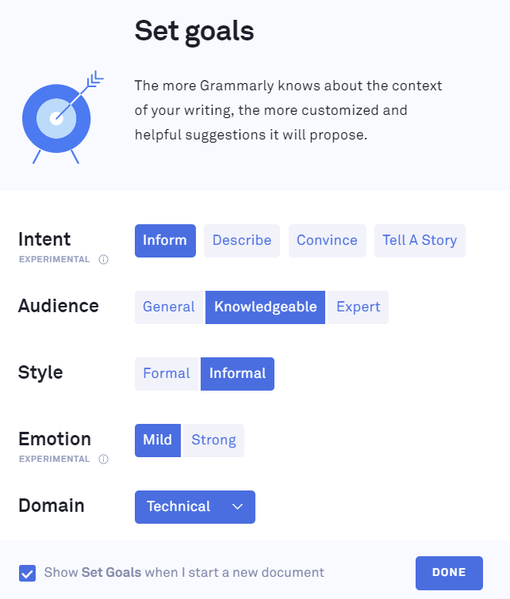
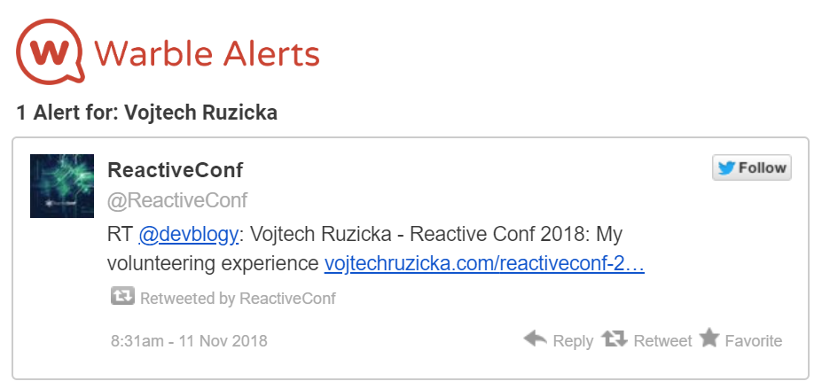
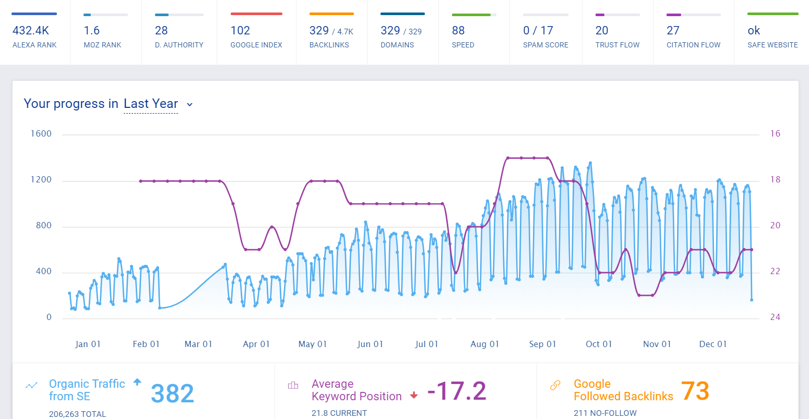
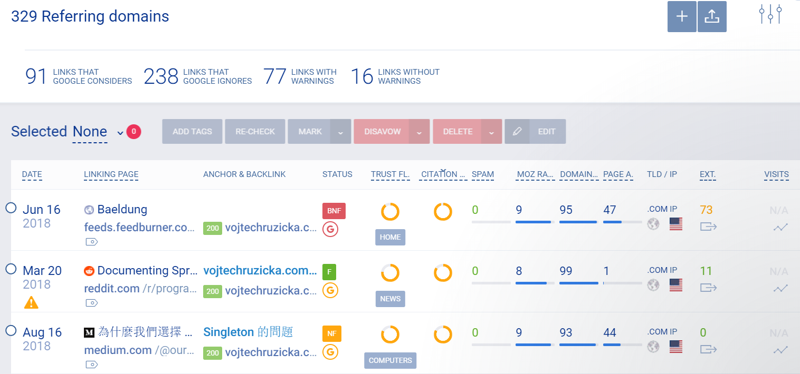

Let's look at a set of useful tools I use regularly to help me when blogging.

Disclaimer: These are tools I regularly use and I find them helpful. I am not affiliated with any of them in any way.

# Grammarly
Since I am not a native english speaker, it is very useful to have a tool to double check my grammar. In additional to wrong grammar, I usually do a lot of typos and there are some words that I just never spell right.

[Grammarly](https://app.grammarly.com/) to the rescue! Before publishing a post I analyze it with Grammarly to make sure it does not contain any typos and bad grammar. Or at least reduce them to minimum.

Grammarly offers a desktop app, which I use for my blog post. In addition, web version is available as well as Microsoft Office integration and a browser extension. So it can check anything you type in your browser such as emails.

The base version is free and should be sufficient in most cases. The paid version offers advanced analysis of the sentence structure, punctuation, plagiarism detector and MS Office integration. For each article you can even define criteria, which help Grammarly to understand the context and tailor its suggestions based on what type of text are you writing.

Currently I use the paid version, which is currently at $11.66 monthly if paid annually. I know there are other similar products, but I have no personal experience with them. Tried just Grammarly and it suits my needs.

# Warble
[Warble](https://warble.co/) is a great tool to help you on Twitter. It allows you to define keywords, phrases or hashtags and set them as alert. Whenever anyone posts on twitter something matching your criteria, you get notified by email about the tweet.

When someone mentions your twitter name , you get notification directly by Twitter. However, when they just mention your real name or website url, it goes unnoticed. Warble is great in such cases, because you can detect these tweets and engage.

Similar tool, which I tried is [Google Alerts](https://www.google.com/alerts), which allows you to do the same for the whole web. It is sometimes useful, but usually it does not get many hits and it does not monitor social media.

# Content King

# Monitor Backlinks
Long gone are the good old days of hacking SEO and spamming keywords to get better search engine rankings. These days, one of the most important signals for search engines is number of other sites linking to your content and their quality. Unless a link contains `rel="nofollow"` (which is usually case on social media, discussion forums, stack overflow and so on), it is considered a backlink to your site.

It is useful too keep track of backlinks pointing to your site. First of all, while good backlinks help you with SEO, bad backlinks will hurt you. A link can be considered bad for many reason such as originating from a malicious or spammy site, site with a big amount of ongoing links and so on.

The good news is that you don't need any paid service to browse your backlinks. This functionality is provided by [Google Search Console](https://search.google.com/search-console/welcome) for free, you can easily register your site there and use its functionality. In addition to browsing backlinks, you can also "Disavow" bad backlinks. That is - you can declare that this is not an intended backlink and it should be ignored by Google.

[Monitor Backlinks](https://monitorbacklinks.com) allows you to do the same and integrates with various other services such as Google Analytics, Moz Rank/Domain Authority, Alexa page rank or Page Speed Insights. You have one nice dashboard with all the information in one place.

Of course, you can browse and manage your backlinks and disavow them.

What's useful is that unlike in Google Search Console, you get notified when new backlinks are discovered. Another useful feature is that you can define you custom keywords and watch how your pages rank with them over time. It is often vital to be able to detect sudden drop in keyword position so you can investigate what went wrong.

Monitor Backlinks is a paid service with various plans depending on how many backlinks and domains you need to track. I currently use the lowest tier, which is $21 a month, when paid annually. 

Of course, there are many similar services such as [ahrefs](https://ahrefs.com/), but they are usually way more expensive - ahrefs is $82 monthly when paid annually.

# Bigstock
In each of my posts, I use a featured image. Since you cannot simply take any post from the web (or at least it is not a good idea), you need to use your own images or to buy them.

There is a plenty of services just for obtaining stock photos for a small price. I currently use [Bigstock](https://www.bigstockphoto.com/).

You can buy a subscription, where you get couple of images a day, but it is too much for my needs. As an alternative, you can purchase image credits to buy images on demands. The higher resolution of an image, the more credits it costs. The more credits you buy, the bigger the discount. It is usually something like $2-3 per image.

What is kinda sad is that a big amount of backlinks detected by Monitor Backlinks is someone else using my purchased images on their site. Usually various image aggregators.

# Mailchimp
Every now and then (usually once a month or so) I assemble a mail with all the new articles and send it to all the subscribers via [Mailchimp](https://mailchimp.com/).

Back in the old days, [before Gatsby](https://www.vojtechruzicka.com/gatsby-migration/) when I was running WordPress, I used to use [Sumo](https://sumo.com/) for subscriber email gathering with popup window at the end of the post and subscribe tool bar. It was much more effective than a simple hyperlink to subscribe, which I use now. But I found it rather intrusive and annoying and decided to remove it. Now I have a simple link to a Mailchimp signup form.

I know that Disqus, which I currently use, has functionality to gather emails as well, but it is a part of the paid plan. Ultimately, [I would like to get rid of Disqus](https://www.vojtechruzicka.com/staticman/) anyway.

You can subscribe to my monthly mail notifications about new posts [here](https://vojtechruzicka.us13.list-manage.com/subscribe?u=10c0f3bbb5e2a9011195ce12c&id=2163dc88de).

# What do you use?
What are your favorite tools and services you use? Please share them in comments below.