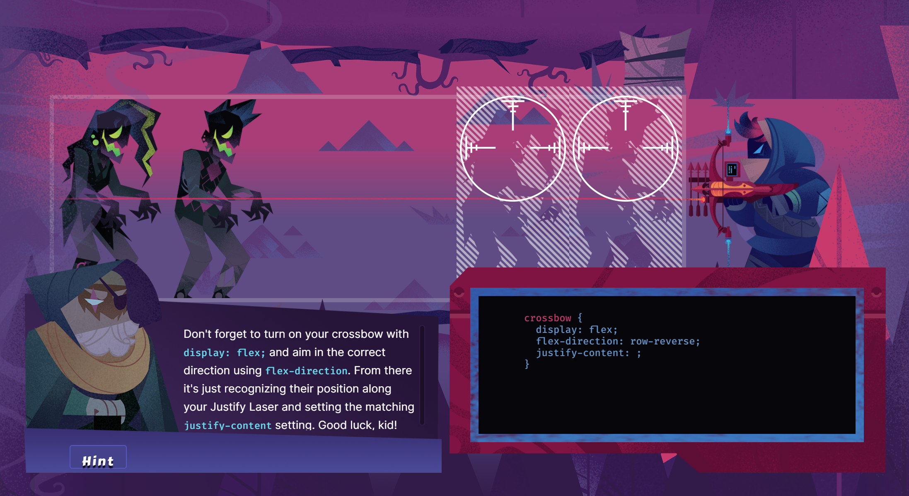

## Flexbox
- flexible display module
- manage alignment
- distributing extra space
- When we describe flexbox as being one dimensional we are describing the fact that flexbox deals with layout in one dimension at a time — either as a row or as a column. This can be contrasted with the two-dimensional model of CSS Grid Layout, which controls columns and rows together.
- If I were to work in Arabic, then the start edge of my main axis would be on the right and the end edge on the left.
- flext container vs flex items
- specification: https://www.w3.org/TR/css-flexbox-1/

## Flex container

TODO flex (=flex block)
TODO flex-inline

### Flex direction
- default is row

### Wrapping

### Aligning content
- justify-content
- default flex-start
- flex-end, center, space-between, space-around

## Item level properties

### Aligning individual items

### Ordering items
Items in the flexbox container are not necessary displayed in the order, in which they are declared in HTML. That is, you can reorder items by assigning them specific `order` property. This is an integer value and defaults to 0 if not specified otherwise. This property is set not on the flex container level, but at the item level, as you want to order individual items.

If you want to put items before those, which don't have order specified, you can use negative values.

<!-- TODO this can be replaced by simple url once there is support in the gatsby codepen plugin -->
<iframe height="400" scrolling="no" src="//codepen.io/vojtechruz/embed/preview/ZEbGeRO/?height=400&amp;theme-id=light&amp;default-tab="result" frameborder="no" allowtransparency="true" allowfullscreen="true" style="width: 100%;"></iframe>

Multiple items can have the same `order` value. Such items belong to the same *ordinal group*. Items within the same group are then ordered in the same order in which they are declared in HTML.

For example, if you have three items with order 1, they will be placed after all the items with lower order. All these three items with the same order value will then be placed in the same order as in HTML.

<!-- TODO this can be replaced by simple url once there is support in the gatsby codepen plugin -->
<iframe height="400" scrolling="no" src="//codepen.io/vojtechruz/embed/preview/BaoNWGg/?height=400&amp;theme-id=light&amp;default-tab="result" frameborder="no" allowtransparency="true" allowfullscreen="true" style="width: 100%;"></iframe>

### Visual, not logical order
You have to be careful when changing order in a flexbox container this way. This only changes visual order of the items, not logical order. In other words, in DOM, the items are still placed in the same order as in HTML. 

This has several implications. Most notably, any assistive technologies as screen readers will process the items in their original order. This also applies to keyboard navigation using <kbd>Tab</kbd> key, unless you also explicitly change `tab-order` of your components.

## Browser Support
Fortunately, flexbox currently has [great support](https://caniuse.com/#feat=flexbox) across all the major browsers. That is 98.72% of all the users. It is even supported by IE 11, even though [it has many issues](https://github.com/philipwalton/flexbugs) and some non-standard behavior.

If you are targeting some old browsers, you can check [Advanced Cross-Browser Flexbox](https://dev.opera.com/articles/advanced-cross-browser-flexbox/).

## Learning flexbox with zombies

Learning flexbox is way more fun if there are zombies involved. Instead of reading boring tutorials, you can shoot zombies with your crossbox, while learning flexbox. Try [Flexbox Zombies](https://mastery.games/flexboxzombies/) browser game. It is for free.

Want some more practice? You can check other games helping you to master Flexbox, such as [Flexbox Defense](http://www.flexboxdefense.com/) - a tower defense game where you position your towers using CSS and flexbox. Another one is [Flexbox Froggy](https://flexboxfroggy.com/) - help Froggy and his friends to reach lilypads and cross a pond by writing CSS code.

## Additional resources
- [Flexbox specification](https://www.w3.org/TR/css-flexbox-1/)
- [Solved by Flexbox](https://philipwalton.github.io/solved-by-flexbox/) - showcase of common layout problems solved by Flexbox
- [Interactive Flexbox playground for testing various flex properties](https://flexbox.help/)

TODO flexbox zombies link
TODO cheatsheet
TODO table showing which are on parent level vs on item level
TODO https://developer.mozilla.org/en-US/docs/Web/CSS/CSS_Flexible_Box_Layout/Relationship_of_Flexbox_to_Other_Layout_Methods
TODO https://developer.mozilla.org/en-US/docs/Web/CSS/CSS_Flexible_Box_Layout/Relationship_of_Flexbox_to_Other_Layout_Methods