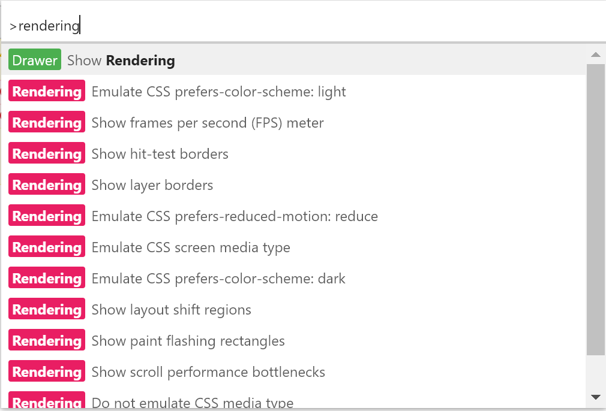
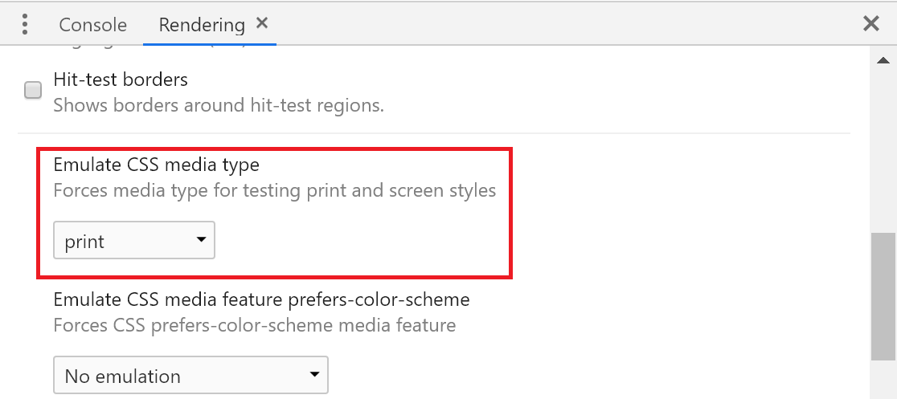

## Adding print stylesheet
When you want to apply certain CSS rules just when printing, you can easily add a separate stylesheet, which will be used just for printing purposes.

```html
<link rel="stylesheet" media="print" href="printing-stylesheet.css">
```

If you add your stylesheet this way, it will be applied **id addition** to your regular stylesheet. This is often what you need. However, if you would like to have two distinct stylesheet - one only for screen, one just for printing, you can achieve it like this:

```html
<link rel="stylesheet" media="screen" href="screen-stylesheet.css"><link rel="stylesheet" media="print" href="printing-stylesheet.css">
```

Having separate stylesheet just for printing can be useful, if you want to [load it dynamically](http://www.javascriptkit.com/javatutors/loadjavascriptcss.shtml), only when needed or you prefer your print styles to be completely separated.

## Media queries    
More modern way of including print-specific CSS is using [media queries](https://developer.mozilla.org/en-US/docs/Web/CSS/Media_Queries/Using_media_queries).

You can define that certain set of CSS rules can be applied only when printing.

```css
@media print {
  ...
}
```

Or only when using screen.

```css
@media screen {
  ...
}
```

This approach may be preferred to separate print stylesheet as you can easily have regular and print CSS for a page/component on the same place. This makes the maintenance easier and it is less likely that you will forget to update printing styles when making changes to regular styles.

## Check your CSS framework
If you are using external CSS styles, for example a frameworks such as Bootstrap, you should first check its print support.

Bootstrap, for example, provides some support out of the box - it will hide navigation bar and so on.

## Removing unnecessary content
Web pages contain a lot of content, which is not really useful when printing, this can be:

- Navigation bar
- Social share buttons
- Media content such as video or audio
- Cookie and subscription toolbars
- Ads

And much more. It is useful to remove this content. This way your users save paper, ink and the output is easy to read and not cluttered.

It is easy to hide elements by setting `display:none;`:

```css
@media print {
  .navigation {
    display: none;
  }
}
```

## Margins
When printing, it may be useful to override the default settings for margins of your pages (for example to provide space for writing notes).

```css
@page {
  margin: 20mm;
}
```

Of course, you can set individual margins separately. This can be useful when printing souble-sided documents. That's because when you want to bind your documents tgether, you need extra space for better readability. However, with double sided pages, this space is either on the left or right of the page depending whether it is odd or even.

Fortunately, you can select odd and even pages by `@page:left` and `@page:right`. Left here means left-facing page and right is right-facing.

```css
@page:left {
  margin-right: 30mm;
}

@page:right {
  margin-left: 30mm;
}
```

if you want to treat the first page separately, you can use `@page:first`.


## Page breaks
For better readability, it can be useful to control where are page breaks inserted. 

### Avoiding breaks
It can be inconvenient if images or code examples get split across two pages. Fortunately, you can ensure that certain elements will never be split across two pages. Let's say we want to do that for images and code blocks:

```css
img, pre {
  break-inside: avoid-page;
}
```

You can also specify that page break should not be inserted before or after an element. This can be useful, for example, so that heading is not placed as a last element on a page and is not separated from the following paragraph.

```css
h1, h2, h3 {
  break-after: avoid-page;
}
```

### Explicit breaks
Sometimes, it can be useful to explicitly insert page breaks before or after certain elements.

For example, you may need each chapter to start on its own page. You can achieve it using `break-before` on your chapter heading.

```css
h2 {
  break-before: page;
}
```

You can also insert page breaks after an element using `break-after`.

<div class="msg-info">
There are older properties [page-break-before](https://developer.mozilla.org/en-US/docs/Web/CSS/page-break-before), [page-break-after](https://developer.mozilla.org/en-US/docs/Web/CSS/page-break-after) and [page-break-inside](https://developer.mozilla.org/en-US/docs/Web/CSS/page-break-inside), which are now deprecated in favor of break-before, break-after and break-inside.</div>

## Hyperlinks
You should take extra care when handling printed hyperlinks. Many pages these days don't use undelrline for hyperlinks and rather differentiate links by color. This is not very convenient when printing, especially with black and white output. Marking hyperlinks with underline is a good traditional way of recognizing them even when printing.

```css
@media print {
  a {
    text-decoration: underline;
  }
}
```

Another problem with hyperlinks is that in printed document, there is no way to determine where the link is pointing to. Fortunately, this can be fixed with just a little bit of CSS.

```css
a:after { 
	content: " (" attr(href) ") "; 
	font-size: 80%; 
}
```

This will include url after each `a` element, so you can clearly see where is it pointing to. The url is a bit smaller than the regular text for better readability.


This is good but we can do even better. The first issue to solve is to make sure only lniks in text are processed, not all the links on the page. We can prefix the `a` selector in our code with either `p` or better yet, with the container for our page text, such as `#page-content` (or whatever name you might have).

The second improvement can be restricting this to only external links. We can do this by selecting only `a` tags where `href` starts with `http`:

```css
#page-content a[href^="http"]:after {
  content: " (" attr(href) ")";
  font-size: 80%; 
}
```

This solution works, but if you have a lot of links, especially with long URLs, it can become hard to read. There is an alternative solution described by [Aaron Gustafson](https://alistapart.com/article/improvingprint/).

The idea is not to put URL after each link, but rather a reference number (1,2,3,...) and then at the end of document provide a reference table with all the number and their URLs.

This also involves a bit of JAvaScript, but it can be handy when working with a lot of links.


## Adding labels
TODO page counters, url, site name, copyright

## Handling printing in JS
With JavaScript, you don't have to rely on your users to initiate printing of your page, you can trigger it yourself using

```javascript
window.print();
```

You may be tempted to use your own print button, if you need to perform some custom JS logic before printing, such as manipulating DOM, loading new data and so on.

The problem is that you cannot guarantee that users will use your button instead of native browser printing.

For such cases, where you need to perform some custom logic before (or even after) printing, there are two handy methods.

- [beforeprint](https://developer.mozilla.org/en-US/docs/Web/API/Window/beforeprint_event)
- [afterprint](https://developer.mozilla.org/en-US/docs/Web/API/Window/afterprint_event)


As the name suggest, the first one is fired before you enter the print dialog, so you can do whatever is necessary. The second one is triggered after the printing finishes and you can use it for reverting to the original state.

You can register your event listeners like this (of course, this may be different if using a framework):

```javascript
window.onafterprint = (event) => {
  console.log('Printing finished!');
};
```

It is usually preferred to do as much as possible in CSS, but sometimes using JS may be necessary.

## Chrome Dev Tools Print Preview
It can be time consuming to open print preview dialog in your browser every time when you want to check how your page looks when printing.

Fortunately in Chrome Devtools you can easily [switch to view](https://developers.google.com/web/tools/chrome-devtools/css/print-preview), which shows how your page would look like when printing.

1. Open your Devtools
2. Press  or <kbd>Ctrl</kbd>+<kbd>Shift</kbd>+<kbd>P</kbd>  (or <kbd>⌘</kbd>+<kbd>⇧</kbd>+<kbd>P</kbd> on Mac)
3. Search for `rendering`
4. Select `Show Rendering` and press <kbd>Enter</kbd>



A new `Rendering` window should appear.



Here you can select `Emulate CSS media type → print`.

Although, not related to printing, you can emulate some more interesting rendering options in this tab, such as whether user prefers light or dark theme or reduced motion, show FPS and more.