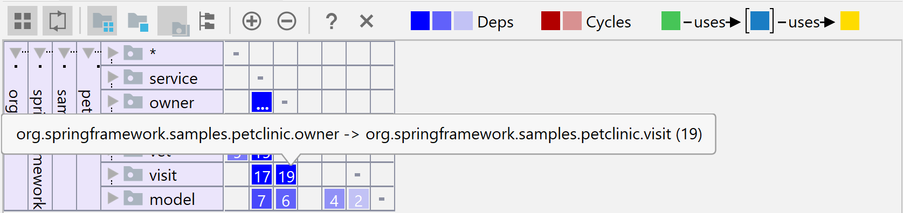
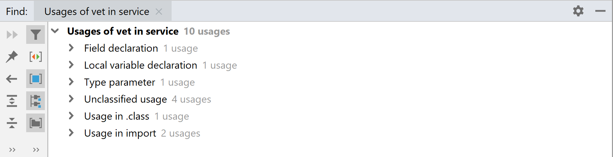

## Analyzing Maven dependencies
In Maven project, you can get into all sorts of trouble with your dependencies, such as dependency conflicts or cyclic dependencies. Maven offers you to generate dependency tree representation by calling:

```
mvn dependency:tree -Dverbose -DoutputFile=dependencies.txt
```

Plain text format can look something like this ([here is the full example](https://gist.github.com/vojtechruz/0f8394f71bb9c4ae324a8dc4518c5761#file-plain-text)):

```
--- maven-dependency-plugin:3.0.2:tree (default-cli) @ spring-boot-actuator-example ---
com.vojtechruzicka:spring-boot-actuator-example:jar:1.0.0-SNAPSHOT
+- org.springframework.boot:spring-boot-starter-actuator:jar:2.0.3.RELEASE:compile
|  +- org.springframework.boot:spring-boot-starter:jar:2.0.3.RELEASE:compile
|  |  +- org.springframework.boot:spring-boot:jar:2.0.3.RELEASE:compile
|  |  +- org.springframework.boot:spring-boot-autoconfigure:jar:2.0.3.RELEASE:compile
|  |  +- org.springframework.boot:spring-boot-starter-logging:jar:2.0.3.RELEASE:compile
|  |  |  +- ch.qos.logback:logback-classic:jar:1.2.3:compile
|  |  |  |  \- ch.qos.logback:logback-core:jar:1.2.3:compile
|  |  |  +- org.apache.logging.log4j:log4j-to-slf4j:jar:2.10.0:compile
|  |  |  |  \- org.apache.logging.log4j:log4j-api:jar:2.10.0:compile
|  |  |  \- org.slf4j:jul-to-slf4j:jar:1.7.25:compile
|  |  +- javax.annotation:javax.annotation-api:jar:1.3.2:compile
|  |  \- org.yaml:snakeyaml:jar:1.19:runtime
```

But it offers various other formats as output, which are better suited for representing dependency graph such as [graphml](https://gist.github.com/vojtechruz/0f8394f71bb9c4ae324a8dc4518c5761#file-graphml) or [tgf](https://gist.github.com/vojtechruz/0f8394f71bb9c4ae324a8dc4518c5761#file-tgf).

You can specify some other parameters to help you with investigation, but for larger projects, it can be cumbersome to work with dependency tree output directly. Fortunately, IDEA offers a nice GUI tool to work with Maven dependency graphs.

This tool is in IntelliJ for quite some time, but as of version 2019.1, it received some needed enhancements, which make it much more useful in projects with large dependency graphs.

To show the graph, go inside a `pom.xml` file and press <kbd>Shift</kbd> + <kbd>Ctrl</kbd> + <kbd>Alt</kbd> + <kbd>U</kbd> (or <kbd>⌥</kbd> + <kbd>⇧</kbd> + <kbd>⌘</kbd> + <kbd>U</kbd> on Mac). Alternatively `Right click → Diagrams → Show Dependencies`.

You'll see zoomed out dependency graph, where it is not possible to see individual item names unless you zoom in. Looking for individual items manually can be a lot of pain. Fortunately, you can use `Find` as usual using <kbd>Ctrl</kbd> + <kbd>F</kbd>.


We are able to locate a specific dependency easily now, but still a lot of unrelated dependencies making the graph hard to read. Let's look into how to filter the dependencies to get rid of unwanted noise.

First option is to show only direct neighbors. That is, only direct dependencies of the current item and only items that directly depend on the selected item.


Note that this works not only for single items, but you can select multiple items while holding <kbd>Shift</kbd>. 

Another way to filter is no display the dependency chain leading from the root to the selected item(s).


IDEA does highlight conflicts for you in red. Still, it may be difficult to find if there is something wrong in a huge dependency tree. Fortunately, you can filter problematic parts only:


In the example above, you can see there is a conflict between junit versions. There is an explicit dependency to junit 3.8.1 and a different version transitively taken through `spring-boot-starter-test`.

## Dependency Matrix
So far we've discussed only Maven dependencies on the module level. But often you require more fine-grained analysis. That is not only on module level, but also on class level.

This can be very important as tighly coupled classes and modules or even cyclic dependencies mean that your code is very hard to refactor and reuse.

Dependency Structure Matrix (or DSM for short) can help you visualize your dependencies and look for potential problems. First make sure to build your project. Then, to launch the analysis go to `Analyze → Analyze Dependency Matrix...`. You need IDEA Ultimate edition and `DSM Analysis` bundled plugin enabled.

After the analysis is done, you'll see something similar to this:


To beter understand the matrix, look at the following image.


IDEA skips the column labels to save the precious space, but it behaves as if they were there.

Each row and column represent the package. Each cell represents a intersection of a row and column - that is two packages. The number in the cell represents number of dependencies one package has on another. That means one class from the source package using another class from the destination package. The darker the cell is, the more dependencies. If there is more than 99 dependencies, it shows `...` instead the number.

As long as the dependencies are blue, it is good as they are one way only. Cyclical dependencies would be shown in red, which is not good. But we'll see that later.

### Visual aids
The matrix is a powerful tool, which can show a lot of information at once. However, it may be difficult to read at first, if you're not used to working with it. Especially with the columns hidden. Fortunately, there are visual aids, which can help you to better understand the dependencies.

If you hover your mouse cursor over a cell, it will show you with tooltip what is the dependency direction there.



This can be useful, but there is more. You can click any package on the left (not an individual cell with dependency numbers) and IDEA will show you some more useful info.


The row is highlighted, as well as the corresponding column representing the same module. On top of that, you can see that some other modules are highlighted by either yellow on green.

- Yellow highlights modules on which the selected module depends
- Green marks modules which depend on the selected module

In addition to selecting a whole package, you cal also click individual cells. The color coding is the same, there is just one new concept. The purple cell represents dependencies between the same two modules but in other direction.

### We need to go deeper
So far we were working only on package level. This is no doubt useful, but often you need to go into more detail. Which means investigating also dependencies between single classes.

In the DSM view, it is simple, you can expand your packages to see their contents. This way you can see dependencies for all the potential sub-packages or even individual classes.


### Cyclic dependencies
So far, we covered only uni-directional dependencies. Something, you should look for are cyclic dependencies. In the DSM view, they are marked in red:


You can see that class `Owner` has 15 dependencies on class `Pet`, while `Pet` has 5 dependencies on `Owner`.

## Taking Action
DSM view in IDEA is not only a useful tool to visualize dependencies, but you can also take many useful actions directly from the context menu when right-clicking a cell or module.

You can even refactor your classes directly from the DSM view. If you click a cell with dependencies, you can call `Find usages for dependencies`. It will look for all the places in one of your classes/packages where the other class/package is used.

Let's look at an example to be more specific. We can find all the places in the `vet` package, where anything from the `service` package is used. The results are classified by type:
Let's look at an example to be more specific. We can find all the places in the `service` package, where anything from the `vet` package is used. The results are classified by type:



Now you can inspect the occurences one by one and check whether you could improve flow of your dependencies.