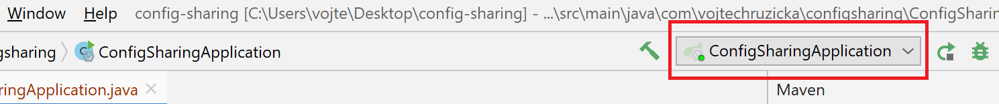
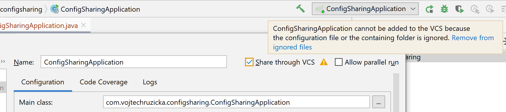

Finally with IDEA 2020.1, you can easily share your runconfiguration among your team members utilizing version control.

## IDEA settings sharing
When developing in a team, it is vital to stick to a common set of practices to keep consistency in the development process. Having your IDE configured in the similar way can greatly help you with this. Fortunately, IDEA offers several ways of settings sharing, which can be very useful in such situations. It can be also beneficial for individuals when working with multiple machines. You can read more about it in the following article:

<h4 class="front-post-title" style="margin-bottom: 0.375rem;"><a href="/intellij-idea-tips-tricks-synchronization-sharing-settings/" style="box-shadow: none;">IntelliJ IDEA Tips &amp; Tricks: Synchronization and Sharing of Settings</a></h4><small class="front-post-info">24 January, 2018
<ul><li><a href="/tags/idea/">#IDEA</a></li></ul>
</small>
<a class="front-post-image" href="/intellij-idea-tips-tricks-synchronization-sharing-settings/">

<picture><source srcset="/linked/idea-settings/5e4a3/idea-settings-featured.jpg 45w,
/linked/idea-settings/e451c/idea-settings-featured.jpg 90w,
/linked/idea-settings/29fd0/idea-settings-featured.jpg 180w,
/linked/idea-settings/b3ebb/idea-settings-featured.jpg 270w,
/linked/idea-settings/8841e/idea-settings-featured.jpg 360w,
/linked/idea-settings/2b1a3/idea-settings-featured.jpg 900w" sizes="(max-width: 180px) 100vw, 180px"></picture><noscript><picture><source srcset="/linked/idea-settings/5e4a3/idea-settings-featured.jpg 45w,
/linked/idea-settings/e451c/idea-settings-featured.jpg 90w,
/linked/idea-settings/29fd0/idea-settings-featured.jpg 180w,
/linked/idea-settings/b3ebb/idea-settings-featured.jpg 270w,
/linked/idea-settings/8841e/idea-settings-featured.jpg 360w,
/linked/idea-settings/2b1a3/idea-settings-featured.jpg 900w" sizes="(max-width: 180px) 100vw, 180px" /></picture></noscript>
</a>Did you know IDEA offers two ways of synchronization of you settings among multiple instances of your IDE? You can use it when working on multiple computers or to share unified settings in your team.

## Run configuration sharing
You can see your Run Configurations of top of the IDE window next to `Run` and `Debug` buttons.

A configuration can be as simple as running your project. You can have one for running tests, deploying to application server and more. Configurations can get more complicated as you introduce more settings such as environmental variables, command line arguments VM options and much more.

In case of these more complicated configs, it is vital to be able to share them with your team, so they can use the app right after cloning with no advanced setup. Not only is it good for simplification of the initial setup, but it can also help to ensure that everybody is running with the ame settings.

To edit individual configurations, you can hit double <kbd>Shift</kbd> and then search for `Edit Configurations...`.

### Default behavior
The default bahavior of IDEA run configurations is not very sharing friendly. All your run configs are shared in `.idea/workspace.xml`.

This is problematic as the file also contains a lot of user-specific information,so it is not really suitable for sharing among team members. As a result the whole `.idea` folder usually ends up in `.gitignore` file.

### Share through VCS
As a result, IDEA later introduced concept of sharing your run configuration through VCS.

This is configured per each configuration, so you can have both your personal and shared configurations at the same time.

It works in a way that is stores your shared run configurations in `.idea/runConfigurations`. This is better, but still not ideal. Ignoring the whole `.idea` dir does not work anymore and you need to have more coplicated ignore config to ignore everything except the configs directory. Otherwise it won't work.

### Store project file

In version 2020.1, you can now [easily store run configurations](https://blog.jetbrains.com/idea/2020/03/intellij-idea-2020-1-beta2/) as external files, not necessarily under `.idea` directory.

This replaces the old `Share through VCS` option. For backwards compatibility with older IDE versions, you can still store your files under `.idea/runConfigurations`.

You can check [an example of stored run configuration file](Config.run.xml).