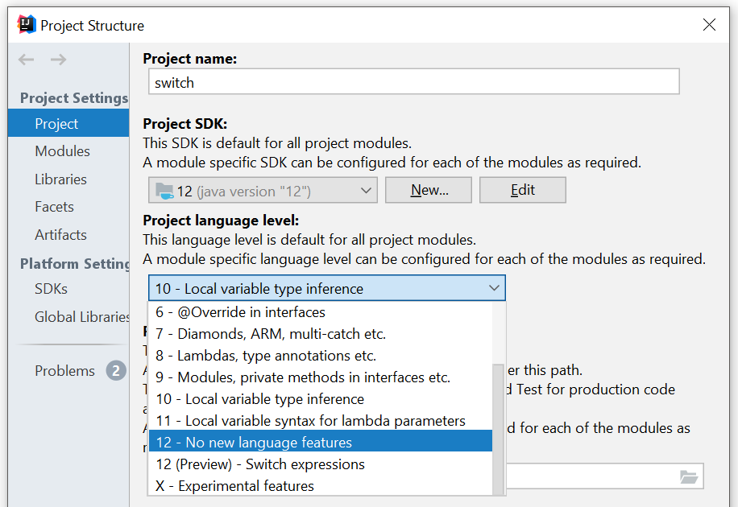

# Traditional switch


# Preview Feature
Java 12 brought whole lot of improvements to the traditional switch. As of Java 12, they are, however, available as a [preview feature](http://openjdk.java.net/jeps/12).

What does it mean?

    A preview language or VM feature is a new feature of the Java SE Platform that is fully specified, fully implemented, and yet impermanent. It is available in a JDK feature release to provoke developer feedback based on real world use; this may lead to it becoming permanent in a future Java SE Platform.
    
    Before the next JDK feature release, the feature's "real world" strengths and weaknesses will be evaluated to decide if the feature has a long-term role in the Java SE Platform and, if so, whether it needs refinement. Consequently, the feature may be granted final and permanent status (with or without refinements), or undergo a further preview period (with or without refinements), or else be removed.

Such features are shipped in the JDK but are not enabled by default. You need to explicitly enable it to use it. Needless to say, it is not intended for production use, but rather for evaulation and experimentation as it may get removed or heavily changed in another release.

First, make sure you actually have JDK 12 installed. Then, in IntelliJ IDEA you can enable preview features under `File -> Project Structure`.



Alternatively, if building manually, you need to provide the following params to `javac`:

```
javac --release 12 --enable-preview ...
```

That is for compile-time. At run you just provide `--enable-preview`

```
java --enable-preview ...
```

TODO
http://openjdk.java.net/jeps/325

- preparation for pattern matching http://cr.openjdk.java.net/~briangoetz/amber/pattern-match.html
- intellij idea support
   - https://blog.jetbrains.com/idea/2019/01/intellij-idea-2019-1-early-access-program-is-open/
   - https://blog.jetbrains.com/idea/2019/02/java-12-and-intellij-idea/
- arrow and colon syntax ins not allowed
- must cover all posible enum values   
