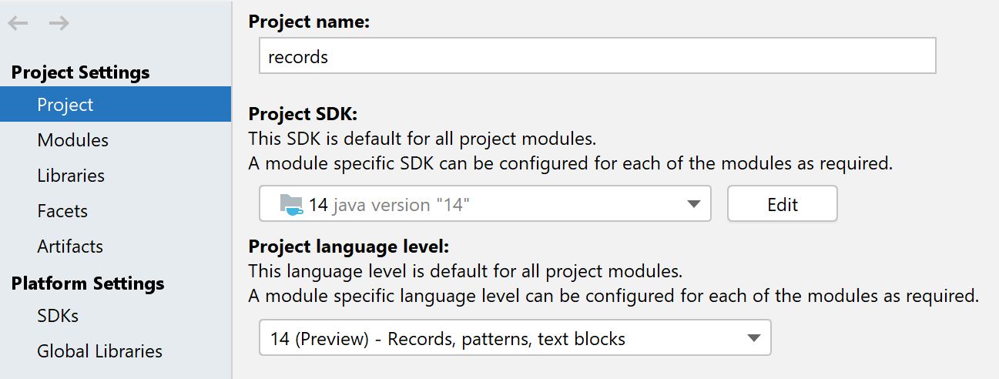

## The problem
One of the problems with Java is its verbosity and the amount of boilerplate code needed. That's nothing new. 

Let's consider a simple `Cat` class in Java. We want each cat to have:

- A name
- Number of lives
- Color

Quite simple, right? Now let's look at the code in Java. For simplicity, let's make our class immutable - no setters, we'll set up everything in our constructor.

```java

public final class Cat {
    
    private final String name;
    private final int numberOfLives;
    private final String color;

    public Cat(String name, int numberOfLives, String color) {
        this.name = name;
        this.numberOfLives = numberOfLives;
        this.color = color;
    }

    public String getName() {
        return name;
    }

    public int getNumberOfLives() {
        return numberOfLives;
    }

    public String getColor() {
        return color;
    }
}
```

It's already quite long, isn't it. It gets worse. We'll also want to have some basic implementation of `equals()` and `hashCode()`.

```java
@Override
public boolean equals(Object o) {
    if (this == o) return true;
    if (o == null || getClass() != o.getClass()) return false;
    Cat cat = (Cat) o;
    return numberOfLives == cat.numberOfLives &&
            Objects.equals(name, cat.name) &&
            Objects.equals(color, cat.color);
}

@Override
public int hashCode() {
    return Objects.hash(name, numberOfLives, color);
}
```

Are we done yet? Not quite, we'll also need some nice `toString()` method:

```java
@Override
public String toString() {
    return "Cat{" +
            "name='" + name + '\'' +
            ", numberOfLives=" + numberOfLives +
            ", color='" + color + '\'' +
            '}';
}
```

And we're finally done. It's about fifty lines of code! It's quite painful to write (although your IDE can help here) and difficult to read. What's worse, it's hard to find some extra functionality (such as new methods) in all the boilerplate.

In these fifty lines, there are three lines that are actually interesting and bear some information:

```java
private final String name;
private final int numberOfLives;
private final String color;
```

There rest is just boilerplate, which is predictable and can be automatically generated based on these three lines. Your IDE can do that and there are tools such as [Lombok](https://projectlombok.org/features/Data), which can do this for you as well.

In Java, you often use classes, which just hold data, like our Cat. The implementation is always pretty much the same - a bunch of fields, getters, `equals()`, `hashCode()` and `toString()`. Often it is useful to have them immutable, if possible, which has many benefits. But to write and read such classes is a lot of work as there is a lot of code involved. And it is error prone. Who know wherther your `hashCode()` and `equals()` code is actually correct?

## Records
[Java 14](https://openjdk.java.net/projects/jdk/14/) tries to solve this issue by introducing a new type called `record`, it is described by [JEP 359: Records (Preview)](https://openjdk.java.net/jeps/359)

The same 50 lines long class from the example above could be written as a record like this:

```java
public record Cat(String name, int numberOfLives, String color) { }
```

It's a lot less code, right?

The functionality is the same as in our previous example - we have:

 - an immutable class with three fields
 - Constructor assigning these fields
 - Getters
 - equals(), hashCode() and toString()

To illustrate this better, let's look at decompiled version of our record.

```java
public final class Cat extends java.lang.Record {
    private final java.lang.String name;
    private final int numberOfLives;
    private final java.lang.String color;

    public Cat(java.lang.String name, int numberOfLives, java.lang.String color) { /* compiled code */ }

    public java.lang.String toString() { /* compiled code */ }

    public final int hashCode() { /* compiled code */ }

    public final boolean equals(java.lang.Object o) { /* compiled code */ }

    public java.lang.String name() { /* compiled code */ }

    public int numberOfLives() { /* compiled code */ }

    public java.lang.String color() { /* compiled code */ }
}
```

You can see that the code is pretty much the same as our old `Cat`. One notable exception is that the class extends [java.lang.Record](https://download.java.net/java/early_access/jdk14/docs/api/java.base/java/lang/Record.html).

The `equals()` implementation considers two records to be equal if they are the same Type and have the same values. The `toString()` implementation prints our record like this:

```
Cat[name=Fluffy, numberOfLives=9, color=White]
```


## Limitations
TODO 

## Adding methods
TODO

## Custom constructors
TODO


## Try it yourself!
If you want to try this feature yourself, you can already do so even though Java 14 is not out there yet (as of 1/2020).

### Preview feature
Records functionality is available in Java 14, however, currently only as a preview feature. What does it mean?

>A preview language or VM feature is a new feature of the Java SE Platform that is fully specified, fully implemented, and yet impermanent. It is available in a JDK feature release to provoke developer feedback based on real-world use; this may lead to it becoming permanent in a future Java SE Platform.
> 
>Before the next JDK feature release, the feature's "real world" strengths and weaknesses will be evaluated to decide if the feature has a long-term role in the Java SE Platform and, if so, whether it needs refinement. Consequently, the feature may be granted final and permanent status (with or without refinements), or undergo a further preview period (with or without refinements), or else be removed.

Such features are shipped in the JDK but are not enabled by default. You need to explicitly enable them to use them. Needless to say, it is not intended for production use, but rather for evaluation and experimentation as it may get removed or heavily changed in a future release.

To try this featue yourself, you'll need to have [JDK 14 installed](https://jdk.java.net/14/). 

### IntelliJ IDEA setup
In IntelliJ IDEA you can enable preview features under `File → Project Structure`.



To use records in intelliJ IDEA, you'll need version `2020.1`and later. As of 1/2020, it is available as [Early Access Program build](https://www.jetbrains.com/idea/nextversion/). Currently IDEA has basic support for records, but full-fledged support should be available with  the release version.


### Manual compilation
Alternatively, if building manually, you need to provide the following params to `javac`:

```
javac --release 14 --enable-preview ...
```

That is for compile-time. At run-time, you just provide `--enable-preview`

```
java --enable-preview ...
```

### Maven projects

For Maven builds, you can use the following configuration:

```xml
<build>
        <plugins>
            <plugin>
                <artifactId>maven-compiler-plugin</artifactId>
                <configuration>
                    <release>14</release>
                    <compilerArgs>
                        --enable-preview
                    </compilerArgs>
                    <source>14</source>
                    <target>14</target>
                </configuration>
            </plugin>
            <plugin>
                <artifactId>maven-surefire-plugin</artifactId>
                <configuration>
                    <argLine>--enable-preview</argLine>
                </configuration>
            </plugin>
            <plugin>
                <artifactId>maven-failsafe-plugin</artifactId>
                <configuration>
                    <argLine>--enable-preview</argLine>
                </configuration>
            </plugin>
        </plugins>
    </build>
```


