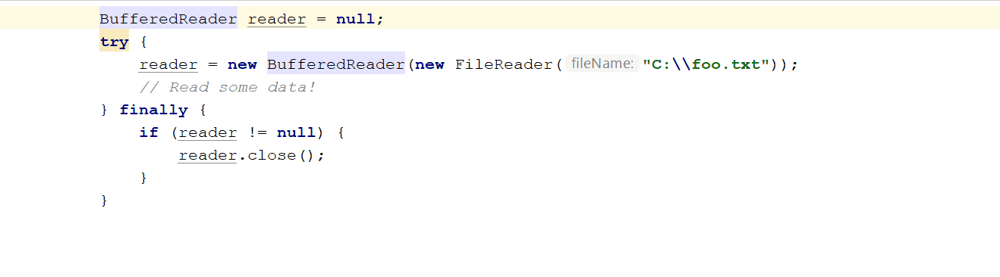

Try with resources offers an easy and foolproof way to make sure all your resources are properly closed. It manages closing automatically instead of explicitly using `try-finally`.


## Java 9 improvements
Try with resources was introduced in Java 7. Until Java 9 you were forced to declare the resources and assign them a value in the parentheses right after `try`. This is a lot of text and noise, which makes `try-with-resources` hard to read, especially when using multiple resources.

```java
try (FileReader fileReader = new FileReader("C:\\foo.txt"); 
     BufferedReader bufferedReader = new BufferedReader(fileReader)) {
    // Read some data!
}
```  

Fortunately, since Java 9, you can just reference the name of the existing resource instead of its declaration and assignment. This is much more readable.

```java
FileReader fileReader = new FileReader("C:\\foo.txt");
BufferedReader bufferedReader = new BufferedReader(fileReader);
        
try (fileReader; bufferedReader) {
    // Read some data!
}
```

It is not shorter, but when you check `try-with-resources`, you can immediately see which resources it uses without all the noise.

The limitation is, though that all the resources used need to be final of effectively final.

## IntelliJ IDEA integration
As usual, IDEA offers a nice support for try with resources feature. When you are using a resource, which implements `AutoCloseable` interface, you can surround it with `try-with-resources`. Just press <kbd>Alt</kbd> + <kbd>Enter</kbd> to open intention actions popup:


Usingthe same keyboard shortcut, IDEA allows you to convert traditional `try-catch-finally` to `try-with-resources`.



Alternatively, you can do the reverse operation using the same shortcut - convert `try-with-resources` to good old `try-catch-finally`.


- Resources must implement AutoCloseable interface
- Can implement also closeable???
- Multiple values
- Still can use catch and finally as normally

Any object that implements java.lang.AutoCloseable, which includes all objects which implement java.io.Closeable, can be used as a resource.

Note: A try-with-resources statement can have catch and finally blocks just like an ordinary try statement. In a try-with-resources statement, any catch or finally block is run after the resources declared have been closed.

Classes That Implement the AutoCloseable or Closeable Interface
See the Javadoc of the AutoCloseable and Closeable interfaces for a list of classes that implement either of these interfaces. The Closeable interface extends the AutoCloseable interface. The close method of the Closeable interface throws exceptions of type IOException while the close method of the AutoCloseable interface throws exceptions of type Exception. Consequently, subclasses of the AutoCloseable interface can override this behavior of the close method to throw specialized exceptions, such as IOException, or no exception at all.

 * <p>Note that unlike the {@link java.io.Closeable#close close}
     * method of {@link java.io.Closeable}, this {@code close} method
     * is <em>not</em> required to be idempotent.  In other words,
     * calling this {@code close} method more than once may have some
     * visible side effect, unlike {@code Closeable.close} which is
     * required to have no effect if called more than once.
     *
     * However, implementers of this interface are strongly encouraged
     * to make their {@code close} methods idempotent.
     *
     * @throws Exception if this resource cannot be closed