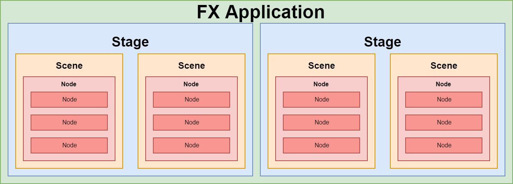

This is a second post in the JavaFX series. You can check the first post on how to set up you environment for JavaFx development. 

TODO link

## Application composition
Each application consists of hierarchy of some basic components. Stages, scenes and nodes. Let's look at each of them.

### Stage
Stage basically represents a window. Your application can have multiple stages, but needs at least one.

### Scene
Scene represents contents of a stage. Each stage can have multiple scenes, which you can switch. Image a theater stage switching multiple scenes during a play.

### Node
Each scene can contain various components, which are called nodes. These can be controls like buttons or labels or even layouts, which can contain multiple nested components. Each scene can have one nested node, but it can be a layout, which can host multiple components. The nesting can be multiple levels deep - layouts can contain other layouts and regular components.

### Summary
Each application can have multiple stages - windows. Each stage can switch multiple scenes. Scenes contain nodes - layouts and regular components.

You can visualize the heirarchy like this:



Now let's see this on a specific example - real application.


## Application Class
Now let's start coding. If you followed the previous article (TODO Link), you allready have all the required dependencies in place.

Each JavaFX application needs to have a main application class. That is - a class that extends `javafx.application.Application`.

Not only that, but you also need to override abstract method from the `Application` class - `public void start(Stage primaryStage) throws Exception`.

Your main class can look something like this:

```java
import javafx.application.Application;
import javafx.stage.Stage;

public class Main extends Application {

    @Override
    public void start(Stage primaryStage) throws Exception {
        // TODO implement me!
    }
}
```

Of course, we still need to implement the start method.

## Main method
JavaFx does not necessarily need `main()` method to start. You can package an executable jar using [JavaFX Packager Tool](https://docs.oracle.com/javafx/2/deployment/packager.htm). However, it is much more convenient to actually have the main method.

Not only is the application easier to start, but you can also pass command-line parameters to your application as usual.

Inside the `main()` method, we can launch our application using `Application.launch()`. 

```java
public static void main(String[] args) {
    // Here you can work with args - command line parameters
    Application.launch(args);
}
```

You can see it is a static method on the `Application` class. We did not specify what our main class actually is, JavaFX is able to determine this automatically depending on the class which calls this method.

## Setting up Stage
We are able to launch our app using `main()` method now. Still, nothing happens if we do so. We need a window to show. Windows are called stages, remember? As a matter of fact, we are already given primary stage in the start method as an input parameter - `public void start(Stage primaryStage)`. We can us this. The only problem is it is hidden by default. Fortunately, we can easily show it using `primaryStage.show()`.

```java
@Override
public void start(Stage primaryStage) throws Exception {
    primaryStage.show();
}
```

Now when you run the application, you should see a window like this:


Not very impressive, right? First, lets add some nice caption to our window.

```java
primaryStage.setTitle("Hello world Application");
```

Now you can configure the Stage object's properties and behaviour such as:
- Setting position using `setX()` and `setY()`
- Setting initial size using `setWidth()` and `setHeight()`
- Limit maximum dimensions of the window using `setMaxHeight()` and `setMaxWidth()` or disable resizing altogether using `setResizable(false)`
- Set window always on top using `setAlwaysOnTop()`
- Set full screen using `setFullScreen()`
- [And many more](https://openjfx.io/javadoc/11/javafx.graphics/javafx/stage/Stage.html)

## Adding Scene
Now we have a window with some fancy title, but it is still empty. You already know, you cannot add components directly to a Stage (window). You need a scene first.

However, Scene constructor requires already its child node. Let's create a simple label first. The we create a scene with this label as child.

```java
Label helloWorldLabel = new Label("Hello world!");
Scene primaryScene = new Scene(helloWorldLabel);
```

To make it slightly more visually appealing, lets center the label vertically on the screen.

```java
helloWorldLabel.setAlignment(Pos.CENTER);
```

Finally, we need to set scene to the stage we already have:

```java{7-10}
 @Override
public void start(Stage primaryStage) throws Exception {
    primaryStage.setTitle("Hello world Application");
    primaryStage.setWidth(300);
    primaryStage.setHeight(200);

    Label helloWorldLabel = new Label("Hello world!");
    helloWorldLabel.setAlignment(Pos.CENTER);
    Scene primaryScene = new Scene(helloWorldLabel);
    primaryStage.setScene(primaryScene);

    primaryStage.show();
}
```

Now our window contains a scene with a label component.

