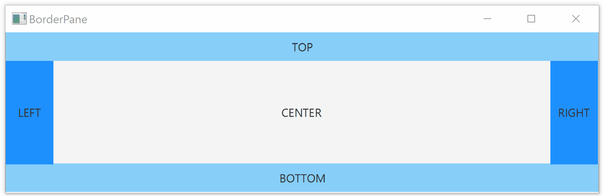

How to organize and position your GUI components in JavaFX application using advanced layouts.

In the previous article [we covered some basic JavaFX layouts](/javafx-layouts-basic). Now it's time to go through the rest of the available layouts.

## AnchorPane
AnchorPane is an interesting and powerful layout. It allows you to define anchor points to the components inside. There are 4 types of anchors:

- top
- left
- right
- left

Each component can have any combination of anchors. From zero up to all four. Anchor point also defines a distance. 

Anchoring means that the component will keep the defined distance from a particular edge of the layout (eg. TOP). This distance is preserved even on resize of the layout.

For example: `anchorRight=10` means that the component will keep distance 10 from the right edge of the layout.

You can combine two anchor points, which are not in the opposite direction to anchor your component to a specific corner of the layout.

Acnhor `TOP = 10`, `RIGHT = 10` means that the component will stay in the top right corner of the layout in the distance 10 from both edges.


In the example above, the size of each component stays the same on resize. However, if you define anchor points on the opposite directions, you can make it grow/shrink on resize.


You can have various combinations like this:
- LEFT+RIGHT resizes horizontally
- TOP+BOTTOM resizes vertically
- All 4 anchors means both horizontal and vertical resizing

Defining anchor points in FXML is easy. In the following example there are all four, but you can include none or only these which you want.

```xml
<AnchorPane>
    <Button AnchorPane.topAnchor="10"
            AnchorPane.leftAnchor="10"
            AnchorPane.rightAnchor="10"
            AnchorPane.bottomAnchor="10">I am anchored!</Button>
</AnchorPane>
```

Now let's look how anchoring is achieved in Java:

```java
AnchorPane anchorPane = new AnchorPane();
Button button = new Button("I am fully anchored!");
AnchorPane.setTopAnchor(button, 10d);
AnchorPane.setBottomAnchor(button, 10d);
AnchorPane.setLeftAnchor(button, 10d);
AnchorPane.setRightAnchor(button, 10d);
anchorPane.getChildren().add(button);
```

## GridPane

## BorderPane
BorderPane is a layout with five sections:
- Top
- Bottom
- Right
- Left
- Center


You can assign conponents to individual sections of the BorderPane:

```xml

<BorderPane>
    <top>
        <Label>TOP</Label>
    </top>
    <bottom>
        <Label>BOTTOM</Label>
    </bottom>
    <left>
        <Label>LEFT</Label>
    </left>
    <right>
        <Label>RIGHT</Label>
    </right>
    <center>
        <Label>CENTER</Label>
    </center>
</BorderPane>
```

Now the same example in Java:

```java
Label top = new Label("TOP");
Label bottom = new Label("BOTTOM");
Label left = new Label("LEFT");
Label right = new Label("RIGHT");
Label center = new Label("CENTER");

BorderPane borderPane = new BorderPane();
borderPane.setTop(top);
borderPane.setBottom(bottom);
borderPane.setLeft(left);
borderPane.setRight(right);
borderPane.setCenter(center);
```

### Sizing
All the regions except the center have the fixed size. Center then fills rest of the space.

Top and Bottom regions are stretched across all the available horizontal space. Their height is based on the height of the component inside.

Left and right fill all the available vertical space (except what's occupied by top and bottom). Their width is dependent on width of the component inside.

Center has dynamic size and fills rest of the space not occupied by other sections. Let's look at an example:

 

## SplitPane

## TabPane