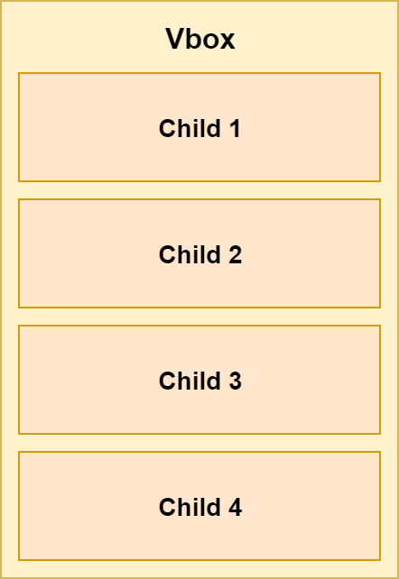

## Layouts

## HBox
This is one of the simplest layouts available. It just puts all the items inside horizontally in a row, one after another.

TODO image

In FXML, you can use HBox like this:

```xml
<HBox>
    <Button>1</Button>
    <Button>2</Button>
    <Button>3</Button>
    <Button>4</Button>
</HBox>
```

In Java you can use this:

```java
 HBox hbox = new HBox();
Button btn1 = new Button("1");
Button btn2 = new Button("2");
Button btn3 = new Button("3");
Button btn4 = new Button("4");
hbox.getChildren().addAll(btn1, btn2, btn3, btn4);
```

### Spacing
Our elements are now neatly laid out horizontally in a row, one after another:


But it does not look very good as they are right after each other with no spacing. Fortunately we can define spacing between component using `spacing` property of the HBox:

```
<HBox spacing="10">
     ...
</HBox>
```

Or in Java using `setSpacing()`:

```java
HBox hbox = new HBox();
hbox.setSpacing(10);
```

### Padding
The elements are now spaced properly, however, there is still no padding between elements and the HBox itself. It can be useful to add padding to our HBox:


You can define each section of the padding separately - top, bottom, left and right.

```xml
<HBox>
    <padding>
        <Insets top="10" bottom="10" left="10" right="10"/>
    </padding>
    ...
</HBox>
```

The same thing can be achieved in Java:

```java
HBox hbox = new HBox();
hbox.setPadding(new Insets(10, 10, 10, 10));
```


## VBox
VBox is very similar to HBox, but instead of displaying the components inside horizontally in a row, it displays them vertically in a column:



You can still set the spacing and padding in a same way as with HBox.

In code, VBox is used exactly in the same way as HBox, just the name is different:

```xml
    <VBox spacing="10">
        <padding>
            <Insets top="10" bottom="10" left="10" right="10"/>
        </padding>
        <Button>1</Button>
        <Button>2</Button>
        <Button>3</Button>
        <Button>4</Button>
    </VBox>
```

And in Java:

```java
VBox hbox = new VBox();
Button btn1 = new Button("1");
Button btn2 = new Button("2");
Button btn3 = new Button("3");
Button btn4 = new Button("4");
hbox.getChildren().addAll(btn1, btn2, btn3, btn4);
```

## StackPane
This layout is useful for stacking its component one on top of each other. The order of insertion determines order of the items. That means the first item is on the bottom, the next is on top of it and so on.

This can be useful, for example, for having an image and then having some text or button on top of it.

### Item alignment

### Margin

## FlowPane

## TilePane