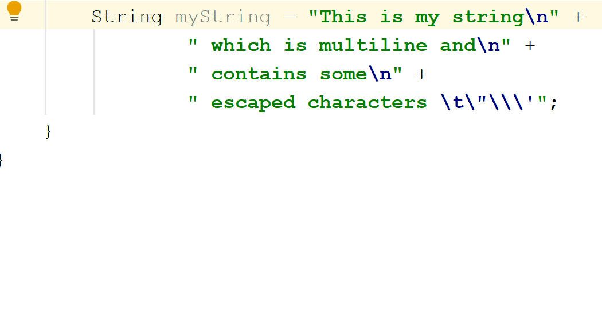

# Raw Strings

# String Interpolation

# IntelliJ IDEA support
The good news is that since version 2018.3, IDEA already supports Raw String Literals.

You can convert from good old string literals to the raw variant and vice versa. IDEA will handle escape sequence conversion and splitting to multiline for you.

IDEA is also able to detect if you are unnecessarily using too many backticks and will be able to remove excess backticks for you.

In addition to this, it now supports actions such as spell-checking or regular expressions detection in Raw String Literals. You can read more in [Preview Raw String Literals in IntelliJ IDEA 2018.3](https://blog.jetbrains.com/idea/2018/10/preview-raw-string-literals-in-intellij-idea-2018-3/).

<!--

In a class file, a string constant does not record whether it was derived from a raw string literal or a traditional string literal.

Like a traditional string literal, a raw string literal is always of type java.lang.String. Strings derived from raw string literals are treated in the same manner as strings derived from traditional string literals.
 
 JEP DEFINITION:
 https://openjdk.java.net/jeps/326
 
 Download JDK:
 https://jdk.java.net/12/
  -->