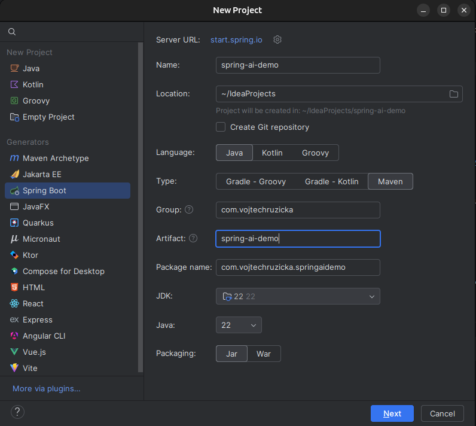
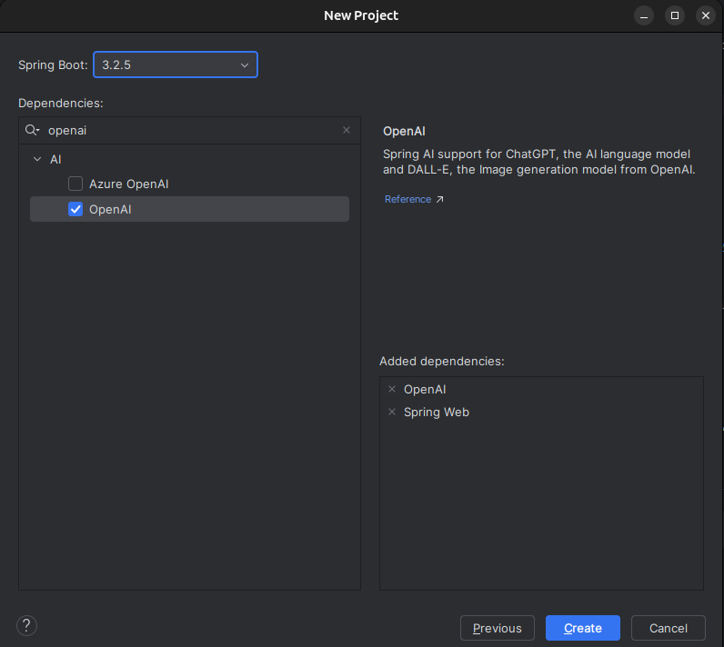
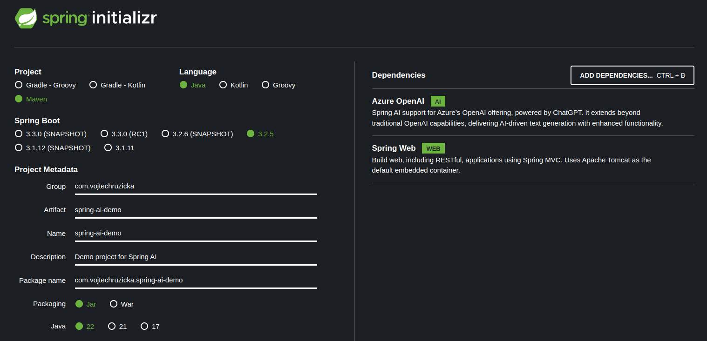

<PostHeader frontmatter={props.data.mdx.frontmatter} />

<Info>At the time of writing this article (4/2024), 1.0.0 version of Spring AI is not yet released. You can already use Spring AI for many use cases, but the API and usage may change in the future.</Info>

## New project
The easiest way to set up Spring AI is to create a new application using Spring Initializr. This way you'll avoid couple of manual configuration steps and the creation is much faster. If you need to update existing application with AI capabilities, you can skip to [Existing project](#existing-project) section below.

### IntelliJ Idea
Idea has built-in integration with Spring Initializr, you can simply go to:

```
File → New → Project → Spring Boot
```

In the first section fill in as usual your desired settings, nothing AI specific here.



In the second section, let's add dependency to `OpenAI`. That's all what's needed, but let's also add `Spring Web` so we can expose our AI functionality as REST endpoints.



Our project is now generated, you can skip to [API Key](#api-key) section below.

### Spring Initializr Web
Creating project form IntelliJ IDEA is the simpliest approach, but if you have different IDE, which does not integrate Spring Initializr, you can [generate the project from the web](https://start.spring.io/). It is very similiar to generating from IDE, but you'll need to do a couple of extra steps - download and extract the generated project and then import it to your IDE.

Fill whatever configuration you prefer (such as Java version or build tool) and add dependency on OpenAI. While not required, let's add Spring Web also so we can easily expose our new AI functionality as REST endpoints.



Our project is now generated, you can skip to [API Key](#api-key) section below.

## Existing project
Updating an existing project is a bit more tricky at the moment before the final version is released. It is mostly because the artifact is not yet released to the regular Spring repository, so you need to manually set up an alternative repository for pre-release artifacts.

### Repository setup
You can choose from two available repositories:
- Snapshot repository: Most up to date version available, which will contain the newest features but may be more unstable.
- Milestone repository: Released milestone versions are more stable and that's what we will use in this article

For Maven, update your `pom.xml` with the following:

```xml
<repositories>
    <repository>
      <id>spring-milestones</id>
      <name>Spring Milestones</name>
      <url>https://repo.spring.io/milestone</url>
      <snapshots>
        <enabled>false</enabled>
      </snapshots>
    </repository>
</repositories>
```

For Gradle, use the following:

```groovy
repositories {
  mavenCentral()
  maven { url 'https://repo.spring.io/milestone' }
}
```

### Dependency Management

<Info>At the time when this article was written, the latest version was 0.8.1, you can check the current latest version on the <a href="https://docs.spring.io/spring-ai/docs/">Spring AI site</a> and use it instead.</Info>

While you can add your dependencies with a version directly specified, in Spring Boot applications it is usually not the preferred way. Normally you don't specify any versions directly except for the parent pom, which defines all the versions of individual dependencies. When you add a new dependency, you don't need to worry about specyfing version as it is then inherited from the parent pom. This has advantage that you don't need to worry about determining exact version of your components and also your dependencies will work well together.

In the final release of Spring AI, all the dependency versions will be most likely specified as usually in the parent pom, but until then, you can import Spring AI BOM, which will achieve the same.

```xml
  <dependencyManagement>
      <dependencies>
          <dependency>
              <groupId>org.springframework.ai</groupId>
              <artifactId>spring-ai-bom</artifactId>
              <version>0.8.1</version>
              <type>pom</type>
              <scope>import</scope>
          </dependency>
      </dependencies>
  </dependencyManagement>
```

```groovy
dependencies {
  implementation platform("org.springframework.ai:spring-ai-bom:0.8.1")
}
```


### Adding dependencies
Now it's time to add dependency on Spring AI and a specific AI platform. Let's use OpenAI for now.

For Maven, add the following dependency to your `pom.xml` file in the `<dependencies>` section:

```xml
<dependency>
    <groupId>org.springframework.ai</groupId>
    <artifactId>spring-ai-openai-spring-boot-starter</artifactId>
</dependency>
```

Or if you are using Gradle:

```groovy
dependencies {
    implementation 'org.springframework.ai:spring-ai-openai-spring-boot-starter'
}
```

Note that we didn't have to specify version as it is taken from the spring AI BOM, which we configured earlier.

## API Key
Now we have all the required dependencies in place, but we need to configure connection to OpenAI API. The good news is that the only configuration parameter we need to provide is the API key. This will be used for authentication with the API.

To obtain the API Key, we will first need to [create OpenAI account](https://platform.openai.com/signup). After that, go to [API Keys](https://platform.openai.com/api-keys) page and generate a new key. After the key is created, copy it, so we can use it later.

Now we need to provide our application with the new API Key so it can connect to OpenAI platform. The easiest way is to put it in your `application.properties` (or `application.yml`).

```properties
spring.ai.openai.api-key=XXX
```

<Info>While this will work for our simple hello world application, it is usually not good idea to have your secret credentials stored with the application itself and available to all in git. You can instead set environmental variable `SPRING_AI_OPENAI_API_KEY` with your API key or pass the `spring.ai.openai.api-key` as command line param when launching the application.</Info>

## Text generation
TODO

## Image generation
TODO

## AI Provider abstraction
TODO

## Conclusion
TODO

## Further reading
- [Spring AI Reference documentation](https://docs.spring.io/spring-ai/reference/index.html)
- [Spring AI Github Repository](https://github.com/spring-projects/spring-ai)

TODO - Add github sample repo
TODO update cover image