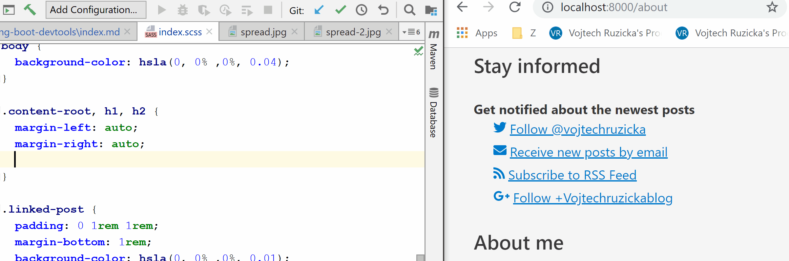

How to speed up your Spring Boot development even more with Devtools and make it more enjoyable and productive? 

# Setup
As usually with Spring Boot, the setup is really simple. All you need to do is to add the right dependency and yo are good to go. Spring Boot will detect this and auto-configure Devtools accordingly.

If you are using Maven:
```xml
<dependency>
    <groupId>org.springframework.boot</groupId>
    <artifactId>spring-boot-devtools</artifactId>
    <optional>true</optional>
</dependency>
```

Or when using Gradle:
```
configurations {
	developmentOnly
	runtimeClasspath {
		extendsFrom developmentOnly
	}
}
dependencies {
	developmentOnly("org.springframework.boot:spring-boot-devtools")
}
```

Note that the dependency is declared as optional. This is important. This will prevent devtools dependency being  transitively applied to other modules that depend on your project.

## Automatic Restart
Whenever there is a change in files on your classpath, devtools automatically restart your running application. When developing locally this can be valuable as it saves you don't need to manually restart your application.

On it's own it wouldn't be so useful as restarts can still take a lot of time. Fortunately, these restarts are way faster than ordinary restarts because of a clever trick, which devtools use.

You see, when developing an application you usually change a class of few and want to check results in your running application for a feedback. You just change a tiny fraction of your application as the majority of loaded classes are from frameworks and third party libs.
 
 Under the hood Spring Devtools use two classloaders - *base* and *restart*. Classes which do not change are loaded by *base* classloader. Classes you are working with are loaded by *restart* classloader. Whenever a restart is triggered, *restart* classloader is discarded and recreated. This way restarting your application is much faster than usual and can be a viable alternative to dynamic class reloading with tools such as JRebel.

### Triggering a restart in an IDE
The restart is triggered whenever there is a change on classpath. However, this varies depending on your IDE. That means, it is not enough to just change your '.java' files, what matters is that IDE actually updates '.class' files on the classpath.

When using IntelliJ IDEA, you need to build your project (Ctrl + F9 or *Build → Build Project*). In Eclipse it is enough to just save your files.

## Development only
The usage of the Spring Boot Devtools is intended only for development, not for production. If your application detects you're running in production, devtools are automatically disabled.

For this purposes, whenever you run your app as a fully packaged artifact such as jar with embedded application server, it is considered to be production app:

```
java -jar devtools-example-1.0.0.jar
```

Same applies when your app is started via special classloader, such as on a application server. In contrast, when you run an exploded artifact (such as in your IDE), your application is considered in development mode. The same applies when using spring-boot-plugin to run the application:

Maven:
```
mvn spring-boot:run
```

Gradle:
```
gradle bootRun
```

## Live Reload
[LiveReload](http://livereload.com/) is a useful tool, which allows you instantly update your page in browser whenever you make changes in your files such as HTML, CSS, images and more. It will even pre-process files as needed - that means even compiling automatically your SASS or LESS files.



Spring Devtools automatically launch a local instance of LiveReload server, which monitors your files. All you need to do is to install a [browser extension](http://livereload.com/extensions/) and you're good to go. It is not only useful for developing frontend of your application (in case you distribute it as a part of your Spring app artifact), but it can be used also to monitor and reload output of your REST API.

## Properties override
When developing your application locally, you usually have a different configuration needs than when running in production. One example can be caching. When in production it is crucial to depend on various caches (such as templating engine's caches, caching headers for static resources and so on). In development it can make you miserable by serving obsolete data and not reflecting your latest changes. Another example may be enhanced logging, which can be useful in development but too detailed for production.

It is unnecessarily complex to manage dual sets of configuration by yoursels. The good news is that Spring Boot Devtools configure many properties for your local development out of the box. 

```properties
spring.thymeleaf.cache=false
spring.freemarker.cache=false
spring.groovy.template.cache=false
spring.mustache.cache=false
server.servlet.session.persistent=true
spring.h2.console.enabled=true
spring.resources.cache.period=0
spring.resources.chain.cache=false
spring.template.provider.cache=false
spring.mvc.log-resolved-exception=true
server.servlet.jsp.init-parameters.development=true
spring.reactor.stacktrace-mode.enabled=true
```

You can check list of all the properties in the [DevToolsPropertyDefaultsPostProcessor](https://github.com/spring-projects/spring-boot/blob/v2.0.6.RELEASE/spring-boot-project/spring-boot-devtools/src/main/java/org/springframework/boot/devtools/env/DevToolsPropertyDefaultsPostProcessor.java).

## Remote connection
In addition to local development, you can also connect to a remote application running Devtools. This is not intended for production environments as it can be a serious security risk. However, it can be very useful in pre-production environments.

### Enabling remote connection
Remote connection is not enabled by default, you need to explicitly enable it by modifying your pom file:

```xml{7}
<build>
    <plugins>
        <plugin>
            <groupId>org.springframework.boot</groupId>
            <artifactId>spring-boot-maven-plugin</artifactId>
            <configuration>
                <excludeDevtools>false</excludeDevtools>
            </configuration>
        </plugin>
    </plugins>
</build>
```

Or with gradle, [you need to set](https://docs.spring.io/spring-boot/docs/current/gradle-plugin/reference/html/#packaging-executable-configuring-excluding-devtools) `excludeDevtools = false`:

```
bootWar {
	excludeDevtools = false
}
```

Then you need to set a secret password to be used for authentication when connectiong to the remote application

```properties
spring.devtools.remote.secret=somesecret
```

### Connecting to a remote app
TODO

Once you connect to a remote app, Devtools will monitor classpath changes same as it does for a local development. But instead of a local restart it will push changes to the remote server and trigger restart there. This can be a lot faster then building the app and deploying to the remote machine. 

## Global configuration
You can caonfigure Devtools using configuration properties as you would in any other Spring application. That usually means editing `application.properties` of your project. This configuration is separate for each application.

However, in some scenarios it may be handy to have a global configuration for ALL the applications running on the same machine. You can create a property file called `.spring-boot-devtools.properties` localed in your `$HOME` directory. Config declared in this file will be applied to all the applications running Devtools.

## Limitations
### Live Reload
Spring app using Devtools automatically launches LiveReload server. Unfortunately, only one instance of this server can be running  at the same time. To be more precise, just the first one will work. That applies not only to multiple instances of Spring apps with Devtools but any other apps, which are also using LiverReload under the hood, such as [Gatsby](https://www.vojtechruzicka.com/gatsby-migration/) in development mode.

If you want to configure your Spring app to not launch LiveReload server, you can configure it in your `application.properties`:

```properties
spring.devtools.livereload.enabled=false
```

### Shutdown Hook
Devtools are dependent on [shutdown hook](https://docs.spring.io/spring-boot/docs/current/api/org/springframework/boot/SpringApplication.html#setRegisterShutdownHook-boolean-) of `SpringApplication`. It will not work correctly if you manually disabled the hook using:

```java
springApplication.setRegisterShutdownHook(false);
```

By default the hook is enabled so you don't need to worry about it unless you explicitly disable it.

### Collisions with third-party libraries
While Devtools should usually run properly, it may have conflicts with third party libs. In particular, there is a [known issue](https://docs.spring.io/spring-boot/docs/current/reference/html/using-boot-devtools.html#using-boot-devtools-known-restart-limitations) with deserialization using standard `ObjectInputStream`.

In case of such conflict, you can disable restarting by setting:

```properties
spring.devtools.restart.enabled=false
```

Restart will no longer be triggered, however the *restart* classloader will still be used. If you need to disable the classloader completely, you need to do so before launching the app:

```java
public static void main(String[] args) {
	System.setProperty("spring.devtools.restart.enabled", "false");
	SpringApplication.run(MyApp.class, args);
}
```

Even if you don't use automatic restarting you can still benefit from the other feature Devtools provide.
     
## Conclusion
TODO