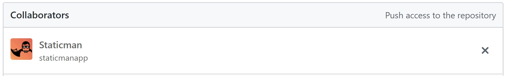

# Dynamic content in static sites 
Static JAMStack sites are great. If you are not familar with them, you can check my older post how I migrated my blog from WordPress to a static site using Gatsby.

<div class="linked-post"><h4 class="front-post-title" style="margin-bottom:0.375rem;" data-reactid="177"><a style="box-shadow:none;" href="/gatsby-migration/" data-reactid="178">Migration to GatsbyJS and JAM stack from WordPress</a></h4><small class="front-post-info" data-reactid="179"><span class="front-post-info-date" data-reactid="180">25 March, 2018</span><div class="post-tags" data-reactid="181"><ul data-reactid="182"><li data-reactid="183"><a href="/tags/blogging" data-reactid="184"><!-- react-text: 185 -->#<!-- /react-text --><!-- react-text: 186 -->Blogging<!-- /react-text --></a></li><li data-reactid="187"><a href="/tags/jam-stack" data-reactid="188"><!-- react-text: 189 -->#<!-- /react-text --><!-- react-text: 190 -->JAMStack<!-- /react-text --></a></li></ul></div></small><div data-reactid="191"><a class="front-post-image" href="/gatsby-migration/" data-reactid="192"><div class=" gatsby-image-outer-wrapper" style="position:relative;" data-reactid="193"><div class=" gatsby-image-wrapper" style="position:relative;overflow:hidden;" data-reactid="194"><div style="width:100%;padding-bottom:66.66666666666667%;" data-reactid="195"></div><noscript data-reactid="197"></noscript></div></div></a><span class="front-post-excerpt" data-reactid="198">How and Why I migrated from WordPress to static JAM Stack site built with Gatsby JS.</span></div></div>

Long story short, you get great performance, increased security and more. Static sites do have their limitations though. Most of the pages use some kind of user-generated content. Usually it is comments, user reviews, discussion and various others.

With traditional static pages, this is somewhat problematic. With users submitting new content such as comments all the time, your site cannot be truly static. You sually end up with solution such as Disqus. That is - third party service, which collects, manages and displays the user generated content on your site. You basically have your core content static and then load bunch of javascript, which fetches the dynamic content from third-party API. That's what `A` in JAMStack actually stands for - API.

This may be necessary for dynamic and ever-changing data such as stock prices, weather forecast and so on. However, comments or user reviews actually dont belong to this category. The are, in fact, static. Once you post a comment to a discussion it hardly ever changes. The discussion thread stays exactly the same until someone new adds a comment.

What if you could build your static site after a user comments including their new submission? Instead of loading the comment thread dynamically after the page loads, the whole thread could be core part of your static page. This way your sitewould be truly static with all the advantages.

#Staticman
Turns out you can achieve this easily with a tool called [Staticman](https://staticman.net/). The idea is simple.

1. Provide a submission form to you static site. For example a form for submitting a new comment.
2. Since static sites have no backend, the form submits to a Staticman service instead.
3. Staticman pushes the changes to your git repo.
4. As usual, your site can be automatically [rebuilt and redeployed](https://www.vojtechruzicka.com/jamstack-migration-netlify/) on repo change.
5. The user submitted data is now a core part of your static site.

How great is that? Of course, you don't want users spamming your site, so Staticman offer you option to moderate submissions by creating a Pull request instead of directly pushing to your branch. If you want more sophisticated protecion, it does offer integration with Akismet anti-spam filter or re-captcha.

# Setup

## Granting Github access


After adding Staticman as a collaborator, you should see pending invite:


Now you need to open the following URL in your browser to make Staticman accept your invite:

```
https://api.staticman.net/v2/connect/{your GitHub username}/{your repository name}
```

With a real data it will look something like this:

```
https://api.staticman.net/v2/connect/vojtechruz/staticman-example
```

If all goes well, you should receive response `OK!`. And in the collaborators section you should no longer see pending invite.



## Adding a configuration file
Staticman loads its configuration from a yaml fille called `staticman.yml`. A sample file can be found [here](https://github.com/eduardoboucas/staticman/blob/master/staticman.sample.yml). Detailed explanation of all the available configuration options can be found in the [official documentation](https://staticman.net/docs/configuration).

There is a l ist of some of the basic configuration properties:

| Property   | Description   |
|------------|---------------|
| allowedFields  | An array of the form fields, which should be accepted. If a field is received and it is n ot specified here, it will be discarded. |
| branch | Name of the git branch Staticman should use. |
| commitMessage | Commit message to be used. |
| fileName | Each entry is stored as a file. This property determines the name. You can use placeholders such as @{id] or {@timestamp}. |
|format| Format of the files created. yaml, json or frontmatter|
|moderation|If true, Staticman will created a Pull Request instead of pushing directly to your configured branch.|
|pah| Path to a directory where your Staticman files will be created.|
|requiredFields| Array of required fields. If some of them are missing, the entry will be rejected.|

## Creating a form
Now all you need is to create a form, which will accept user input and submit it to Staticman. You need to define all the fields which you want to collect and submit the form to:

```
https://api.staticman.net/v2/entry/{GITHUB USERNAME}/{GITHUB REPOSITORY}/{BRANCH}/{PROPERTY}
```

An example of such form:
```html
<form method="POST" action="https://api.staticman.net/v2/entry/vojtechruz/staticman-example/master/comments">
  <label><input name="fields[name]" type="text">Name</label>
  <label><input name="fields[email]" type="email">E-mail</label>
  <label><textarea name="fields[message]"></textarea>Message</label>
  
  <button type="submit">Submit</button>
</form>
```

Note the '/comments' section at the end of action URL. This is a section identifier, which allows you to have multiple configurations for your site. Eg. One for comments, one for user reviews etc. In this case, we're saying that we want to use configuration specified under the 'comments' section of your configuration file.

```yaml
comments:
  allowedFields: ["name", "email", "message"]
  ...
reviews:
  allowedFields: ["name", "email", "rating"]
  ...  
```

If you want to redirect the user to a specific url after submit you can do it by including this field:

```html
<input name="options[redirect]" type="hidden" value="https://www.example.com">
```

# Integrating with your static site generator
Each user submission is stored as a separate file. You can define the location and format of these files in your configuration file.


Each file contains fields submitted by the user plus any automatically generated fields, which you can define in your config file.

```yaml
_id: 749a3b20-a7a4-11e8-9d49-9fff9455a2a1
name: Vojtech Ruzicka
email: vojtech.ruz@gmail.com
message: Hello StaticMan!
date: 1535118541
```

What you need to do is to make sure your static site generator reads this data (you can set a different format than yaml if you need to) and generates static content based on it. This will, of course, vary greatly depending on which generator you use. 

For example, if using Gatsby, you can use [gatsby-transformer-yaml](https://www.gatsbyjs.org/packages/gatsby-transformer-yaml/) to read the yaml data and then just populate your comments section based on this data as you would with any other data source.

# Moderation
You can turn on moderation of user submissions by setting `moderation: true` in your config file. Staticman then creates a Pull Request for each user submission, which you can either accept or decline.


# Advanced features
## Running your own instance
If using Staticman as a service does not suit your needs for any reason, you can [run you own instance](https://staticman.net/docs/api).

## Akismet 
Staticman offers integration with [Akismet](https://akismet.com/) spam filter. This can be great when running your own instance, but unfortunately does not work [currently](https://github.com/eduardoboucas/staticman/issues/83) on public Staticman instance as it is using shared Akismet account under the hood, which reached the maximum usage limit.

## Email notifications
Staticman supports email notifications on new user submissions using [Mailgun](https://staticman.net/docs/configuration). You jus need to enable the notifications in your [config file](https://staticman.net/docs/configuration) and provide your Mailgun domain and API key.

## Re-captcha
Staticman supports re-captcha integration. You'll need to [create a re-captcha account](https://www.google.com/recaptcha/admin) first. You will receive a `site-key` and `secret`. Your secret is not used directly by Staticman and you need to encrypt it first.

```
https://api.staticman.net/v2/encrypt/SECRET  
```

You should receive encrypted secret back in the response. You then use it in your `staticman.yml` config file:

```yaml
reCaptcha:
  enabled: true
  siteKey: "SITE-KEY"
  secret: "ENCRYPTED-SECRET"
```

Then you need to include re-captcha javascript in your site:

```html
<script src='https://www.google.com/recaptcha/api.js'></script>
```

Then the element where it should be rendered:

```html
<div class="g-recaptcha" data-sitekey="YOUR-SITE-KEY"></div>
```

Finally you need to include these hidden fields in your Staticman form:

```html
<input type="hidden" name="options[reCaptcha][siteKey]" value="SITE-KEY">
<input type="hidden" name="options[reCaptcha][secret]" value="ENCRYPTED-SECRET">
```

You can find detailed info about re-captcha integration [here](https://github.com/eduardoboucas/staticman-recaptcha).

# Example

# Conclusion
Staticman is a great tool if you want to have user-generated content on your site while remaining truly static. You no longer need to rely on third-party services, to manage and store your content. There is no need to load the user-generated content from third party API at runtime. This should give you a better performance and you have direct control over your data. If you need a moderation of submitted content, Staticman can create Pull Requests, so you can decide which submissions are acceptable and which not.