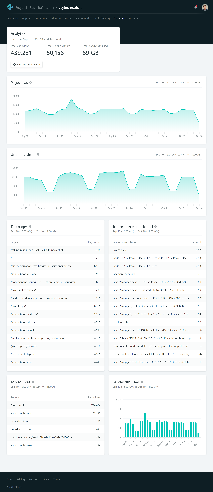

## Netlify Analytics
Netlify is a cool service focused on building and deploying your static and [JAM Stack](https://www.vojtechruzicka.com/gatsby-migration/) sites. If you're interested you can read more about the service in one of my previous posts:

<PostLink node={props.pageContext.links["/jamstack-migration-netlify/"]} />

One of the new features recently [announced by Netlify](https://www.netlify.com/blog/2019/07/10/netlify-analytics-accurate-insights-without-performance-impacts/) is [Netlify Analytics](https://www.netlify.com/products/analytics/). In its purpose, it is similar to Google Analytics - gather stats about people visiting your pages. Unique visitors, pageviews, that sort of stuff.

Unlike [Google Analytics](https://analytics.google.com/analytics/), it does not rely on JavaScript to gather and send this data. Instead, everything happens on the Netlify servers. That has some advantages we'll discuss in a moment. Now let's see how the Netlify Analytics dashboard looks like.

That's it: just this one screen, no other sub-views per category of per various metrics. Netlify's philosophy here is not to overwhelm users with a lot of data and keep it simple. Still, the product is new, and there are more features to come. It will never be as feature-rich as GA, though.

## Advantages
Unlike Google Analytics and other similar services, Netlify Analytics runs on the server-side, which has some nice implications.

### Better performance
Since everything happens server-side, there is zero impact on client performance. You don't need to include any external JavaScript, parse and execute it and make any calls to an external service. Google Analytics script currently has 43.4 kb (although it is much smaller compressed). It may not seem as much, but it can make a difference on low-end devices and with poor network connectivity.

### Works with adblockers
Adblockers are really popular these days. What's problematic, is that most of them also block analytics tools. You lose information on all of your visitors, who use adblockers. According to [the following report](https://www.statista.com/statistics/351862/adblocking-usage/) from 2018, globally 27% of desktop users on average use adblockers. But that's just average. It goes as high as 42% in Greece! That's huge. It means that a huge portion of your traffic can go untracked. It can get even worse, depending on your target audience. Likely, more tech-savvy users use adblockers more often. If you have a developer-targeted blog like me, the percentage is going to be way higher than the broad average. 

### Works with Javascript disabled
Since Netlify Analytics doesn't rely on Javascript, it works even if a client has JavaScript disabled. In the era of React, Angular, and other JS frameworks everywhere, the percentage is very low these days. Still, it may be useful to capture these visitors as well (assuming your page can actually run without JS).

### Historical data when enabled
The good news is that Netlify already collects analytics data for you, even if you don't have analytics enabled. You just have to pay to view it. Once you do, you'll be able to view historical data up to 30 days back. It may take some time to import everything, though, so don't expect to see everything immediately.

### Error & Not Found pages
By its nature, JS-powered tools such as Google Analytics, can show you only valid pages. Since Netlify Analytics is server-side, it can also capture requests to non-existent pages and resources. This may be handy to detect broken links and other similar issues.

### Simplicity
GA is a very powerful tool, but it may be intimidating at first, if you're not familiar with it. For casual usage, it may be too complex. Netlify Analytics is very simple and easy to understand, which is good.

## Disadvantages
Although Netlify Analytics has some powerful features, it has, currently, also some serious flaws. This is to be expected as the project is still fresh and not mature yet. According to Netlify, there are fixes and enhancement to many of the disadvantages currently on the roadmap.

### Accuracy
Netlify Analytics promises improved accuracy because it can track even users without javascript, those who have adblockers, and even missing resources. It's true to some degree. The problem is that it currently also tracks visits from bots, which can greatly affect your stats and provide irrelevant data.

Let's compare my stats on Netlify vs Google Analytics to illustrate this:

- Unique visitors: 44K vs 50K ⟶ + 13.6%
- Page views: 57K vs 439K ⟶ + 770 %

The Netlify data is supposed to be higher as it also detects users with adblockers, but this looks like way too much and is likely because of the bot activity.

Fortunately, according to Netlify, it is something they are already working on, and hopefully, it will be fixed soon. Currently, however, your stats include a lot of irrelevant data from bot visits.

### Limited date range
One of the most significant shortcomings is a limited history of your data. Currently, you can see only the last 30 days of user activity. You don't have any means of determining how is your traffic changing in the long term. Did all these new articles bring enough traffic, or is it stagnant? How did your traffic rise over the past few years?

According to Netlify, the date range is likely to be increased in the future, but is it ever going to be full history, which GA already offers? Is it enough to have 180 days instead of 30 if your site is running for years?

### Limited functionality
The feature set of Netlify Analytics is so far very limited; it's just one screen, which we saw in the image above. That's it. And it's not likely to be anywhere near to what GA offers anytime soon. Or ever. There a list of features which are currently offered:

- Total pageviews
- Total unique visitors
- Total bandwidth used
- Pageviews over the last 30 days: chart
- Unique visitors over the last 30 days: chart
- Top pages by pageviews
- Top resources not found by the number of requests
- Top sources of traffic by pageviews
- Bandwidth used over the last 30 days: chart 

If it is good enough for your case, that's great. However, it's likely you need more. There's not drill down per page, region, or device. No bounce rate, time spent on-page, or session flow. No demographics about users. Not to mention custom metrics.

### Price
The biggest downside is pricing. Adding analytics costs $9 per month PER SITE. This can quickly ramp up if you're running multiple different sites on Netlify. The price seems quite steep, considering the biggest competitor, Google Analytics, has many more features and is completely free. I can imagine running and developing such kind of service can cost a lot of money. However, for a user, there needs to be a strong justification to choose a $9 service with fewer features over a free, more powerful alternative. It doesn't mean Netlify analytics is bad, but the alternatives may be more compelling considering the cost.

Also, the $9 price is only for pages with less than 250K monthly pageviews. If you have more, they have [custom pricing](https://www.netlify.com/pricing/#analytics), and you need to contact their sales team.

## Conclusion
Netlify Analytics is a nice service, which has some powerful features, because of the fact, that it is running completely server-side. That means better performance and tracking of a portion of your traffic, which would otherwise not be visible. The setup is effortless and straightforward, and it's nicely integrated with Netlify.

It is still a new product and I'm expecting it to evolve and mature over time. Hopefully, some pain-points, such as bot tracking, will be fixed soon, and the service will be even better.

As for the price, it may not be justifiable on its own, but you have to take into consideration that Netlify provides a cool service with a generous free plan, and this is a way to make some profit by an optional product. Even though analytics are not perfect yet, I expect it to mature, and I'll be happy to pay $9 as a way to support a company offering a great product (Netlify as a whole), while still using the free plan.

If you're not too keen on supporting Netlify, it may be a better approach to wait some time until the product is more mature.

As for now, I'll still be using Netlify Analytics. However, I cannot really ditch GA either as I also want to have historical data. This way, I lose the performance benefit, and the only real remaining advantage is tracking users with adblockers and disabled JavaScript.