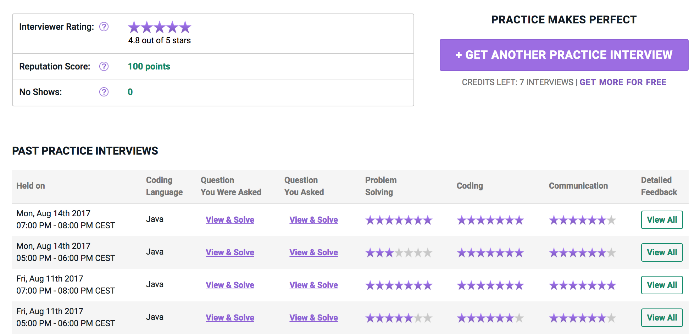


<b>UPDATE:</b> In November 2021, <a href="https://blog.tryexponent.com/pramp-joining-exponent/">Pramp was acquired</a> by <a href="https://www.tryexponent.com/">Exponent</a>. According to the statement Pramp should still be available for free, but both platforms should be more integrated in the future.


## Coding interviews
Coding interviews are not easy. You need to prepare for them if you want to succeed. The first step is obviously to learn all the intricacies of various algorithms and data structures, and how to determine their time and space complexity. This is just the beginning though. Then you need to practice. And then practice some more. Acing the coding interview is a skill like any other. Fortunately, it can be improved by preparation and practice. There are various ways to practice. You can find numerous online services just for that.

The problem is that they usually test your ability to complete the task on your own. You are provided with a problem and then you submit your solution. That's good, however not sufficient. Coding interview is much more than this. And you need to be prepared for that.

What's missing is the interaction with a real interviewer, which is crucial. During the interview, you are evaluated on many more levels than just your ability to provide the solution. The communication with your interviewer is paramount. You need to project confidence. You need to ask questions, make sure you gather all the requirements right. Sometimes the task is missing some key information on purpose and you are tested on your ability to ask questions and clarify requirements. And most importantly, you are supposed to think out loud and explain what you are doing and why - reveal your thought process as you are coding. The interviewer is much more interested how you tackle problems and how you approach them instead of just a plain result.

The bottom line is - you need to train with an actual person as an interviewer.

## Pramp to the rescue
Fortunately, there is a service, which does exactly this. [Pramp.com](https://www.pramp.com) (it's an acronym for **PRA**ctice **M**akes **P**erfect). It lets you pair with another person to practice the interview. First, you are interviewing them, then you switch the roles.

### Registration
The registration is fairly easy. You need to provide your location, which determines the time zone for your interviews. Then you provide education and years of experience. Then your areas of expertise such as frontend, backend, mobile development and such. And then programming languages. And that's it. All the data provided is used for matchmaking so Pramp can find you best match possible for your interviews.

### Scheduling an Interview
Once you are registered you can schedule an interview. You are provided with a number of available time slots which you can choose from:

Once you schedule an interview, the application will choose the best possible match for you from the other users. Multiple factors are taken into consideration such as your education, work experience, preferred languages or interview topic you marked you are interested in. Once you schedule your interview, you receive the question you'll be asking in advance with the hints and the answer, so you can prepare ahead of time. While you get a new question as an Interviewee every time, the questions you ask tend to repeat. The reason why is it makes you better interviewer, because you are already familiar with the topic and details of the question.

One disadvantage is that the number of the slots each day is currently fairly limited as you can see in the image above. Therefore you cannot interview any time of the day or all day if necessary.

### The Interview
After your scheduled interview starts, you are connected to your previously selected match. Randomly, either you or your peer is assigned the role of interviewer. The other one is provided with a question. The interviewer also has some hints available to guide you in the right direction in case you are stuck. And of course, they have access to the complete answer including the time and space complexities.

There is an IDE, in which you are supposed to code your solution to the given problem. You can work in a language of your choice - Java, Python, Ruby, PHP, Go, C, C++, C\#, Swift, Clojure and Haskell. The contents of the IDE are synchronized, so your interviewer can see you typing in the real-time and can also edit the contents as needed.

Once you are finished, you can swap the roles. The interview usually takes an hour - 30 mins for each. At any time you can either run the code to check whether there are any compile problems or run test cases to verify your algorithm. Of course, the IDE is rather simple, so you cannot expect anything more than just syntax highlighting. But that is probably a good thing as it is same as you would get in other tools you usually get your online coding interview in, so it is good to get used to that. It's good to be comfortable with a simple IDE rather than to be paralyzed when you suddenly leave the comfort of your powerful favorite IDE.

### Evaluation

After the interview is done, both you and your peer are given a form, where you provide feedback for each other. You get to rate your peer with up to 7 stars in:
-   Coding skills
-   Problem solving
-   Communication

Then there is free-text feedback for
-   Things they did well
-   Things they should work on

Finally, you rate your peer as an interviewer with up to 5 stars and a free-text comment on their performance as an interviewer.

They do the same for you. The result may look something like this:

### Aftermath
Once you finish your interview and the feedback is recorded, the interview is saved and available on your dashboard. You can see detailed feedback on your performance. But most importantly, you can get back to your task and the task of your peer. You can see the task, but also the suggested answer and hints, so you can get back to the problem, check for a better solution or just try to solve it again, in a better way.

## Additional Resources
There is a free Udacity video course by Pramp covering a [Technical interview](https://in.udacity.com/course/technical-interview--ud513), basic algorithms and data structures. This can be a good place to start before practicing actual interviews. Then, of course, there is the [Cracking the Coding Interview](http://www.crackingthecodinginterview.com/) book, which is also really helpful. There are of course many other resources. I'll be glad if you share your favorites in the comments below.

## Conclusion
Pramp is a great service to practice your skills as an interviewee (and as an interviewer for that matter). And it's free. I highly recommend it. The number of available slots is somewhat limited though, so you may want to add other services to the mix too.


Note: I am not affiliated with Pramp in any way, I just like the service and find it very useful.


