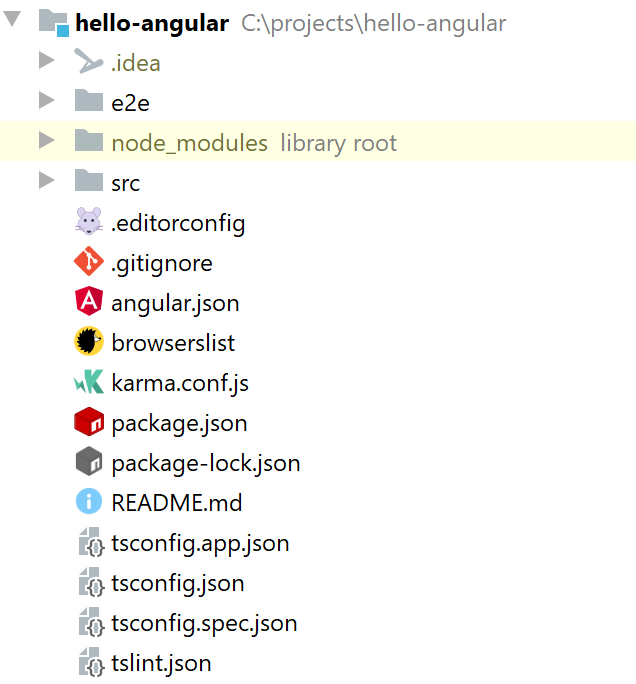
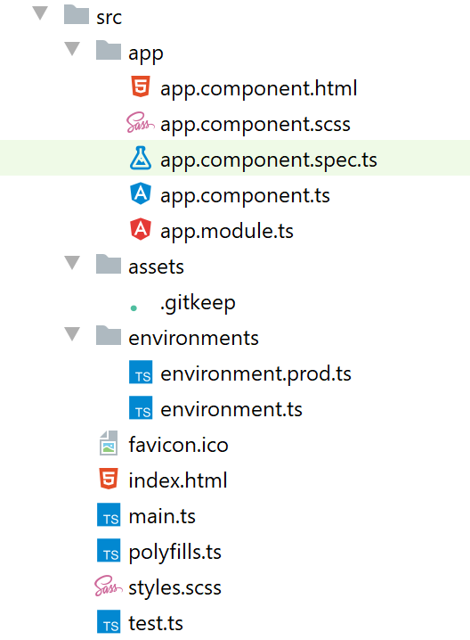

<PostHeader frontmatter={props.data.mdx.frontmatter} />

## About this series
In this series, we'll learn how to use the Angular framework. This is intended for absolute beginners, we'll cover everything you need to know. This is the first post in the series.

## Prerequisites
You don't need to have any prior knowledge of Angular. On the other hand, it is required to have some understanding of HTML, Javascript, and CSS (or SASS). Typescript knowledge is not required, but at least basic understanding is useful.

## What is Angular
Angular is a modern Single Page Application Framework by Google. What does it mean? In the traditional web apps, the HTML is dynamically constructed on the server and then sent to the browser. You have a full page refresh when navigating between pages.

In Single Page Apps, there is no full page refresh. You just download a simple HTML page and a whole bunch of Javascript. Then all the changes and navigations are done by dynamically replacing parts of the page based on user interaction and navigation. From the server, you just fetch any raw data you need in the background using AJAX calls. The whole experience is much smoother and more responsive.

Instead of plain Javascript, Angular uses Typescript for development. Variables have types declared such as number or string - this means that you have type safety. You can discover bugs such as using string instead of number very early on, which can save you a lot of headaches. Of course, browsers don't know how to work with Typescript, so everything is compiled to plain Javascript during the build process.

Angular should not be confused with AngularJS. AngularJS (commonly referred to as Angular 1) was a previous version of the framework, but it is completely different from Angular (also known as Angular 2+). When googling, be careful, so you don't accidentally use resources intended for AngularJS rather than Angular.

## Preparing environment
Before we create our first application, we need to set up our environment properly first. We'll need Node.js and Angular CLI (Command Line Interface).

### Node.js
First, we need to [download Node.js](https://nodejs.org/en/download/) and install it. Be aware that Angular requires a minimal version of Node to operate properly. For Angular 9, it is `10.13.0` or higher. 

For the version requirements of the latest Angular version, [you can check the package.json](https://github.com/angular/angular-cli/blob/master/package.json) of the Angular CLI project.

```json
"engines": {
    "node": ">=10.13.0 <13.0.0",
    "yarn": ">=1.22.4"
},
```

If you have Node.js already installed, you can check your version by running:

```bash
node -v
```

You can also use this command to verify that the installation was successful.

### Angular CLI
Now when we have Node, we can use its Node Package Manager (npm) to download and install the Angular CLI to our machine.

```bash
npm install -g @angular/CLI
```

This installs the latest version of Angular CLI. Note the `-g` option. It means this will install the CLI globally. It will be available from your command line anywhere on your machine.

You can verify the installation by running:

```bash
ng version
```

If the installation was successful, you should see output similar to this:

```
     _                      _                 ____ _     ___
    / \   _ __   __ _ _   _| | __ _ _ __     / ___| |   |_ _|
   / △ \ | '_ \ / _` | | | | |/ _` | '__|   | |   | |    | |
  / ___ \| | | | (_| | |_| | | (_| | |      | |___| |___ | |
 /_/   \_\_| |_|\__, |\__,_|_|\__,_|_|       \____|_____|___|
                |___/


Angular CLI: 9.1.6
Node: 10.16.3
OS: win32 x64

Angular:
...
Ivy Workspace:

Package                      Version
------------------------------------------------------
@angular-devkit/architect    0.901.6
@angular-devkit/core         9.1.6
@angular-devkit/schematics   9.1.6
@schematics/angular          9.1.6
@schematics/update           0.901.6
rxjs                         6.5.4
```

Note that all the commands in Angular CLI start with `ng` followed by the name of the command and potentially some other parameters. You can run `ng help` for more info or check the [official docs](https://angular.io/cli). Don't worry about the CLI much for now, we'll cover additional commands through the series.

## Generating new project
Now with all prerequisites installed, we can create our first project. Hooray! Fortunately, you don't have to create the whole project structure and all the files manually. We can use Angular CLI to generate a fully functional starter project automatically. Simply run:

```bash
ng new hello-angular
```

This will generate a new project **in the current directory** with the name specified (`hello-angular` in this case). You'll be prompted a few basic questions before the project is generated.

```
? Would you like to add Angular routing? No
? Which stylesheet format would you like to use? (Use arrow keys)
> CSS
  SCSS   [ https://sass-lang.com/documentation/syntax#scss                ]
  Sass   [ https://sass-lang.com/documentation/syntax#the-indented-syntax ]
  Less   [ http://lesscss.org                                             ]
  Stylus [ http://stylus-lang.com                                         ]
```

We don't need routing for now, and you can specify any styling option you are comfortable with. And that's it. You can notice that Angular also created a Git repository in your new project and installed all the required dependencies in your `node_modules`. No need to run `npm install`.

## Running the app
Now when our first project is ready, we can run it using Angular CLI. It is as simple as running the following command:

```bash
ng serve
```

You need to run this in the root directory of your project. The project is generated as a new folder in the directory where you run `ng new`. So we need to cd there first using `cd hello-angular`.

When you run `ng serve` Angular first compiles and bundles all your files and then runs a local development server, so you can check your app locally.

```
** Angular Live Development Server is listening on localhost:4200,
open your browser on http://localhost:4200/ **
```

Simply go to [http://localhost:4200/](http://localhost:4200/) to check your new app.


## Project structure
Let's check the project structure, which was generated for us to better understand how Angular works. You can find a more detailed description of each file [in the official documenation](https://angular.io/guide/file-structure).

### Root folder
The root folder contains mainly project-wide configuration files. 




#### Common files
Some of them are common and not really specific to Angular. Such as `.gitignore`, `.editorconfig` or `README.md`.

#### package.json
Another one is `package.json`. It is also not Angular, specific, but it is still very important. It holds the definition of all your third-party dependencies and also definitions of some useful commands, mainly using Angular CLI. All the dependencies defined here are downloaded to a directory called `node_modules`.

#### Typescript config
Angular uses Typescript, so there are several files for its configuration - `tsconfig.json`, `tsconfig.app.json`, and `tsconfig.spec.json`.

#### Test config
The unit test configuration is in `karma.conf.js`. End-to-end tests are present and configured in the `e2e` directory.

#### Angular config
For Angular specifically, an important file is `angular.json`, which contains many configuration options for your project.

### src
The `src` folder is the main directory of your application. It contains all the source code, assets such as images or styles, environmental configuration, and more. 



#### app folder
This is an important folder, where you put all your custom application code, such as your components.

There are several files - some of them define a component, and some of them a module.

There is one component called `app.component`, which consists of four files:

- `app.component.html`: HTML template or a view. This is the HTML structure of the component
- `app.component.ts`: Logic of the component. This is how the component behaves.
- `app.component.spec.ts`: Here are unit tests of the component.
- `app.component.scss`: Here are the styles of the component, this is how the component looks.

Note that the generated component by Angular CLI is a bit irregular as it contains the styles directly in its HTML. Usually, you would put these style runes in the `app.component.scss`.

Again, if you used something else than SASS during project creation, the styles file will have a different extension, but the concept is still the same.

#### index.html
This is the main HTML file for your application. You can see that it is pretty much empty. That's because Angular is a Single Page Application (SPA) framework. Instead of defining all your content in HTML, it dynamically changes the contents of the DOM using JavaScript based on user actions. That's why even if switching between 'pages', you don't see full reload of the page as Angular is just dynamically switching contents of your page.

The most interesting part is the following:

```html
<body>
  <app-root></app-root>
</body>
```

It defines that `app-root` component (defined in `src/app/app.component`) should be displayed when you load your app. It may be confusing why you use `app-root` in HTML when the component is called `app.component`. This is actually defined in the `selector: 'app-root'` inside the `app.component.ts` file.

#### styles.scss
This is a general stylesheet of your applications, which will apply to all your components. Individual components also have their own stylesheets, which affect only them. This file may be different depending on what styling option you choose when creating your application using Angular CLI.

#### main.ts
This is the main file that bootstraps and runs the whole application. There is defined which module should be started when running the app.

#### test.ts
This is the main entry point when running unit tests. You usually don't need to modify this.

#### polyfills.ts
In this file, you can uncomment various sections to add support for older browsers using polyfills.

#### assets folder
Here you place your static assets such as images or fonts.

#### environment folder
This folder can contain various configuration files for different environments. That means you can have different configurations (for example, your API URLs) based on the environment you are building for - such as DEV, UAT, or Production. We'll cover this in more detail later in the series.

## Making changes
Now let's make some changes to our application. Let's change this title:


Let's open the `app.component.html` and look for this line:

```html
<span>{{ title }} app is running!</span>
```

Looks like the title is not hard-coded but rather uses a variable `title` to generate the text. Variables, which are used in the HTML template, are defined in the corresponding Typescript file of the same component. We'll need to look at `app.component.ts`. And there it is:

```typescript
export class AppComponent {
  title = 'hello-angular';
}
```

Let's change it to something else:

```typescript
export class AppComponent {
  title = 'My first Angular App';
}
```

If you switch back to your browser, you'll notice that the title got automatically updated.


Pretty cool, right? When you run your app using `ng serve`, Angular CLI will automatically monitor your files for changes. If you edit one of your files, it gets recompiled and updated, and you can immediately see the changes in your browser.

## Conclusion
We learned how to prepare your system by installing Node.js and Angular CLI. Then we created a new project using Angular CLI with `ng new` command. We ran that project using `ng serve`, which not only runs the project locally, but also automatically applies any changes you make in your application. We also learned the basic structure of an Angular project.

## What's next
In the next article [Building Blocks](/angular/02-building-blocks), we'll learn what the basic building blocks of Angular applications are.