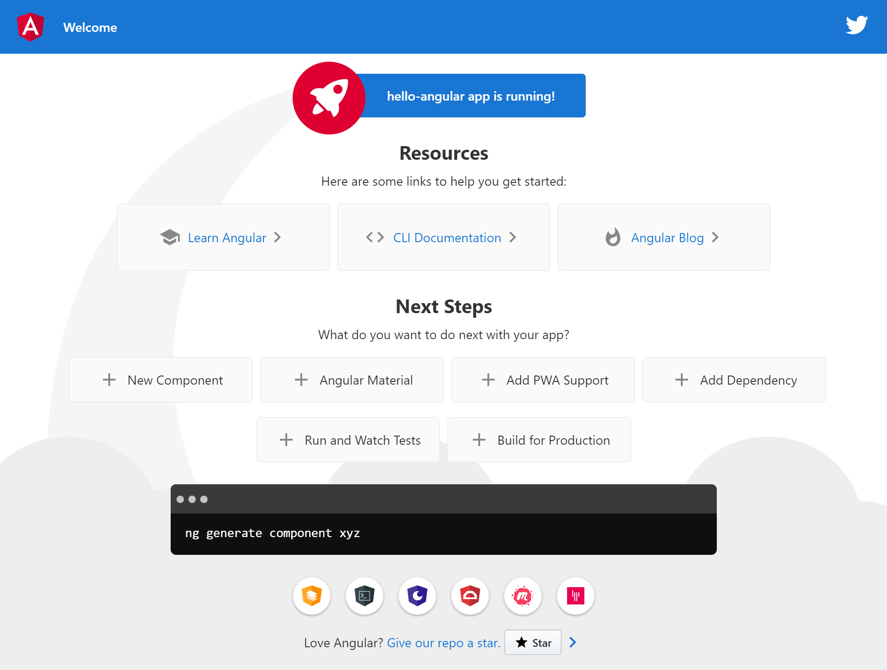
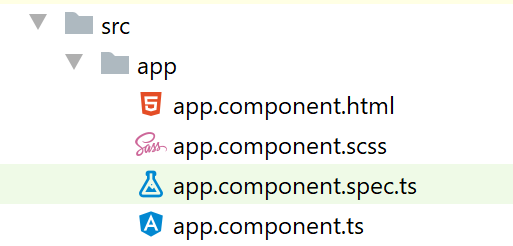
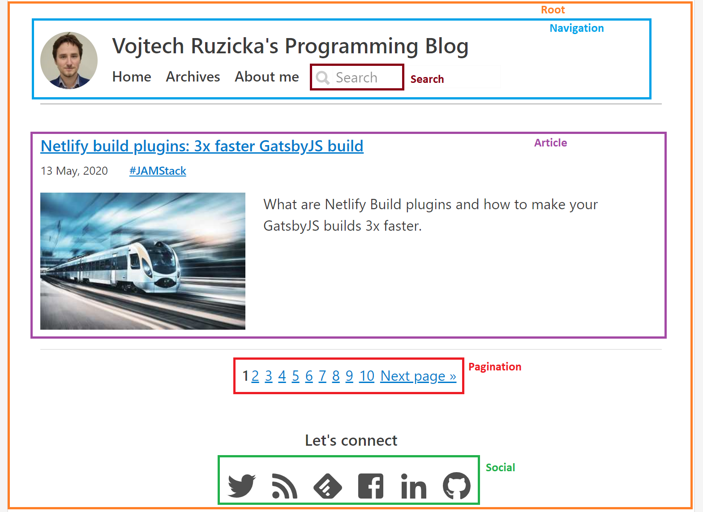
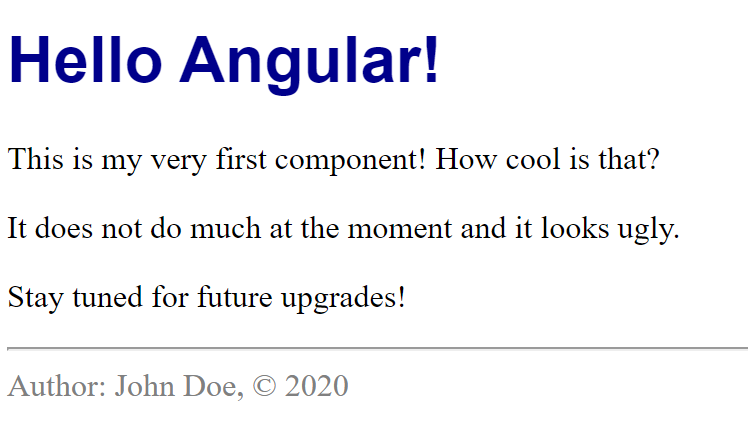

Angular apps are composed of components, which encapsulate view logic and styling. We'll focus on these in this part of the series.

<!--TODO remove this after they fix gatsby-remark-series -->
<div class="series-table-of-content">
  <div>All posts in the Angular Tutorial series</div>
  <ol>
    <li><a href="/angular/01-getting-started">Getting Started</a></li>
    <li><a href="/angular/02-building-blocks">Building Blocks</a></li>
  <li class="series-current">Components</li>
  <li><a href="/angular/04-data-binding">Data Binding</a></li>
  </ol>
</div>

## Getting started
Let's start with a fresh application to recap using Angular CLI. We need to generate a new project using `ng new`. Then navigate inside its directory and run `ng serve` to launch the local development server on `http://localhost:4200/`.

If all goes well, you should be able to see something similar to this:



What you can see is the `app.component`. In the next section, we'll replace it with our own new component. So let's get started by deleting the existing `app.component`. You can remove all these four files.



Note that now your app won't compile. Don't worry, we'll fix that soon enough.

## New component
Now let's create our first component called `main`. First, we'll need a typescript file to contain our component. Start by creating `main.component.ts` in `src/app` directory.

Each component is a Typescript class:

```
export class MainComponent {

}
```

### @Component decorator
Now we need to provide additional metadata to the component, so Angular know how to handle it. This is done using `@Component` decorator on the class level. Since this is not recognized by Typescript by default, we need to import it.

```
import {Component} from "@angular/core";

@Component()
export class MainComponent {

}
```

### Selector
Much better, but still not enough. We need to pass some metadata to the `@Component`. You can put in  a configuration object with various properties. Let's start with `selector`.

```
import {Component} from "@angular/core";

@Component({
  selector: 'app-main'
})
export class MainComponent {

}
```

A quick recap - selector is the name of HTML tag, which represents our component. In this case we can use `<app-main></app-main>` to use our component in `index.html`.

LEt's go there and replace `<app-root></app-root>` (the main component we previously deleted) with `<app-main></app-main>`.

```
<html lang="en">
  <head>
    <meta charset="utf-8">
    <title>HelloAngular</title>
    <base href="/">
    <meta name="viewport" content="width=device-width, initial-scale=1">
    <link rel="icon" type="image/x-icon" href="favicon.ico">
  </head>
  <body>
    <app-main></app-main>
  </body>
</html>
```

Note that our component is called `main` but the selector is `app-main`. Why is there the `app-` prefix? It is a good practice to have such prefix (can have different value) for your custom components. This allows you to easily distinguish you own components' tags from ordinary HTML tags and avoid collisions. It also allos you to distinguis your own components from any third-party components, which usually have their own prefix. You can even use different prefix in each module.

### Template
We have a component, but there is no HTML associated, which should be used for rendering it. Let's change that.

```
import {Component} from "@angular/core";

@Component({
  selector: 'app-main',
  template: '<h1>Hello Angular!</h1>'
})
export class MainComponent {

}
```

As you can see, `template` is used to sepcify a string, which represents HTML used to render our component. For now, we specified just a simple H1 heading with a hard-coded title.

### Updating app.module
Our component is now ready, but our project won't compile and there is no output in the browser.

If you remember the previous ost, you can guess what is wrong. Our module `app.module.ts` specifies which components should be recognized in `index.html`. And there is still the old `app.component`, which we deleted. Let's fix that. This is the current conents of `app.module.ts`.

```typescript {4,8,14}
import { BrowserModule } from '@angular/platform-browser';
import { NgModule } from '@angular/core';

import { AppComponent } from './app.component';

@NgModule({
  declarations: [
    AppComponent
  ],
  imports: [
    BrowserModule
  ],
  providers: [],
  bootstrap: [AppComponent]
})
export class AppModule { }
```
We need to change all occurences of `AppComponent` to `MainComponent`, including the import. The new content should be the following:

```typescript {4,8,14}
import { BrowserModule } from '@angular/platform-browser';
import { NgModule } from '@angular/core';

import {MainComponent} from "./main.component";

@NgModule({
  declarations: [
    MainComponent
  ],
  imports: [
    BrowserModule
  ],
  providers: [],
  bootstrap: [MainComponent]
})
export class AppModule { }
```

Note that our component here is referred to as `MainComponent`. This name corresponds to the Typescript class we used at the beginning:

```
export class MainComponent {

}
```

Now if you save your files and go to `http://localhost:4200/`, you should see the following page:


That is the same HTML we specified in the `template: '<h1>Hello Angular!</h1>'`.

### Expanding the template
Our component works, but it is rather simple. Let's expand its template a bit.

```
@Component({
  selector: 'app-main',
  template: `
    <h1>Hello Angular!</h1>
    <p>This is my very first component! How cool is that?</p>
    <p>It does not do much at the moment and it looks ugly.</p>
    <p>Stay tuned for future upgrades!</p>
  `
})
```

We added just a few lines of HTML for now, but in real applications, the template can become very big quickly.

In such case, it is not very nice to have big chunk of HTML in your component's Typescript file. It is harder to read and edit. Fortunately, we can move this template to a separate file. It is actually common practice unless the template is really small.

Let's create a new file in the same directory called `main.component.html` and copy our template inside.

Now we need to change `template` to `templateUrl` and give it path to our new HTML file.

```
@Component({
  selector: 'app-main',
  templateUrl: './main.component.html'
})
```

That's much cleaner. We have our template neatly separated from our Typescript file.

### Adding some styling
Our component works, but it does not look very pretty. We have no styling at all. Fortunately, we can easily add some with `styles`

```
@Component({
  selector: 'app-main',
  templateUrl: './main.component.html',
  styles: [`
    h1 {
      color: darkblue;
      font-family: sans-serif;
    }
  `]
})
```

Please note that styles is actually an array of strings rather that single string.

Same as with HTML template in our previous example, this is not very clean to have styles directly in your Typescript file, especially if they get longer.

Similarly to extracting HTML to a separate file, you can do the same with styles. Let's create a file called `main.component.scss` and move our styles inside. Then we can link it using `styleUrls`.

```
@Component({
  selector: 'app-main',
  templateUrl: './main.component.html',
  styleUrls: [
    './main.component.scss'
  ]
})
```

## Generating components
We managed to create our first component, but it was not very easy and convenient. Fortunately, Angular CLI allows you to create new components automatically. Just navigate in your terminal to the directory where you want your component to be createad (lets use `src/app/` for now) and run the following command:

```
ng generate component component-name
```

The last parameter `component-name` is the name of the component to be generated. You can achieve the same using a shorter syntax `ng g c component-name`.

his command creates a new directory with the name of your component and inside you'll find:

- Typescript component class
- HTML template
- Stylesheet file
- Unit test file (`.component.spec.ts`)

All the files are already linked together. What's more, your new component gets automatically added to `app.module`.

## Nesting components
We currently have just one component in our app. In real applications, this is rarely the case. Usually you have many components, which you combine together to create the desired output.

You ofteh have one root component in your `index.html` and the rest of the components are nested inside. The nesting can be multiple levels deep - that means you can have component inside a component inside another component. Also, components are reusable can can be used multiple times.



### Adding nested component
Let's try nesting in practice. First, we'll need a new component called `footer`,which we'll and into our `main` component. You already know that Angular CLI can help us here a lot:

```
ng generate component footer
```

The component was generated for us and also automatically registered in `app.module.ts`.

```
@NgModule({
  declarations: [
    MainComponent,
    FooterComponent
  ],
  imports: [
    BrowserModule
  ],
  providers: [],
  bootstrap: [MainComponent]
})
```

What's important is that `bootstrap` section still contains only `MainComponent` as it is the only component, which will be present in `index.html`. But note that our `FooterComponent` was added to the `declarations` section. That's important. All the components we use in our app (no matter whether they are used directlyin `index.html`) need to be in this section, so Angular can recognize them.


### Customizing footer
The HTML template of our new component, has already some content generated in `footer.component.html`. Let's change it to something more meaningful:

```
<hr>
<div class="footer">
  Author: John Doe, © 2020
</div>
```

We can also add some styling to `footer.component.scss`:

```
.footer {
  color: gray;
}
```

### Adding footer to the MainComponent
Now let's inspect `footer.component.ts` file, which was generated for us.

```
@Component({
  selector: 'app-footer',
  templateUrl: './footer.component.html',
  styleUrls: ['./footer.component.scss']
})
```

We need to know what `selector` was generated for us, so we can use it later. It is `app-footer`, so we can use `<app-footer></app-footer>` tag to represent our new component.

Now we want to nest the footer component in our MainComponent. We need to add it the HTML template of the MainComponent, which is in file `main.component.html`. Let's add our new tag there to the bottom.

```
<h1>Hello Angular!</h1>
<p>This is my very first component! How cool is that?</p>
<p>It does not do much at the moment and it looks ugly.</p>
<p>Stay tuned for future upgrades!</p>
<app-footer></app-footer>
```

Our lates changes should be reflexed in the browser. The footer component is nested at the bottom of our original MainComponent.



## What we've learned
Components are basic building blocks of Angular applications, they are encapsulated, can be reused and nested in each other.

You can easily create new components using Angular CLI with `ng generate component component-name`.

After creating a new component, you need to register it in your module in the `declarations` section. Only components used directly in your `index.html` need to be registered in `bootstrap` section.

Component metadata is specified using `@Component` decorator on the class level in your `.component.ts` file.

Each component needs a selector, which defines HTML tag, that can represent that component. It is useful to have a prefix for your components for better clarity and avoiding collisions.

Then each component also needs HTML template. It can be directly in your TS file using `template`, but it is often preferred to have it separately in a file using `templateUrl`.

It is very similar with styling. Although you can have styles directly in your TS with `styles`, it is preferrable to extract them in their own file(s) using `styleUrls`.

## What's Next
In the next part we'll cover [Data Binding](/angular/04-data-binding), which is useful for synchronizing data in and out of components and creating and handling events.

<!--TODO remove this after they fix gatsby-remark-series -->
<div class="series-table-of-content">
  <div>All posts in the Angular Tutorial series</div>
  <ol>
    <li><a href="/angular/01-getting-started">Getting Started</a></li>
    <li><a href="/angular/02-building-blocks">Building Blocks</a></li>
  <li class="series-current">Components</li>
  <li><a href="/angular/04-data-binding">Data Binding</a></li>
  </ol>
</div>


TODO link to git repo