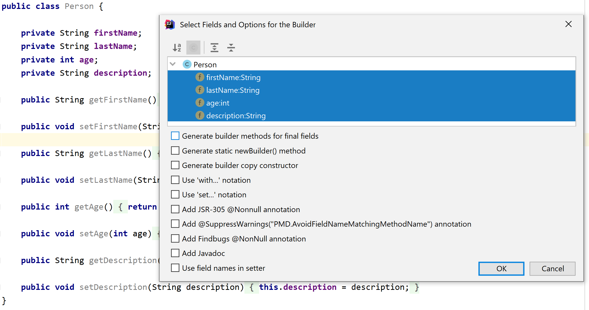

Telescoping constructor pattern is quite common practice. It has, however, some shortcomings. What are the alternative approaches and when should you use them?
<!--more-->

Telescoping Constructor
-----------------------

In Java, there is no support for default values for constructor parameters. As a workaround, a technique called \"Telescoping constructor\" is often used. A class has multiple constructors, where each constructor calls a more specific constructor in the hierarchy, which has more parameters than itself, providing default values for the extra parameters. The next constructor does the same until there is no left.

```java
    public Person(String firstName, String lastName) {
        this(firstName, lastName, "No description available");
    }

    public Person(String firstName, String lastName, String description) {
        this(firstName, lastName, description, -1);
    }

    public Person(String firstName, String lastName, String description, int age) {
        this.firstName = firstName;
        this.lastName = lastName;
        this.description = description;
        this.age = age;
    }
```

What\'s wrong with it?
----------------------

As long as there are only several attributes, everything seems to be ok. But as their number rises, problems start to begin. Such constructors are hard to read. They have many parameters - who know what the sixth one is? If the adjacent parameters have the same type, you can accidentally switch their values without compilation error and everything seems to be fine. Furthermore, you rarely know which optional parameters consumer wants to use for his scenario, which often results in constructor calls where the constructor has many parameters, but many of them are null. It is hard to read which variant of the object is being constructed without further investigation. When adding new parameters, you have to add new constructors to the chain. This pattern can therefore not scale very well - it is hard to maintain and from a certain number of parameters, constructors are insanely long and there is just too many of them.

Alternative 1 - JavaBeans
-------------------------

Probably the easiest and the most flexible and scalable alternative to implement is using [JavaBeans convention](http://www.oracle.com/technetwork/java/javase/documentation/spec-136004.html). In that case, you create the object using a parameter-less constructor and then you set only fields which you want using mutators (setter methods).

```java
private Person john = new Person();
john.setFirstName("John");
john.setLastName("Smith");
john.setAge(33);
john.setDescription("I am a huge fan on JavaBeans convention!");
```

[See full source here](https://gist.github.com/vojtechruz/7491ef6d99569a55cabfe2543cbe4354)

This has several advantages:

-   Easy to implement and change
-   Easy to read - setters are named and you know which fields are assigned which value instantly
-   Easy to scale - Adding more and more parameters is still easy

However, there are also disadvantages, which may or may not concern you depending on the scenario:

-   JavaBeans are mutable, which means their state can be changed using setters anytime after they are constructed. Their fields cannot be declared final, unlike those of objects solely created at once in constructors. There are several advantages having immutable objects, notably being thread safe. When an object construction is not an atomic operation, the object can be accessed in a state where it is not fully constructed yet.

Alternative 2 - Named Static Factory Methods
--------------------------------------------

One of the disadvantages of having multiple constructors is reduced readability. It is hard to distinguish one from another since constructors all have the same name. That is not a limitation of static factory methods. What are they?

```java
    public Person(String firstName, String lastName) {
        this.firstName = firstName;
        this.lastName = lastName;
    }

    public Person createNamedPerson(String firstName, String lastName) {
        return new Person(firstName, lastName);
    }

    public Person createUnknownPerson() {
        return new Person("John", "Doe");
    }
```

As you can see those are static methods, which return an instance of the enclosing class. There are some advantages over constructors, most notably:

-   Each can have a different descriptive name, unlike constructors, revealing the intent of that method.
-   Is not required to return a brand new instance every single time - can be used for instance caching, pooling etc.

Unlike JavaBeans, static factory methods can return immutable instances, when delegating to appropriate constructor. However, like constructors, they do not scale well and are not suitable when there is a lot of different parameters, which can be used in any combination.

Alternative 3 - Builder
-----------------------

If the immutability is an issue, popular approach how to construct objects with many parameters is a Builder as described by [Joshua Bloch](https://twitter.com/joshbloch) in his [Effective Java](http://www.amazon.com/Effective-Java-2nd-Joshua-Bloch/dp/0321356683)(See *Chapter 2 - Creating and Destroying Objects - Item 2: Consider a builder when faced with many constructor parameters*). Do not confuse with [Gang of Four](http://c2.com/cgi/wiki?GangOfFour) Builder pattern, which focuses more on separating process of construction and an actual builder, which performs that construction. That means, keeping the build process, consisting of the same steps every time, while being able to switch builders involved. [See more about Builder Pattern here](http://www.oodesign.com/builder-pattern.html).

### How does it work?

The process is similar to using StringBuilder.

1.  You create an instance of your builder. Optionally, you can provide always required fields in the constructor.
2.  One by one, you set fields, which should be part of the build. Usually, to make things more convenient, the builder returns itself, so you can chain the method calls ([fluent interface](http://martinfowler.com/bliki/FluentInterface.html)).
3.  Once you are done, you call build() method and receive the constructed object. Under the hood, the builder calls the constructor of the constructed object. It is therefore constructed all at once and can be thus immutable.

 

```java
PersonBuilder builder = new PersonBuilder();
Person bob = builder.firstName("Bob")
                    .lastName("Builder")
                    .age(33)
                    .description("Man I love building stuff!")
                    .build();
```

### Inner vs Standalone Builder

There are two basic builder approaches.

-   Builder as a separate class. [(See the source code)](https://gist.github.com/vojtechruz/3162a7e5525d242e50935e93149208a1)
-   Builder as a static inner class. Static here means that it can be instantiated separately independently on the enclosing class instance. The advantage here is that unlike separate class, it has access to private members of enclosing class. It means that you can declare constructor private, effectively prohibiting direct instantiation. Only the builder can now be used to instantiate the class. [(See the source code)](https://gist.github.com/vojtechruz/1ea4f51a016002bbdd0d493b049140dc)

The choice is mostly a matter of preference. Many people consider convenient having the builder as an inner class, bundled all together. Also having private constructor is quite common. Personally I generally avoid inner classes and as such, I like to have my Builders separate (although in the same package). I like having separate construction of the class from the class itself, I consider it two different responsibilities according to Single Responsibility Principle. I also rarely prohibit direct instantiation, unless there is a special need for it. If necessary, having the constructor package private means you can still have a separate builder in the same package while preventing instantiation from the outside.

### Automatic Builder Generation {#automatic-builder-generation style="text-align: justify;"}

The builder is fortunately quite easy to generate. The best way is to use your favorite IDE for that. For example, there is a nice plugin for IntelliJ IDEA [innerbuilder](https://github.com/analytically/innerbuilder), which can be used to generate inner class builders from your classes.



Conclusion
----------

The Builder is no silver bullet, which should be used every time you face a higher number of constructor parameters and telescoping constructors. The usage depends on the specific situation. Each approach has advantages and tradeoffs. Depending on your priorities, you should choose the best-suited one. The process may be similar to the following:

1.  Why do I actually have that many parameters? It may be a red flag that the class has too many responsibilities. Can some of those be extracted? Are some of the fields in such a close relation, that they should be encapsulated in a specialized class (e.g. Address fields such as street, city, and country).
2.  Is the number of fields small enough? Will I in my case benefit from immutability? Is there only a few valid combinations of optional fields and the rest can be replaced by known defaults? In such case, let\'s maybe keep it simple and stick with just constructors.
3.  Too many fields, but immutability is not that important? Maybe the fields need to change too much and creating new instances every time is too much of an overhead? Maybe there is no concurrency involved? Let\'s stick with simple JavaBeans convention and just use setters for object construction.
4.  Do we care about our constructed object being immutable? Thread safe? Let\'s stick with Builder.
5.  Is the construction process complex? Is it likely that the process will stay the same (meaning steps involved), but it may be handy to produce different outputs (e.g. tailored to a different environment) by following the same sequence of steps? Then Gang of Four Builder Pattern may be the way to go.
