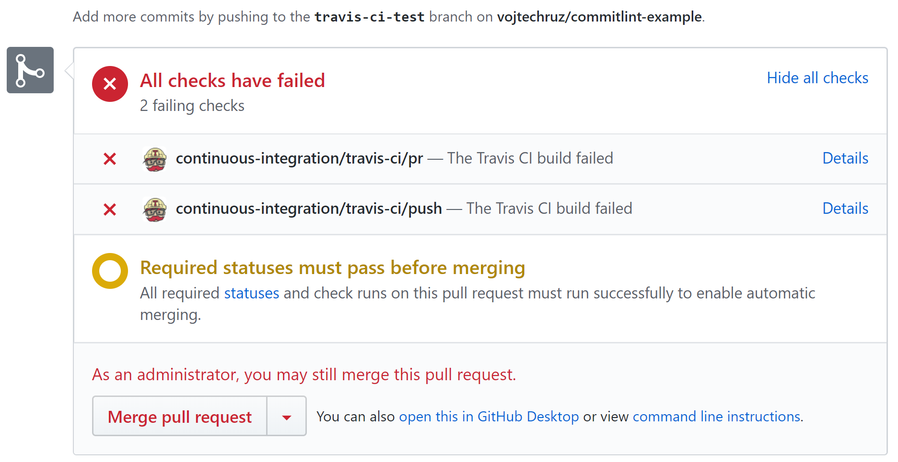
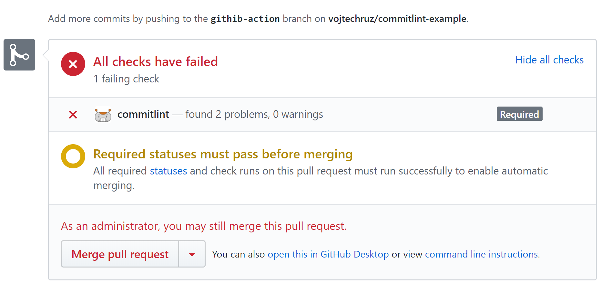

<PostHeader frontmatter={props.data.mdx.frontmatter} />

## Commit conventions
Although you can put pretty much anything in your commit messages, it is beneficial to have a more standardized and structured approach. It is better to stick to a convention, so all your commit messages follow the same structure. This has many advantages:

- Your commit history is more readable and easier to navigate
- You can automatically generate changelogs
- Based on the type of changes, you can properly bump your version when using [semantic versioning](https://semver.org/): 
  - major: when introducing breaking changes 
  - minor: when adding a feature
  - fix: when adding a fix

There are various conventions. One example can be [Conventional Commits](https://www.conventionalcommits.org/).

Conventions can be very useful, but only as long as you can make sure everybody follows them. You can rely on your developers' discipline, but it is risky. Especially with external contributors to your codebase who may not be familiar enough with your convention. What's much better is having an automated tool to check your commits for you and reject them if they don't follow your conventions.

## Githooks & Husky
Fortunately, Git already allows you to perform some actions when specific events are triggered. It is called git hooks. You can react in many phases of the git workflow, such as:

- pre-commit
- pre-push
- pre-rebase
- post-update

The bad news is that this is configured locally in your `.git` directory, so by default, each developer needs to be sure to install their hooks. If they don't, there are no checks, and you cannot check your conventions.

Fortunately, there is a tool called Husky for Node/NPM projects, which solves this issue. You can define your hooks in your project and they are automatically installed for you when running the project. This way all the developers will have proper hooks installed with no effort. If you need to change your hooks, you can do it n just one place, and it gets propagated to all your developers. You can read more about Husky in one of my previous posts:

<PostLink node={props.pageContext.links["/githooks-husky"]} />

While Husky can be used to enforce your commit conventions, it can do much more. You can run your static code analysis, tests, automatic code formatting, and much more when committing.

## Commitlint
Commitlint is an automated tool that can check your commit conventions for you and reject the commit if it does not follow your rules. These rules, of course, can be configured. Under the hood, Commitlint uses Husky git hooks.

## Local setup

### Husky
Since Commitlint utilizes Husky, we need to install it first. Husky is provided as dev-dependency, so it is used only locally and not bundled with your production code.

```bash
npm install --save-dev husky
```

Now we need to register a hook for checking a commit message. The hook is called `commit-msg` and can be registered in your `package.json`.

```json
{
  "husky": {
    "hooks": {
      "commit-msg": "commitlint -E HUSKY_GIT_PARAMS"
    }  
  }
}
```

Alternatively, you can use a dedicated `.huskyrc` file, which contains only Husky configuration:

```json
{
  "hooks": {
    "commit-msg": "commitlint -E HUSKY_GIT_PARAMS"
  }
}
```

### Commitlint
Now when We have Husky, we need to install Commitlint CLI, which will be executed by Husky hook to validate commit messages. Again, it is just a dev dependency, which is not included in your production bundle.

```bash
npm install --save-dev @commitlint/cli
```

### Convention configuration
Commitlint is just a tool for checking if your messages follow your conventions. It does not force you to use a specific convention, you can use whatever you want, it is fully configurable. It offers some configurations out of the box. Currently supported configurations are:

- [@commitlint/config-conventional](https://github.com/conventional-changelog/commitlint/tree/master/%40commitlint/config-conventional)
- [@commitlint/config-lerna-scopes](https://github.com/conventional-changelog/commitlint/tree/master/%40commitlint/config-lerna-scopes)
- [@commitlint/config-patternplate](https://github.com/conventional-changelog/commitlint/tree/master/%40commitlint/config-patternplate)
- [@commitlint/config-angular](https://github.com/conventional-changelog/commitlint/tree/master/%40commitlint/config-angular)
- [@commitlint/config-angular-type-enum](https://github.com/conventional-changelog/commitlint/tree/master/%40commitlint/config-angular-type-enum)

Let's use `@commitlint/config-conventional` for now, but the process would be the same for any different configuration. We just need to install the proper package:

```bash
npm install --save-dev @commitlint/config-conventional
```

The last step is to create a Commitlint configuration file, where you define, which configuration should be used. We'll set up the one we just installed. Create a new file called `commitlint.config.js` in the root directory.

```javascript
module.exports = {
    extends: ['@commitlint/config-conventional']
};
```

### Verifying the setup
Now we're good to go. Let's just make sure everything works. Let's make sure our commit messages are tested against the [Conventional Commits](https://www.conventionalcommits.org/) specification. Let's try an ordinary, not structured commit message first.

```bash
C:\projects\commitlint-example>git commit -m "created base project structure"
husky > commit-msg (node v10.16.3)
⧗   input: created base project structure
✖   subject may not be empty [subject-empty]
✖   type may not be empty [type-empty]

✖   found 2 problems, 0 warnings
ⓘ   Get help: https://github.com/conventional-changelog/commitlint/#what-is-commitlint

husky > commit-msg hook failed (add --no-verify to bypass)
```

The commit was rejected due to missing subject and type. Let's fix that.

```bash
git commit -m "feat: created base project structure
```

Now the commit was accepted. We added the type of the commit `feat` and the part after the colon `:` is considered the subject.

The full structure of conventional commits is the following:

```
<type>[optional scope]: <description>

[optional body]

[optional footer(s)]
```

## Continous Integration
Local setup, as described above, is necessary and useful as the first line of defense. However, it is not bulletproof. Developers can tinker with the local setup or suppress git hooks. You cannot rely purely on the local Husky setup. As another line of defense, it is viable to integrate Commitlint with your CI / remote repository. You can reject invalid commits on the server even if developers manage to sneak them in locally.

### Travis
Commitlint supports integration with [Travis CI](https://travis-ci.org/). First, let's create a `.travis.yml` file in your root directory. We need to configure that it should run the Commitlint script.

```yaml
language: node_js
node_js:
  - node
script:
  - commitlint-travis
```

Now we need to install Travis support in our project:

```bash
npm install --save-dev @commitlint/travis-cli
```

Now Travis can watch your Pull Requests and check whether new commits are compliant.



### Commitlint GitHub action
Even simpler alternative to Travis is adding a [GitHub Action](https://github.com/features/actions). [There is an action for Commitlint available](https://github.com/z0al/commitlint-bot).

The setup is super-easy. You just need to click `Install`, then select whether this action should apply for all your repos or just selected ones. And that's it. Now, whenever you create a Pull Request, it will be automatically checked by Commitlint.

Now if your PR contains invalid commit messages, the checks will fail:



And you will get a comment explaining all the failures:


## Commit message wizard
Conventions are useful, but what's even more useful is to have some tool, which can help you compose valid commit messages. Especially when your convention is new, there are new joiners or external contributors. Fortunately, there are tools available that help you with crafting compliant commit messages.

### Prompt CLI
Commitlint offers a tool, basically a command-line wizard, which lets you create your commit messages based on a series of questions. It is called [@commitlint/prompt-cli](https://github.com/conventional-changelog/commitlint/tree/master/%40commitlint/prompt-cli). You can easily install it:

```bash
npm install --save-dev @commitlint/prompt-cli
```

Now you can register `commit` command in your `package.json`.

```json
{
  "scripts": {
    "commit": "commit"
  }
}
```

Now instead of `git commit`, you can run `npm run commit`. It launches an interactive wizard in your console, which will ask you for all the parts of a commit message such as type, subject, and so on.

```
Please enter a type: [required] [tab-completion] [header]
<type> holds information about the goal of a change.

<type>(<scope>): <subject>
<body>
<footer>

72 characters left
❯ type:
```

What's cool is that this wizard automatically loads your configuration from your `commitlint.config.js` and behaves based on that config.

### Commitizen
Another option instead of `prompt-cli` is a third-party solution called [Commitizen](http://commitizen.github.io/cz-cli/).

It is also a wizard, which lets you easily create specification-compliant commit messages.

## Custom configuration
If you're not happy with any settings of the predefined conventions, you can override them and provide some more configuration options for linting. This can be done in the `commitlint.config.js` file, which we already created.

The detailed configuration is beyond the scope of this article, but you can check [the official configuration documentation](https://commitlint.js.org/#/reference-configuration) and the list of [all available rules](https://commitlint.js.org/#/reference-rules).

## Example repo
You can find an example repository I created with fully set up Commitlint [here](https://github.com/vojtechruz/commitlint-example/). It also includes Travis integration and `prompt-cli` with examples of rejected PRs.

## Conclusion
Having convention for commit messages has many benefits, and you can use many automated tools to utilize that. Automatic generation of changelogs and version bumps are no longer a problem. Not to mention much better readability. Commitlint helps you with that both locally and on your Continous Integration server.

Husky, used by Commit lint, is a powerful tool for managing git hooks and can be used not only for commit messages but also for a wide variety of other quality checks.
