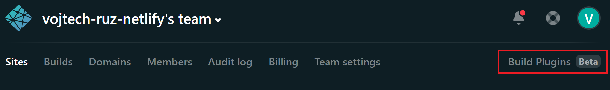
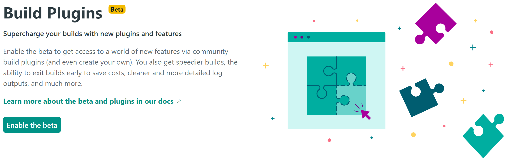
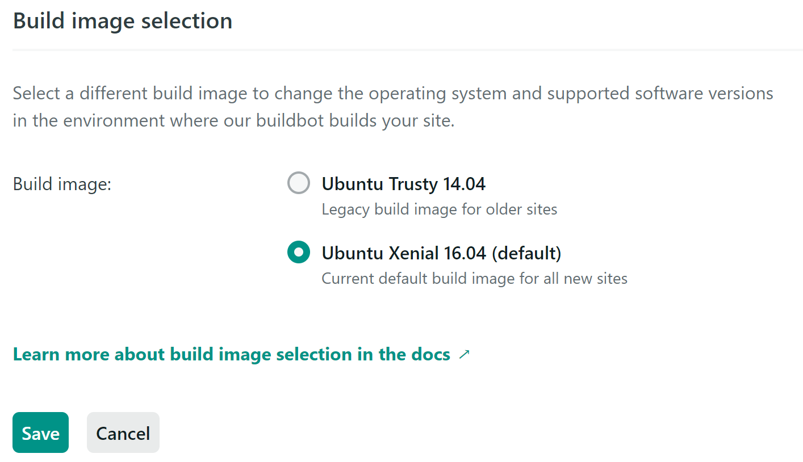

<PostHeader frontmatter={props.data.mdx.frontmatter} />

<Info><b>UPDATE:</b> Build plugins are no longer in beta and are <a href="https://www.netlify.com/blog/2020/05/27/netlify-build-plugins-are-here/">officially available</a>.</Info>

## Netlify build plugins
Netlify build plugins allow you to run custom plugins as a part of your Netlify build process. This allows you to alter your build and run some additional actions.

## Enabling plugins
Netlify build plugins are not enabled by default. This feature is still in beta (as of 5/2020). You can, however, explicitly enable beta build plugin support. Just click on the link `Build Plugins` in the main navigation.



Now simply click `Enable the beta` button:



Now you need to select which repositories should be enabled for plugins. Note that for sites to be available for plugins, they need to be based on the `Xenial` image. New sites should be based on this by default, but for older sites, you might need to change the image explicitly. You can find this configuration under your [site settings](https://docs.netlify.com/configure-builds/get-started/#build-image-selection):

```
Settings → Build & Deploy → Build image selection
```



After selecting repositories, you can see the list of available plugins.

## Configuration
Plugins are not enabled and configured directly from the Netlify UI. Instead, you enable and configure your build plugins in `netlify.toml` file, which should be located inside your project on the root level.

The configuration for [netlify-plugin-gatsby-cache](https://github.com/jlengstorf/netlify-plugin-gatsby-cache) can be as simple as this:

```toml
[build]
  publish = "public"

[[plugins]]
package = "netlify-plugin-gatsby-cache"
```

If you have plugins enabled for your site and this configuration file is present, Netlify will automatically trigger any build plugins defined in your file with the provided settings.

## Gatsby cache plugin
This blog uses GatsbyJS as a static site generator. Originally, the build would take quite a lot of time. This is usually not a problem with GatsbyJS - only the original build takes long, but the subsequent builds are much faster due to Gatsby's cache. Netlify does not preserve this cache by default, so each build is long.

Even if the deployment time is not critical for your application, it can help a lot to improve it. That's because after running out of build minutes, you have to pay for more. And the free plan only currently offers 300 build minutes.

Fortunately, there is a Netlify build plugin called [netlify-plugin-gatsby-cache](https://github.com/jlengstorf/netlify-plugin-gatsby-cache), which fixes this and makes the subsequent builds much faster.

My current site is as follows:
- 4087 image thumbnails (various sizes)
- 119 GraphQL queries
- 92 articles

Without the plugin the build takes **13m 20s**. With the plugin it takes **3m 44s**. That is 3.57x faster!

The time can vary as it depends on the size of your site and the changes that you make.

The official docs also [provide examples of time reduction](https://github.com/jlengstorf/netlify-plugin-gatsby-cache#how-much-of-a-difference-does-this-plugin-make-in-build-times):

| Site Size                                                                           | No Cache  | Cache    | Savings |
|-------------------------------------------------------------------------------------|-----------|----------|---------|
| <ul><li>231 GraphQL queries</li><li>1,871 images</li><li>224 pages</li></ul>        |  293207ms | 72835ms  | 75%     |
| <ul><li>5 GraphQL queries</li><li> No image processing</li><li> 32 pages</li></ul>  |  22072ms  | 15543ms  | 30%     |

## More plugins
There are currently 20 plugins available, featured on the Netlify site. Here are some of the interesting ones:

- [netlify-plugin-a11y](https://github.com/sw-yx/netlify-plugin-a11y): Validate your site with a11y and fail the build if there are accessibility problems.
- [netlify-build-plugin-speedcurve](https://github.com/tkadlec/netlify-build-plugin-speedcurve): Test your performance using SpeedCurve after each deploy.
- [netlify-plugin-checklinks](https://github.com/munter/netlify-plugin-checklinks): Check your site for broken links.
- [netlify-plugin-inline-source](https://github.com/Tom-Bonnike/netlify-plugin-inline-source): Inline some of your assets to reduce the amount of HTTP request and increase performance.
- [netlify-plugin-sitemap](https://github.com/netlify-labs/netlify-plugin-sitemap): Automatically generate sitemap of your site.
- [netlify-plugin-rss](https://github.com/sw-yx/netlify-plugin-rss): Generate RSS feed for your site.

## Additional resources
- [Introducing Netlify Build Plugins](https://www.netlify.com/build/plugins-beta/)
- [What's a Netlify Build Plugin Series](https://www.netlify.com/blog/2020/04/30/whats-a-netlify-build-plugin-series-part-1-using-build-plugins/)
- [Build plugins documentation](https://docs.netlify.com/configure-builds/build-plugins/)
- [How to make your own build plugin](https://www.netlify.com/blog/2019/10/16/creating-and-using-your-first-netlify-build-plugin/)