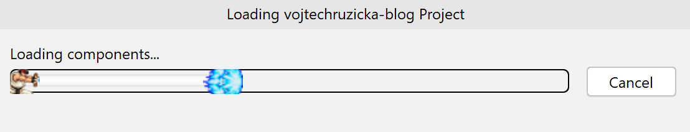

## [Key promoter X](https://plugins.jetbrains.com/plugin/9792-key-promoter-x/)
Using keyboard shortcuts instead of your mouse can greatly increase your productivity. With so many features IDEA offers, it can be intimidating and difficult to learn all the shortcuts. Fortunately, there is a plugin called [Key Promoter X](/learning-intellij-idea-keyboard-shortcuts/), which can help you. 

The idea is simple: whenever you use your mouse to invoke a command in your IDE, a popup is shown, which tells you what the keyboard shortcut for this action is.

It even offers you to assign a keyboard shortcut to an action just performed if there is none yet. After a while, it gets so annoying, that you rather make sure you remember your keyboard shortcuts.

## [Snyk](https://plugins.jetbrains.com/plugin/10972-snyk-vulnerability-scanning/)
Application security is often unfortunately neglected. These days most of the application code comes from third-party libraries and frameworks. You need to make sure you use new versions without security vulnerabilities. There are tools, which can help you with this. One of them is Snyk.

<h4 class="front-post-title" style="margin-bottom: 0.375rem;"><a href="/snyk-detecting-dependencies-with-known-vulnerabilities/" style="box-shadow: none;">Snyk – Detecting dependencies with known vulnerabilities</a></h4><small class="front-post-info">22 November, 2017
<ul><li><a href="/tags/security/">#Security</a></li></ul>
</small>
<a class="front-post-image" href="/snyk-detecting-dependencies-with-known-vulnerabilities/">

<picture></picture><noscript><picture></picture></noscript>
</a>How to detect and fix security vulnerabilities in your dependencies using Snyk?

Snyk offers many features. One of them is [IDE plugin](/idea-snyk-plugin/), which can scan your dependencies and detect what security vulnerabilities they contain.

## [Presentation assistant](https://plugins.jetbrains.com/plugin/7345-presentation-assistant/)
This is a simple plugin, which shows a pop-up notification every time you perform an action in IDEA. It shows what action was performed and what is the keyboard shortcut associated with it.

This can be very useful when [presenting](/intellij-idea-tips-tricks-presentations/), during screencasts, pair programming and so on. Especially when using keyboard shortcuts, it can be difficult to follow what's happening without this plugin.

## [Edu Tools](https://plugins.jetbrains.com/plugin/10081-edutools/)
This is a great plugin for coding lessons, workshops, and so on. It allows you to build courses, with a set of tasks, which can be performed directly in your IDE. You can build your own courses or import public courses.

<h4 class="front-post-title" style="margin-bottom: 0.375rem;"><a href="/idea-edu-tools/" style="box-shadow: none;">IDEA EduTools: Learning directly in your IDE</a></h4><small class="front-post-info">05 May, 2019
<ul><li><a href="/tags/idea/">#IDEA</a></li></ul>
</small>
<a class="front-post-image" href="/idea-edu-tools/">

<picture><source srcset="/linked/idea-edutools/54d54/idea-edu-tools.jpg 45w,
/linked/idea-edutools/357ff/idea-edu-tools.jpg 90w,
/linked/idea-edutools/3dfd4/idea-edu-tools.jpg 180w,
/linked/idea-edutools/00260/idea-edu-tools.jpg 270w,
/linked/idea-edutools/eecda/idea-edu-tools.jpg 360w,
/linked/idea-edutools/4d2f6/idea-edu-tools.jpg 900w" sizes="(max-width: 180px) 100vw, 180px"></picture><noscript><picture><source srcset="/linked/idea-edutools/54d54/idea-edu-tools.jpg 45w,
/linked/idea-edutools/357ff/idea-edu-tools.jpg 90w,
/linked/idea-edutools/3dfd4/idea-edu-tools.jpg 180w,
/linked/idea-edutools/00260/idea-edu-tools.jpg 270w,
/linked/idea-edutools/eecda/idea-edu-tools.jpg 360w,
/linked/idea-edutools/4d2f6/idea-edu-tools.jpg 900w" sizes="(max-width: 180px) 100vw, 180px" /></picture></noscript>
</a>Study programming courses directly in your IDE or create your own.

This is available either as a separate plugin or as [IntelliJ IDEA Edu Edition](https://www.jetbrains.com/education/download/#section=idea), which is basically IDEA Community edition with this plugin already bundled.

## [Extra icons](https://plugins.jetbrains.com/plugin/11058-extra-icons/)
This is basically an icon pack, which provides new icons for special files such as Travis configuration, `package.json`, lint config, and many more.

This can be very useful as you can immediately recognize these special files, and your project is, therefore, much easier to navigate. For example, `package.json` is a json file, but it is much more useful to have a special icon for it as it is an important file for npm projects.

# [Grazie](https://plugins.jetbrains.com/plugin/12175-grazie/)
**UPDATE:** As of 2020.1, Grazie is bundled by default in IntelliJ IDEA.

IntelliJ IDEA has a basic spelling checker, which allows you to detect some typos, but it is not much useful on top of that. It is definitely not a replacement for dedicated grammar checking services such as [Grammarly](https://app.grammarly.com/).

Fortunately, there is a plugin called Grazie, which enhances the basic spell checker with a lot of useful features. It also detects more advanced issues, such as incorrect grammar. It works completely offline, as well.

It allows you to enable checking of commit messages as well. You can learn more in the blog post [Meet Grazie: the ultimate spelling, grammar, and style checker for IntelliJ IDEA](https://blog.jetbrains.com/idea/2019/11/meet-grazie-the-ultimate-spelling-grammar-and-style-checker-for-intellij-idea/).

## [Maven Helper](https://plugins.jetbrains.com/plugin/7179-maven-helper)
IDEA already has powerful tools for [analyzing your dependencies](https://www.vojtechruzicka.com/idea-analyzing-dependencies) and potential problems with them, such as conflicts or cyclic dependencies.

Maven helper offers an alternative UI, which shows your dependencies hierarchically. This can be easier to read and navigate. Also, if you're using the community edition, this is your only option.

## [InnerBuilder](https://plugins.jetbrains.com/plugin/7354-innerbuilder/)
Creating complex objects can be hard. Of course, you can stick with a simple POJO with a whole bunch of setters, but you cannot enforce that created objects have all the required fields and are not used in an incomplete state. To solve this, you need constructors. With more complex objects, this can lead to a whole bunch of [telescopic constructors](https://www.vojtechruzicka.com/avoid-telescoping-constructor-pattern/) with many parameters. In these cases, using a builder is much more appropriate.

This plugin can automatically generate a builder for you from a POJO.

## [Rainbow Brackets](https://plugins.jetbrains.com/plugin/10080-rainbow-brackets/)
If you are struggling with a lot of nested blocks and a lot of brackets, this plugin is for you. It makes it very easy to locate matching brackets as each pair of brackets is color-coded.

It is quite hard to read with the default color theme, so Darcula is much more suitable for use with this plugin.

## [Indent Rainbow](https://plugins.jetbrains.com/plugin/13308-indent-rainbow/)

This plugin is similar to Rainbow brackets, but it does not color your brackets, but rather your indentation. It can be beneficial if you have a lot of indentation levels, which are harder to navigate. It can even mark lines, which don't mark proper indentation levels with red, so it is immediately obvious when there is a mismatch.

Again, this is much less visible in the light theme, so Darcula may be a better choice. 

## [String Manipulation](https://plugins.jetbrains.com/plugin/2162-string-manipulation/)
This is a handy plugin, which allows you to perform various actions with your strings such as:
- Escaping/un-escaping for various contexts (Java, HTML, XML, SQL, ...)
- Case switching (lower, upper, kebab, pascal, camel, ...)
- Sorting
- Grep
- Trimming

## [Git Toolbox](https://plugins.jetbrains.com/plugin/7499-gittoolbox/)
Although git support in IntelliJ is already pretty good, this plugin still offers some useful features on top of that.

You can easily see how many commits is your branch ahead/behind. You can configure automatic fetch with configurable frequency. You can automatically see inline blame information on your current line. 

## [Request Mapper](https://plugins.jetbrains.com/plugin/9567-request-mapper)
IDEA already offers pretty powerful navigation among files. When working with REST endpoints, you may sometimes prefer to navigate to a specific mapping (such as `/persons`) instead of class (such as `PersonController`). This is in cases where you know the URL, but don't remember which class or method it corresponds to. After pressing the associated keyboard shortcut, you can search your URL mappings and navigate to them directly.

The plugin currently supports Spring, JAX-RS, and Micronaut.

## [Multirun](https://plugins.jetbrains.com/plugin/7248-multirun/)
IDEA [does support running multiple tasks (configurations) at once](https://www.jetbrains.com/help/idea/creating-compound-run-debug-configuration.html), however, this feature is currently very limited.

Multirun plugin does support running multiple configurations at once with much more sophisticated options. This can be very useful when running both Backend and Frontend at once, testing multiple modules, and so on.

## [IDEA Mind Map](https://plugins.jetbrains.com/plugin/8045-idea-mind-map/)
It can be very useful to have a mind map editor and viewer directly integrated in your IDE. Not only for quick brainstorming, but also for documentation. The plugin works with `MMD` files, which are text-based, so it is very easy to have your mind maps under version control and manage their changes.

## [Codota](https://plugins.jetbrains.com/plugin/7638-codota) and [TabNine](https://plugins.jetbrains.com/plugin/12798-tabnine/)

These two plugins are similar. They enhance your autocomplete based on scanning open-source projects and intelligently predicting what you probably want to type based on the context.

With Codota, you can also look up relevant examples of some class or method in public projects, which can be handy.

## [Nyan cat progress bar](https://plugins.jetbrains.com/plugin/8575-nyan-progress-bar)
Want to make waiting when idea is loading or building indices more fun? You can replace IDEA progress bars with a [Nyan cat](https://www.youtube.com/watch?v=QH2-TGUlwu4) version.

If you're a fan of Street Fighter, you can have [Hadouken version](https://plugins.jetbrains.com/plugin/12453-hadouken-progress-bar) instead.

## [Grep console](https://plugins.jetbrains.com/plugin/7125-grep-console)
This is a powerful plugin with a lot of useful features. It allows you to filter your console output, add custom highlighting or folding of similar line groups. You can even play sound or execute a script when a specific line type occurs in your console output. You can also tail files in your project and much more.

## Is something missing?
What are your favorite IDEA plugins? Share in the comments below.