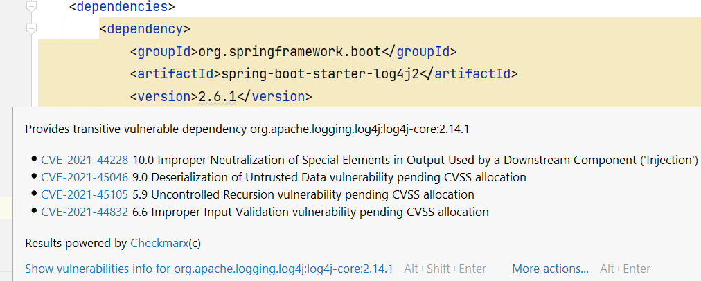
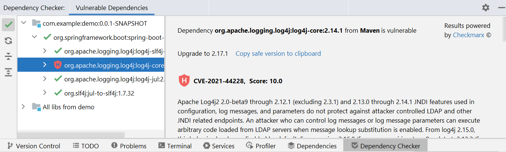

## Dependencies with security vulnerabilities
Making sure your application is as secure as possible is very important. Having security vulnerabilities can lead to serious consequences if they are exploited. You should always make sure your own code is as safe as possible.

However, the core code of your application, which you write yourself, is only the tip of the iceberg. These days, the vast majority of the deployed code is not what you write yourself, but rather various third-party libraries and frameworks. Even the simplest web applications usually have hundreds of thousands of lines of code, which are brought with third-party dependencies.

It is very hard to make big and complex frameworks secure. Not only are they very complicated, but they also depend on numerous dependencies of their own. It is not a question IF your libraries contain security vulnerabilities, but rather WHEN they are discovered. Once discovered, they are usually fixed quickly, and the next version is released.

The problematic part is that applications are not that fast with adopting new versions with security fixes. It can take months or even years to upgrade. First of all, you have to know there is a new version. Then you have to know whether to upgrade or not. Were there important security fixes or just some minor bugfixes? Is the fix important enough to justify upgrading cost, especially if there were changes breaking the backward compatibility?

## Detecting vulnerabilities automatically
In the past, detecting vulnerable dependencies was difficult. There were public databases of security vulnerabilities, but you had to check them manually. Needless to say that only a minority of developers bothered to check. It was just too much trouble.

Fortunately, later, automatic tools became available, which could scan your dependencies and cross-check with vulnerability databases. One example can be [OWASP Dependency Check](https://www.vojtechruzicka.com/detecting-dependencies-known-vulnerabilities/). Later, even more powerful services appeared, most notably Snyk.

<PostLink node={props.pageContext.links["/snyk-detecting-dependencies-with-known-vulnerabilities/"]} />

It can be integrated with your Continuous Integration to break the build if critical vulnerabilities are found. What's more, it can even monitor your app, and once a new version fixing your vulnerabilities is released, it will automatically create a Pull request with the new version. How cool is that?

## Detection directly in your IDE
Having a check for security vulnerabilities integrated as a part of your CI process is important and necessary, but it comes a bit late in the development pipeline.

It would be much better if you could check locally when adding a new dependency whether there are no security issues. This way, you could discover potential problems much earlier in the process. Snyk offers a CLI tool, which you can use, but for regular checking it can be too cumbersome, and you have to remember to run it every time.

Fortunately, Snyk recently released also IntelliJ IDEA plugin, which monitors your dependencies and can show you security vulnerabilities directly in your IDE.

## Snyk plugin
<Info>The plugin is available for free for both the Community and Ultimate editions.</Info>


The [Snyk Plugin](https://plugins.jetbrains.com/plugin/10972-snyk-vulnerability-scanning) is available directly from the plugin marketplace. You can access it using `Settings → Plugins`.


Once you install it and restart your IDE, a new tab is available:


It shows all the dependencies with known security vulnerabilities, which your app uses. You can expand individual dependencies to explore the transitive dependencies, which introduce the vulnerability.


If there is a new version, which fixes the dependency, Snyk suggests a version to upgrade to, which is very useful. You can click the name of a dependency, and Snyk automatically navigates you to the place, where it is declared in you `pom.xml`.

Finally, you can click the `details` link of each vulnerability, which navigates you to a web page in the Snyk vulnerability database with a detailed description of this particular vulnerability. You can then evaluate yourself how critical it is, what can you do to mitigate it a whether it applies in your case or not.


## Maven only
Unfortunately, currently (as of 6/2019), the plugin supports only Maven and not Gradle. If you are using Gradle, you can stick With CLI or CI check, which does support it. However, according to Snyk, Gradle support is planned. Hopefully, it will be available soon. 

## UPDATE 7/2019: Eclipse support
Since 7/2019 there is an IDE plugin not only for IntelliJ IDEA, but [also for Eclipse](https://snyk.io/blog/fix-open-source-vulnerabilities-directly-from-your-eclipse-ide/).

## UPDATE 4/2022: Bundled Checkmarx plugin
Starting with IDEA Ultimate version 2022.1, [Package Checker](https://plugins.jetbrains.com/plugin/18337-package-checker) plugin [is bundled with the installation](https://blog.jetbrains.com/idea/2022/04/ensure-greater-software-security-with-package-analysis-by-checkmarx-in-intellij-idea/). It allows you to also check for vulnerable dependencies both in Maven and Gradle projects.
The plugin checks your dependencies against the [NIST National Vulnerability Database](https://nvd.nist.gov/) and [Checkmarx](https://checkmarx.com/) database. It is able to detect both direct and indirect (transitive) vulnerable dependencies. 

The plugin will automatically scan your dependency definitions and show you any problematic dependencies:



You can still trigger dependency scanning on demand by running:

```
Code → Analyze Code → Show Vulnerable Dependencies
```

This allows you to browse your dependencies in a new `Dependency Checker` tab.



<Info>Currently, vulnerability scanning is only available for IntelliJ IDEA Ultimate. With the Community Edition, you can still use the Snyk plugin.</Info>

## Conclusion
Snyk IDEA plugin offers a simple, yet powerful way to detect security vulnerabilities in your dependencies directly in your IDE. This way, you can discover vulnerable libraries early in the development process without the need to wait for Continuous Integration check. This, however, does not mean you should depend only on the plugin. You should still have CI check in place as a safeguard and continuous monitoring, which Snyk offers, to make sure you discover new vulnerabilities and their fixes once they are available.