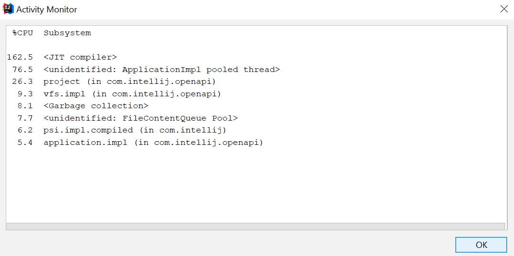

<PostHeader frontmatter={props.data.mdx.frontmatter} />

## Unload Modules
Working on a large project with many modules can greatly reduce the IDE performance. IDEA needs to process a huge amount of files when searching, refactoring or inspecting the code. However, it is often not necessary to work with all the modules at the same time. Maybe you are responsible for just one independent module. Maybe you are developing just frontend/backend part of the application. Or maybe the app contains a lot of legacy modules, which are hardly ever touched. In such cases, it would be really helpful to exclude some modules from IDEA\'s activity completely. Version 2017.2 [introduced a new feature](https://blog.jetbrains.com/idea/2017/06/intellij-idea-2017-2-eap-introduces-unloaded-modules/) called *Unload Modules*, which allows you to define which modules of the project should be excluded. This can greatly improve IDEA\'s performance. Once you need an unloaded module again, you can load it, so it is available to IDEA.

To enter Unload modules dialog, right-click a file or module in your Project View and select *Load/Unload Modules\...* In the dialog, you can see all the modules in the current project and you can assign them to either Loaded Modules or Unloaded Modules category.

IntelliJ IDEA is smart enough to warn you that if you are loading a previously unloaded module, you may also want to load its depending modules. You can learn more about this feature in [this blog post by JetBrains](https://blog.jetbrains.com/idea/2017/06/intellij-idea-2017-2-eap-introduces-unloaded-modules/).

## Excluding Files
Unloading of modules works well when you can unload the whole module. It is not always appropriate. There are, however some files and file types, which can be safely ignored by IDEA across all the modules. An example can be - automatically generated files, minified CSS/JS, compiled files, documentation, logs and more. You can define ignored files either for all projects or on per project basis. The two approaches can be even combined. You can add ignored files/folders by pattern in *Settings → Editor → File Types → Ignore Files and Folders*

Note that some of the common candidates for exclusion are already presented - such as internal directories for Version Control Systems. If you need more fine-grained control over exclusion, you can do that also on Project level. Go to *File → Project Structure → Modules.* In the *Sources* tab, you can mark individual directories as *Excluded*. You can also exclude files by a pattern for the current module in the bottom part of the window - *Exclude files*. Note that you can also exclude folders directly from the Project Tree\'s  context menu - *Mark Directory As → Excluded.*

## Antivirus Exclusion
Antivirus activity can result in a significant performance hit. IntelliJ frequently accesses files in its temporary .idea directory, your sources, runs javac compiler and such. Each of these actions may be first intercepted and verified by your antivirus software. Excluding your project from your antivirus\'s activity may increase your performance quite a bit.

## Disable Unused Plugins
There is a vast number of plugins available for IntelliJ IDEA. You can easily accumulate quite a number of them. Especially, when you are using IDEA as your general purpose IDE for various technologies. Based on the plugins used, the additional features may provide noticeable performance hit. Disabling unused plugins can help. Note that you can just disable plugins using the checkbox, it is not necessary to uninstall them for good.

## Power-Saving Mode
IntelliJ IDEA is a very powerful tool, which constantly checks your code for various issues. Not only simple ones such as syntax errors but also a lot of complex ones such as code duplication or Control Flow Analysis. This can be very CPU intensive. In cases where CPU performance is a bottleneck, you may want to disable some of the inspections. You can configure active inspections under *Settings→ Editor→ Inspections*.

Usually disabling individual inspections does not help much. In that case, there is another option call Power Save Mode. By entering this mode, you can disable the inspections and other CPU hungry tasks altogether. This will lead to much better performance and increased battery life. Power Saving mode can be toggled using Hector (Hector, the Inspector) icon in the lower right corner of the window, in the status bar. 

 

In addition to toggling of the Power Saving mode, you can set the level of inspections there:

-   None
-   Just Syntax
-   Syntax + Inspections

Depending on your setting, the Hector icon will indicate the current level of highlighting.

When you are in Power Saving mode, you don\'t have to give up your precious inspections. You can just run them on demand instead of constant real-time evaluation using *Analyze → Inspect Code* or *Run Inspection by Name\...*

## Disk Defragmentation
There is an old [blog post](https://blog.jetbrains.com/idea/2006/12/boosting-intellij-idea-performance-on-windows-systems/) by JetBrains, which suggests that defragmenting your drive may drastically improve the IDE performance. They claim, that under certain circumstances, defragmenting, optimizing MFT tables, disk folder structure and pagefile may even double the performance. I would take this with a grain of salt. Especially with newer operating systems automatically performing defragmentation and especially with [SSDs](http://www.pcworld.com/article/2047513/fragging-wonderful-the-truth-about-defragging-your-ssd.html). Still, it may be worth a shot.

## Faster Program Switching
By default, when you switch to another application IDEA checks all the files in your project, reads them and compares the version on the disk to loaded version in memory. This can be a very HDD-intensive operation, especially with large projects and antivirus protection enabled for your project folder. It can get quite annoying when frequently switching windows - such as switching from your browser to your IDE and back. If you are modifying your files just from IDEA and not externally, you can disable this feature and greatly improve window-switching performance.

There are two options related to this feature in *Settings → Appearance & Behavior → System Settings*:

-   Synchronize files on frame or editor tab activation
-   Save files on frame deactivation

## UPDATE: Activity Monitor
Since version 2018.3, IDEA allows you to run Activity Monitor, which shows you in the real time how much % of CPU are various subsystems and plugins consuming. This works for both built-in and additionally installed plugins. It can help you troubleshoot performance issues.

You can access the monitor from `Help → Activity Monitor...`.

## Still Slow?
Still experiencing severe performance issues with IntelliJ IDEA and nothing works? You may try this official guide for [Reporting performance problems](https://intellij-support.jetbrains.com/hc/en-us/articles/207241235) by JetBrains.
