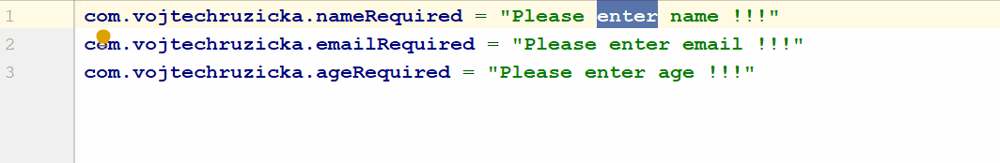

<PostHeader frontmatter={props.data.mdx.frontmatter} />

## Column Selection
This feature is the oldest one, which was available even before the introduction of the proper multiple cursors support. It allows you to select a block of text and then start typing with multiple cursors starting on each selected line at the beginning of the selected block.

You can then move the cursor, as usual, using the arrow keys and even commands like <kbd>Home</kbd> or <kbd>End</kbd>. Note that after I used <kbd>End</kbd> key (go to the end of the line), the cursor was properly placed at the end of each line even if the cursors were no longer vertically aligned.

This feature can be toggled using `Edit → Column` selection. The shortcut is:  
- <kbd>Alt</kbd> + <kbd>Shift</kbd> + <kbd>Ins</kbd> on Linux or Windows 
- <kbd>⇧</kbd> + <kbd>⌘</kbd> + <kbd>8</kbd> on Mac.

You can exit column selection mode by using <kbd>Esc</kbd> key.

Column selection mode can be also used with keyboard only. When in column selection mode and holding <kbd>Shift</kbd>, you can extend cursor to the line above/bellow by using <kbd>↑</kbd> or <kbd>↓</kbd> keys.

## Caret Cloning
The same functionality of creating new cursors as with <kbd>Shift</kbd> + arrows can be achieved by `Clone caret above` and `Clone caret bellow` commands.

The commands are issued by pressing <kbd>Ctrl</kbd> (or <kbd>⌥</kbd> on Mac), then pressing it again and not releasing. While still holding <kbd>Ctrl</kbd>, you can press <kbd>↑</kbd> and <kbd>↓</kbd> arrows to clone cursor to the line above or bellow.

## Multiple Cursors
While the column selection mode is useful, it is limited to cases where places you need to edit are vertically aligned, which may not usually be the case. In other situations, you need to stick to proper multiple cursor support. This is possible since [IDEA version 13.1](https://blog.jetbrains.com/idea/2014/03/intellij-idea-13-1-rc-introduces-sublime-text-style-multiple-selections/).

When holding <kbd>Alt</kbd> + <kbd>Shift</kbd> (or <kbd>⌥</kbd> + <kbd>⇧</kbd> on Mac), clicking on a location creates a new cursor on that location in addition to all the already existing cursors. Unlike column selection, these cursors can be anywhere and don't need to be vertically aligned. Pressing <kbd>Esc</kbd> will exit multiple cursors mode and will leave you with your first original single cursor.

## Multi-selection
As of IntelliJ IDEA 14.1, you can not only insert multiple carets, but you can also select multiple parts of the text and then start typing. This has several advantages. You can replace multiple blocks of text of various lengths by new ones. Also, when copying/cutting the selected blocks into the clipboard, you can later paste the results into a new place when still using multiple cursors and each copied block will be pasted to the corresponding cursor.

This selection can be achieved by holding:

 - <kbd>Alt</kbd> + <kbd>Shift</kbd> on Windows or Linux 
 - <kbd>⌥</kbd> + <kbd>⇧</kbd> on Mac
 
Then select the blocks by the mouse as usual. 

## Select All occurrences
Another way of selecting multiple blocks of text with multiple cursors is `Select All Occurrences` command, which selects all the other occurrences in the current file of the already selected text. In case no text is selected, the closest word to the current cursor is selected.

This command can be triggered by 
- <kbd>Shift</kbd> + <kbd>Ctrl</kbd> + <kbd>Alt</kbd> + <kbd>J</kbd> on Linux or Windows
- <kbd>⌃</kbd> + <kbd>⌘</kbd> + <kbd>G</kbd> on Mac.

## Add occurrence
In some cases, you may want more fine-grained control instead of selecting ALL the occurrences.

When you have a part of text selected, you can add the next occurrence of this string to your selection.

The shortcut is:
- <kbd>Alt</kbd> + <kbd>J</kbd> On Linux or Windows
- <kbd>⌃</kbd> + <kbd>G</kbd> on Mac.

## Remove occurrence
Removing the last occurrence from your selection is the same shortcut with <kbd>Shift</kbd> added:
- <kbd>Shift</kbd> + <kbd>Alt</kbd> + <kbd>J</kbd> On Linux and Windows
- <kbd>⇧</kbd> + <kbd>⌃</kbd> + <kbd>G</kbd> on Mac. 

  

## Presentation assistant
In case you're wondering how I am displaying keyboard shortcuts of the invoked commands on the screen on my gifs - it uses [Presentation Assistant Plugin](https://www.vojtechruzicka.com/intellij-idea-tips-tricks-presentations/), which is very useful during presentations and webinars.    