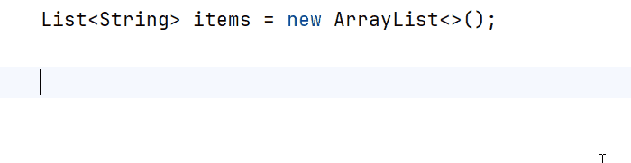
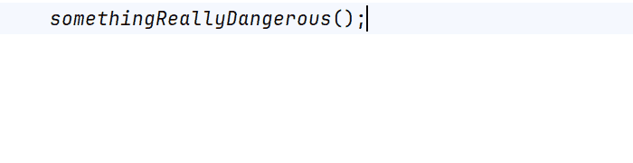

<PostHeader frontmatter={props.data.mdx.frontmatter} />

Postfix completion
------------------

Whenever you have an existing expression, you can append a specific postfix after a dot and apply it using a <kbd>Tab</kbd> key. IntelliJ IDEA takes the expression and transforms it based on the postfix provided.

Let\'s say you have a list of strings called `items`. You can then type `items.for` and then press <kbd>Tab</kbd>. It creates a `for-each` iterating over the items.



Pretty cool, right? Note that the resulting `for-each` has the proper type of items - that is String. Or let\'s  have another example - `.try` postfix. It surrounds an expression with a try-catch block.



There are many more templates available, such as (for Java):

-   **fori** - for iterating with an index over a collection
-   **forr** - iterates with index in reverse order
-   **switch** - produces switch statement with the expression
-   **sout** - Prints the expression using `System.out.println`
-   **null** - check if an expression is null
-   **notnull** - checks if an expression is not null

It looks cool and all but what is it good for you say? You can achieve similar results using the regular live templates in most cases anyway. Often you realize later, that you need to do something with the expression you have already written (maybe add not null check just to be sure?) and it saves you backward caret movement. Also, for many people, it is more natural to think in order of - subject and THEN action which needs to be performed with it. In a given context, there are usually very few subjects to choose from (keep your methods short, remember?), but many actions available. It is easier, when you are offered just the relevant actions when triggering postfix completion.

The feature was originally available in ReSharper, then [as a separate plugin](https://plugins.jetbrains.com/plugin/7342-postfix-completion) for IDEA and was later introduced as a core part of the IDE [in version 13.1](https://blog.jetbrains.com/idea/2014/03/postfix-completion/). It is currently (as of 2017.2.5) available for Java, Scala, JavaScript and Kotlin.

Displaying available templates
------------------------------

It is not necessary to memorize all the postfix templates. Instead, you can use a handy shortcut to show the available postfixes: <kbd>Ctrl</kbd> + <kbd>J</kbd> (or <kbd>⌘</kbd> + <kbd>J</kbd> on Mac). It will open a popup, which only shows items relevant to the given context, not all the existing templates. That means - if you open it when the cursor is next to a collection type, it will only show postfixes applicable to a collection. 


Configuration
-------------

You can browse available postfix templates in Settings under `Editor → General → Postfix Completion`. You can disable individual templates or the feature as a whole.


Writing Custom postfix templates
--------------------------------

While IDEA offers quite a lot of built-in templates, it does not, unfortunately, allow you to define your own. But fear not, there is an IDE plugin just for that. It\'s called [Custom Postfix Templates](https://github.com/xylo/intellij-postfix-templates/).

The plugin comes with a wide variety of additional templates, which you can use or edit to better suit your needs. But what\'s more - you can actually add your own. The plugin currently supports Java language, but according to the roadmap, more are to follow.

What\'s really nice about the plugin is that the template syntax is really easy to read and write. Let\'s look at a specific example:

```xml
.toInt : convert to int
    java.lang.String → Integer.parseInt($expr$)
    java.lang.Number → $expr$.intValue()
    NUMBER → ((int) ($expr$))
```

The first line consists of postfix, which triggers the template `.toInt` and after the colon, there is a text description. Then there is a number of lines, which define what result should be generated based on a different input type to which is the postfix applied.

That means that the same postfix can define different results when applied to different types. In the example above, you can see that converting String to Integer using `.toInt` postfix will result in `Integer.parseInt(\$expr\$)`. However, applying the same prefix to a number will result in a type cast `(int) (\$expr\$)`.

The plugin adds a new section in `Settings` under `Editor → Custom Postfix Templates`. There you can see the list of all the templates and also edit it in case you want to alter them or add your own. What\'s handy is that the plugin will show you a DIFF against the default state, so you can tell what you\'ve changed.


Conclusion
----------

Postfix code completion is a really powerful feature, which can boost your productivity quite a bit. Remember, the list of all the available actions in the current context is available via <kbd>Ctrl</kbd> + <kbd>J</kbd> (or <kbd>⌘</kbd> + <kbd>J</kbd> on Mac). And if the built-in actions are not enough for you, be sure to try [Custom Postfix Templates for IntelliJ IDEA plugin](https://github.com/xylo/intellij-postfix-templates/).

More Resources
--------------

-   [Postfix completion for Mockito](https://plugins.jetbrains.com/plugin/8150-mockito-postfix-completion-plugin)
-   [Android postfix plugin for AndroidStudio](https://github.com/takahirom/android-postfix-plugin)
