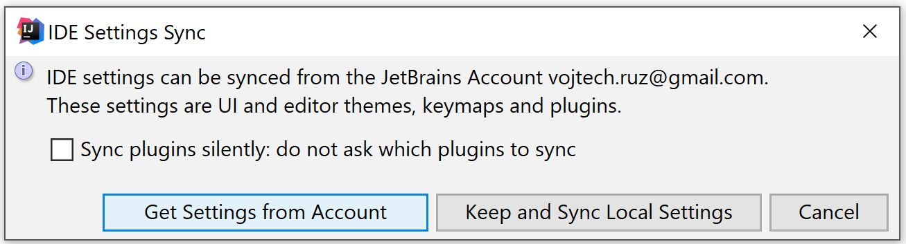

<PostHeader frontmatter={props.data.mdx.frontmatter} />

## The importance of synchronization

As a developer, you usually use multiple computers each with its own instance of your favorite IDE. It can be quite a hassle to keep settings the same on all of them. Rather than doing manually, it is much better to use automated synchronization. Setting up a new IDE is much easier this way and everything is also backed up online in the process.

And of course, you usually do not work alone but in a team. It is important to stick to some guidelines and standards for your project. And having same key settings of your IDE will help a lot. Not to mention that it makes onboarding a new developer and making them stick to conventions much easier.

## Settings Repositories

The first way to synchronize settings is using Settings Repositories. The way it works is that it uses an external Git repository to share the settings. Each IDEA instance then connects to this repository to fetch the settings. In case one instance makes changes in the settings it can be propagated back to the repository. What's nice is that it is a plain old Git repo. That means your settings are backed up and under version control. So you can track and rollback the changes if necessary or even allow other people to create Pull Requests with some tweaks to your settings.

To enable this feature just go to:

```
File → Settings Repository
```

And enter the URL of your git repo. If you are just starting an empty repo will do. When you are configuring Settings Repository this way, you can always check whether your local settings should overwrite those on the server, vice versa or if they should be merged.


And that's it, you're done. In most cases. However, IDEA offers a neat feature - you can actually define multiple Settings Repositories. What is it good for? Well, maybe there are some settings you want to share with your teammates to ensure consistency on your project. But then, of course, you want some of your setting to be personal and just for you. After all, every user has different preferences.

In such case, IDEA will consider one of the repositories primary. That is the one for your own settings. The synchronization works both ways -- from the server to the client and the opposite way. The rest of the repositories are secondary and are read-only. You can only fetch settings from them, but they are not affected by your local settings changes.

To configure multiple repositories go to

```
Settings → Tools → Settings Repository
```

Here you can see your primary repository, which you set up earlier. Underneath you can configure additional secondary repositories:


Note that you can also disable automatic synchronization and use just sync on demand by `VCS → Sync Settings`.

## Sync settings using JetBrains Account

The second way of settings synchronization was available for some time as a standalone optional IDE plugin (which required an invitation to use), but now is integrated and enabled by default since 2017.3. It utilizes your JetBrains account to synchronize the data.

Under the hood, it actually uses a variation of Settings Repository mechanism, but you are shielded from it. It is much more convenient because you don't have to create a Git Repo to store the settings and provide its address to your IDE. On top of that, unlike Settings Repositories, it allows you to also synchronize your installed plugins. Pretty cool, right?

The first thing you need to do is to make sure you have a [JetBrains account](https://sales.jetbrains.com/hc/en-gb/articles/208459005-What-is-JetBrains-Account-). If you don't have one, you can create it [here](https://account.jetbrains.com/login). Once you have your JetBrains account, you'll need to Log in to IDEA using it. Just head to `Help → Register`. Then you just need to select `Activate new License with JetBrains Account` and enter your credentials. Then click `Activate`.


Before you link your IDE to JetBrains account, your status bar in the lower-right part of the window should look something like this:


After your JetBrains account is linked, you should see a new Gears icon which is used to manage Settings synchronization:


If you click it, you'll be able to enable the settings synchronization:


When you enable it on another machine, you'll be prompted how to manage settings conflict. You can either select to overwrite your local settings with the setting from the JetBrains account or vice versa.



Installed plugin synchronization is handled separately from the rest of the settings. You can either manually trigger plugin sync or enable silent automatic synchronization of your plugins in the background.


If you prefer manual synchronization, you can have fine-grained control of what plugins are synchronized and how. That means you can decide for individual plugins and you can even force installation or uninstallation of plugins or your other instances of IDEA.


And of course, if you no longer want to keep certain IDE instance synchronized, you can disable the synchronization using the gears icon in the status bar.


## EditorConfig
Since version `2019.2` IDEA offers a powerful alternative for editor settings sharing using EditorConfig. While the core set of configuration properties is fairly limited in EditorConfig, IDEA supports hundreds of its own configuration properties.

Unlike regular IDE settings, these can be set per folder, committed to version control and are automatically picked up by IDEA right after cloning your project. For more info, check the following article.

<PostLink node={props.pageContext.links["/idea-editorconfig"]} />

## Conclusion

Being able to synchronize your Settings among multiple IDE instances is very important and handy feature. IntelliJ IDEA now supports two different ways of synchronization out of the box.

The first one is using Settings Repositories. It allows you to define multiple Version Control Repositories, which will act as a storage for your settings. It is useful when you want to share the settings in your team. Because you can specify multiple repositories, some of the general settings can be shared with your team members while you can still have your personal settings on top of that synced among all your computers.

The second one uses your JetBrains account to store your settings. Because of it, it is more suitable just for your own personal settings as you are not able to share your JetBrains account with your colleagues. On the other hand, it is able to manage plugin synchronization.

In either case, it is useful to have your settings consistent and backed up in a remote repository.