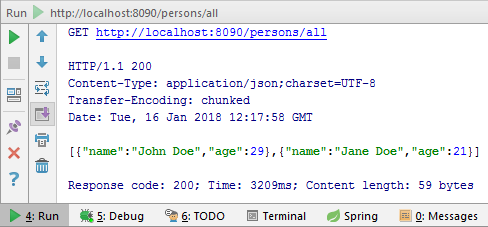
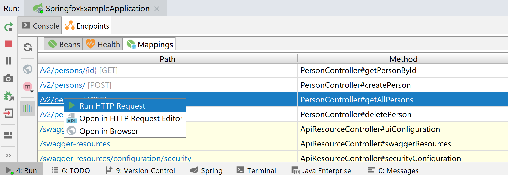

It is often useful to be able to send HTTP requests directly from your IDE. IntelliJ Idea offers full-fledged HTTP client which you can use without the need of a dedicated external client.

## Integrated HTTP Client

You often need to call an HTTP endpoint and examine the response received. In more complicated scenarios you need to use various HTTP methods, send HTTP Headers or cookies. While there are many dedicated programs just for this, IDEA offers this feature out of the box, which is much more convenient. The IDE actually offers two main ways to do so.

## The Old Way - Test RESTFul Web Service

This feature has been in IDEA for quite some time. You can access the REST client by going to:

```
 Tools → HTTP Client → Test Restful Web Service
```

This opens a new tool window called REST client.


The usage is pretty straightforward and similar to many other HTTP clients. First, you need to specify an HTTP method (GET/POST/PUT/\...), target URL and path. You can provide additional data on the `Request` tab, such as HTTP headers, request parameters, and body. You can also specify cookies to be sent on a separate `Cookies` tab.


And then you just hit `Submit Request`. IDEA sends a new HTTP request to the target location and displays the response received in the `Response` tab. Response headers can be viewed in the `Response Headers` tab.


And that\'s pretty much it. On top of this, the client offers some additional features such as:

-   Importing and exporting request from/to an XML file. This can be handy when reporting bugs, so the issue can be easily reproduced. And also to persist request between starts of IDEA as REST client\'s state is not preserved.
-   You can generate basic authentication header from a username and password.
-   Request/response history is saved.
-   Integration with JAX-RS - IDEA can detect your @Path annotations and offer them in the path field, so you don\'t have to manually search for the value.
-   Code completion for common HTTP headers.

## The New Way - Using Http Request File

Even though the REST client is no doubt useful, it has some shortcomings. It is quite cumbersome to add values such as cookies or HTTP headers. You have to do a lot of clicking and moving around before you create a request. In IntelliJ IDEA 2017.3, there is a new way to send HTTP requests, which is simpler and yet more powerful. It is HTTP Request file and it uses HTTP client directly in the Editor window.

### Getting started

The easiest way to start is just to add a file with `.http` extension to your project. The name does not matter, just the extension. Alternatively, you can right-click a directory and select `New → HTTP Request`. This file will be a source file for the new Editor-based HTTP client. Since it is an ordinary file, it will persist between IDE starts, no need to export/import XML files as before. Moreover, it can be shared with other devs or committed to version control.

Sometimes it can be handy to have the requests stored permanently. In other cases not. If you need just a quick test and create one or two throwaway requests, which will not be reused, it is much better to use a [scratch file](https://blog.jetbrains.com/idea/2014/09/intellij-idea-14-eap-138-2210-brings-scratch-files-and-better-mercurial-integration/). Just press <kbd>Ctrl</kbd> + <kbd>Shift</kbd> + <kbd>Alt</kbd> + <kbd>Insert</kbd> to open the `New Scratch file` dialog. Then select `HTTP Request`. No matter which variant you use, the usage will be the same, only the persistence of the file is different.

To make your start with REST client as smooth as possible, as of version 2018.1, you can access several pre-made templates filled with example requests by accessing `Tools → HTTP Client → Open HTTP Requests Collection`. 


### A simple request

The simplest thing you can do is just to type a URL and click Run icon in the gutter. Or alternatively, <kbd>Alt</kbd> + <kbd>Enter</kbd> and `Run`.


When no HTTP method is specified, it assumes you want to use GET. No headers or parameters are sent. Then the response is displayed:



### HTTP Methods and headers

For simple GET requests, you are already covered. But often you need something more complicated. First of all, you will need other methods than just GET. To specify an HTTP method, simply add its name before the URL:

```json
GET http://localhost:8090/persons/all
```

Then you\'ll need a bunch of HTTP headers. Just add them below the URL, one per line as key-value pairs separated by a colon. Since cookies are just HTTP header, you can include them with the other headers.

```json
GET http://localhost:8090/persons/all
Accept-Language:en-US,en;q=0.9
Authorization:BasicQWxhZGRpbjpvcGVuIHNlc2FtZQ==
Cookie: name=value; name2=value2; name3=value3
```

### Adding body

But HTTP headers are not enough. For methods such as POST, you\'ll also want to specify body the of the request. You can do so by leaving one blank line after the end of the request declaration. The body can be multiline. You can have multiple requests in one file and separate them by a line with \#\#\#.

```json
POST http://localhost:8090/persons/add/
Content-Type: application/json

{
    "name": "JohnDoe",
    "age": 29
}
```

Alternatively, you can specify, that the body should be read from an external file. To do this, you need to provide left angle bracket followed by space and the path to the file.

```json
POST http://localhost:8090/persons/add/
Content-Type: application/json

< person.json
```

Note that IDEA does help you with autocomplete for both existing files for body and HTTP Headers. What's more, if you specify content type and the body of the request, IDEA automatically treats the request body as if it was written in that language. That means if you choose XML for example, it does check validity, autocomplete tags for you and all the other language-specific features available in the editor. Also, you can include comments in the file using \#. It is useful for documenting some special HTTP headers or parameters for example.

### File upload
The following example shows sending a form with some text fields and a file to be uploaded.

```
### Send a form with the text and file fields
POST https://httpbin.org/post
Content-Type: multipart/form-data; boundary=WebAppBoundary

--WebAppBoundary
# First text field
Content-Disposition: form-data; name="first-element-name"
Content-Type: text/plain

First Element Value
--WebAppBoundary
# Second text field
Content-Disposition: form-data; name="second-element-name"
Content-Type: text/plain

Second Element Value
--WebAppBoundary
# File upload
Content-Disposition: form-data; name="data"; filename="data.json"
Content-Type: application/json

# Here you specify file to upload
< C:\data.json
--WebAppBoundary--
```

### Environmental variables

Your application is usually deployed to multiple environments. You start developing locally, then it gets deployed to a Development Environment, UAT and eventually Production. The names and number of the environments can vary, but what is certain is there is more than one. When using HTTP client, the requests are usually almost identical among the environments, except for several environment-specific variables, such as URL.

IDEA allows you to reuse the same requests among multiple environments by specifying environmental variables and then using placeholders for the variables. Then it is really easy to switch between environments.

The environments and their variables are defined in a file called `rest-client.env.json`. It is not supplied by default, so you need to create one. Bellow is an example of three environments with different host variable.

```json
{
   "local":{
      "host":"localhost"
   },
   "development":{
      "host":"dev.example.com"
   },
   "production":{
      "host":"example.com"
   }
}
```

In your HTTP Requests file (even scratch) you can then reference variables surrounded by double curly braces:

```json
GET http://{{host}}:8090/persons/all/
```

You can run a specific configuration by clicking the run icon in the gutter: 


### Live templates
[Live Templates](https://www.jetbrains.com/help/idea/using-live-templates.html) allow you to write a short acronym in the IDEA editor and when you press <kbd>Tab</kbd> key, IDEA expands it to a code snippet. For example you can expand `sout` to `System.out.println()`. There is a number of existing templates, and you can even create your own. The good news is that there are also templates for the HTTP client. This allows you to easily generate requests and then just change parameters such as URL or request body.


|Template|Usage    |
|--------|---------|
|gtr     |GET Request|
|gtrp    |GET Request with query parameters|
|ptr     |POST Request with simple body|
|ptrp    |Post Request with parameter-like body|
|mptr    |Post Request to submit a form|
|fptr    |Post Request to submit a form with a file|

### Testing Responses 
In addition to performing requests and checking responses, IDEA offers a simple "test framework" so you can check the response with various assertions such as expected status code.

```javascript
GET https://www.vojtechruzicka.com/

> 
```

As you can see, you write your tests in JavaScript, to be more precise ECMAScript 5.1. You can use IDEA's bunded library, which exposes you two basic entities you can work with - [client](https://www.jetbrains.com/help/idea/http-client-reference.html) and [response](https://www.jetbrains.com/help/idea/http-response-reference.html).

You can write your own JavaScript, but mostly you'll be probably testing the properties of the response such as `status`, `headers`, `body` or `contentType`.

```javascript
GET https://www.vojtechruzicka.com/

> {%
client.test("Request executed successfully", function() {
  client.log("Look, I can log!");
  client.assert(response.status === 200, "Response status is not 200");
  client.assert(response.contentType.charset === "UTF-8", "Unexpected content type - charset");
  client.assert(response.contentType.mimeType === "text/html", "Unexpected content type - MIME type");
  client.assert(response.headers.valueOf("x-frame-options") === "DENY", "Frame options not set to DENY");
  client.assert(response.body.indexOf("Vojtech") !== -1, "Expected body to contain 'Vojtech'");
});
%}
```

### Preserving data between requests
In some cases, it can be useful to save some information to be used in the subsequent requests. For example, let's assume server provides you with auth token you need to send back with your future requests. You can use scripting and the `client` object to store data in a global variable and [retrieve it later](https://www.jetbrains.com/help/idea/http-response-handling-examples.html).

In short, you save a variable by `client.global.set("variableName", variableValue)` and then later you can reference it using `{variableName}`:

```javascript{9,14}
GET https://www.example.com/auth
Content-Type: application/json

{
    "token": "secret-token"
}

> 

GET https://www.example.com/foo
Authorization: Bearer {{token}}
```

### Spring Boot Integration
Since version 2018.2, IDEA's HTTP Client offers Spring Boot Integration. That is, as long as you have [Spring Boot Actuator](https://www.vojtechruzicka.com/spring-boot-actuator/) dependency.

In such case, you can call endpoints of your application directly from your @Controller classes. Just click the green arrow icon next to your endpoint:


Additionally, IDEA shows a list of all endpoint mappings in the Run/Debug tab under `Endpoints → Mappings` from there you can execute requests and open HTTP client as well.



## HTTP Proxy

In case you need HTTP proxy for your calls, both clients share proxy settings of the whole IDE, which can be configured under `Appearance & Behavior → System Settings → HTTP Proxy`.

## History

What's cool is that IDEA automatically stores the history of all the requests you performed (up to 50 items). It is available from `Tools → HTTP Client → Show HTTP Requests history`. What it actually does is that it opens a file called `http-requests-log.http` in `.idea/httpRequests` folder. It can look something like this:

```json
POST http://localhost:8090/persons/add
Content-Type: application/json

< C:/_MY/rest-demo/person.json

<> 2018-01-11T032255.200.txt

###

GET http://localhost:8090/persons/all

<> 2018-01-11T115612.200.json

###
```

The really nice thing is that it is just another `.http` file. That means that you can directly execute the requests from there again and it uses the same syntax. The second cool thing is that it preserves not only requests but also responses (response bodies only, unfortunately). Each Response body is saved in a separated file indicated by angle brackets. The type of the file corresponds to the received content type, so here it is JSON, but it can be HTML or something else. You can navigate to the response file by <kbd>CTRL</kbd> + Click. Actually, the same response information is also shown in scratch files, but not in physical `.http` files. When performing the same request multiple times, the response info is preserved for each invocation. Then you can easily compare two of the responses by IDEA\'s integrated DIFF tool.


It is nice that the same history and log are used both for the new editor based HTTP Request files and the old REST Client, which runs in a separate tool window.

## Conclusion

IDEA's integrated HTTP client capabilities are now stronger than ever with the new HTTP Request files. What's so cool about them is the fact that it is not an HTTP client in a separate tool window with various tabs, text-fields, and buttons, but everything happens directly in the Editor window. That means you get all the goodies such as autocomplete or language injection. And it is much simpler and quicker to use as you don't have to navigate a complicated UI. That means that it is much easier to use it with keyboard only also. This is the state as of IDEA 2018.1, according to the JetBrains, we have many more features to look forward to in the future releases.
