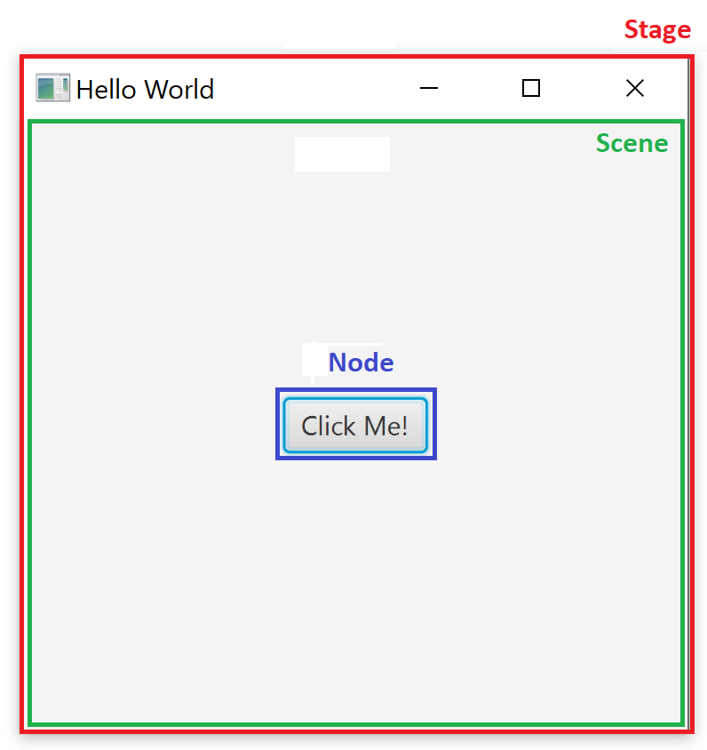
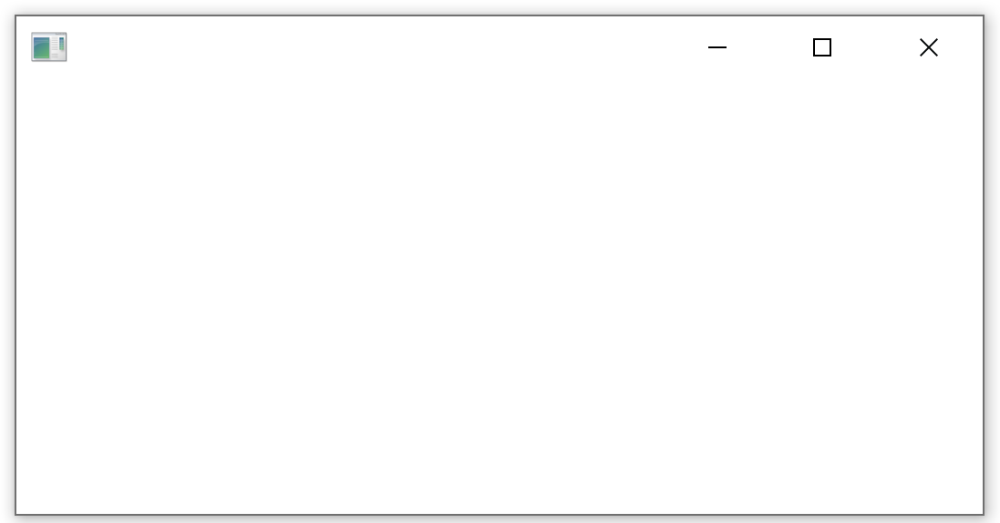

Tutorial on how to build your first JavaFX application.

This is a second post in the JavaFX series. You can check the first post on [how to set up your environment for JavaFx development](/javafx-getting-started/). 

<!--TODO remove this after they fix gatsby-remark-series -->
<div class="series-table-of-content">
  <div>All posts in the JavaFX series</div>
  <ol>
    <li><a href="/javafx-getting-started/">JavaFX Tutorial: Getting started</a></li>
    <li class="series-current">JavaFX Tutorial: Hello world</li>
    <li><a href="/javafx-fxml-scene-builder/">JavaFX Tutorial: FXML and SceneBuilder</a></li>
    <li><a href="/javafx-layouts-basic/">JavaFX Tutorial: Basic layouts</a></li>
    <li><a href="/javafx-layouts-advanced/">JavaFX Tutorial: Advanced layouts</a></li>
    <li><a href="/javafx-css/">JavaFX Tutorial: CSS Styling</a></li>
    <li><a href="/javafx-spring-boot/">JavaFX Weaver: Integration of JavaFX and Spring Boot applications</a></li>
  </ol>
</div>

## Application composition
Each application consists of a hierarchy of some basic components. Stages, scenes, and nodes. Let's look at each of them.

### Stage
Stage basically represents a window. Your application can have multiple stages, but needs at least one.

### Scene
A scene represents the contents of a stage. Each stage can have multiple scenes, which you can switch. Imagine a theater stage switching multiple scenes during a play.

### Node
Each scene can contain various components, which are called nodes. These can be controls like buttons or labels or even layouts, which can contain multiple nested components. Each scene can have one nested node, but it can be a layout, which can host multiple components. The nesting can be multiple levels deep - layouts can contain other layouts and regular components.

### Summary
Each application can have multiple stages - windows. Each stage can switch multiple scenes. Scenes contain nodes - layouts and regular components.

You can visualize the hierarchy like this:


Now let's see a specific example - a real application.



## Application Class
Time to start coding. If you followed the [previous article](/javafx-getting-started/), you already have all the required dependencies in place.

Each JavaFX application needs to have a main application class. That is - a class that extends `javafx.application.Application`.

Not only that, but you also need to override the abstract method from the `Application` class - `public void start(Stage primaryStage) throws Exception`.

Your main class can look something like this:

```java
import javafx.application.Application;
import javafx.stage.Stage;

public class Main extends Application {

    @Override
    public void start(Stage primaryStage) throws Exception {
        // TODO implement me!
    }
}
```

Of course, we still need to implement the start method.

## Main method
JavaFx does not necessarily need the `main()` method to start. You can package an executable jar using [JavaFX Packager Tool](https://docs.oracle.com/javafx/2/deployment/packager.htm). However, it is much more convenient to actually have the main method.

Not only is the application easier to start, but you can also pass command-line parameters to your application as usual.

Inside the `main()` method, we can launch our application using `Application.launch()`. 

```java
public static void main(String[] args) {
    // Here you can work with args - command line parameters
    Application.launch(args);
}
```

You can see it is a static method in the `Application` class. We did not specify what our main class actually is. JavaFX is able to determine this automatically depending on the class, which calls this method.

## Setting up a Stage
We are able to launch our app using `main()` method now. Still, nothing happens if we do so. We need a window to show. Windows are called stages, remember? As a matter of fact, we are already given the primary stage in the start method as an input parameter - `public void start(Stage primaryStage)`. We can use this. The only problem is that it is hidden by default. Fortunately, we can easily show it using `primaryStage.show()`.

```java
@Override
public void start(Stage primaryStage) throws Exception {
    primaryStage.show();
}
```

Now when you run the application, you should see a window like this:



Not very impressive, right? First, let's add some nice caption to our window.

```java
primaryStage.setTitle("Hello world Application");
```

To make it look even better, let's add a nice icon to the window top bar:

```java
InputStream iconStream = getClass().getResourceAsStream("/icon.png");
Image image = new Image(iconStream);
primaryStage.getIcons().add(image);
```

You can add multiple icons. That is, multiple sizes of the same icon representing the application. Depending on the context, the best size for your application will be used.

Now you can configure the Stage object's properties and behaviour such as:
- Setting position using `setX()` and `setY()`
- Setting initial size using `setWidth()` and `setHeight()`
- Limit maximum dimensions of the window using `setMaxHeight()` and `setMaxWidth()` or disable resizing altogether using `setResizable(false)`
- Set window always on top using `setAlwaysOnTop()`
- Set full screen using `setFullScreen()`
- [And many more](https://openjfx.io/javadoc/11/javafx.graphics/javafx/stage/Stage.html)

## Adding a Scene
Now we have a window with some fancy title, but it is still empty. You already know, you cannot add components directly to a Stage (window). You need a scene first.

However, the scene constructor requires already its child node. Let's create a simple label first. Then we create a scene with this label as a child.

```java
Label helloWorldLabel = new Label("Hello world!");
Scene primaryScene = new Scene(helloWorldLabel);
```

You can see that `Scene` only accepts one child component. What if we want more? You need to use a layout then, which is a component, that can have multiple children and arranges them on the screen depending on the layout used. We'll cover layouts [later in the series](/javafx-layouts-basic/).

To make it slightly more visually appealing, let's center the label vertically on the screen.

```java
helloWorldLabel.setAlignment(Pos.CENTER);
```

Finally, we need to set  the scene to the stage we already have:

```java{14}
 @Override
public void start(Stage primaryStage) throws Exception {
    primaryStage.setTitle("Hello world Application");
    primaryStage.setWidth(300);
    primaryStage.setHeight(200);

    InputStream iconStream = getClass().getResourceAsStream("/icon.png");
    Image image = new Image(iconStream);
    primaryStage.getIcons().add(image);

    Label helloWorldLabel = new Label("Hello world!");
    helloWorldLabel.setAlignment(Pos.CENTER);
    Scene primaryScene = new Scene(helloWorldLabel);
    primaryStage.setScene(primaryScene);

    primaryStage.show();
}
```

Now our window contains a scene with a label component.


## What's Next
In the next step in the series, we'll cover how to [write our GUI in XML rather in Java](/javafx-fxml-scene-builder/).

<!--TODO remove this after they fix gatsby-remark-series -->
<div class="series-table-of-content">
  <div>All posts in the JavaFX series</div>
  <ol>
    <li><a href="/javafx-getting-started/">JavaFX Tutorial: Getting started</a></li>
    <li class="series-current">JavaFX Tutorial: Hello world</li>
    <li><a href="/javafx-fxml-scene-builder/">JavaFX Tutorial: FXML and SceneBuilder</a></li>
    <li><a href="/javafx-layouts-basic/">JavaFX Tutorial: Basic layouts</a></li>
    <li><a href="/javafx-layouts-advanced/">JavaFX Tutorial: Advanced layouts</a></li>
    <li><a href="/javafx-css/">JavaFX Tutorial: CSS Styling</a></li>
    <li><a href="/javafx-spring-boot/">JavaFX Weaver: Integration of JavaFX and Spring Boot applications</a></li>
  </ol>
</div>