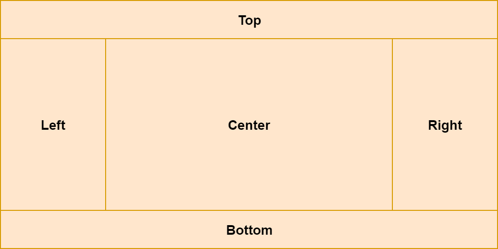

<PostHeader frontmatter={props.data.mdx.frontmatter} series={props.pageContext.seriesInfo} />

In the previous article [we covered some basic JavaFX layouts](/javafx-layouts-basic/). Now it's time to go through the rest of the available layouts.

## AnchorPane
AnchorPane is an interesting and powerful layout. It allows you to define anchor points to the components inside. There are 4 types of anchors:

- top
- bottom
- left
- right

Each component can have any combination of anchors. From zero up to all four. Anchor point also defines a distance. 

Anchoring means that the component keeps the defined distance from a particular edge of the layout (e.g., TOP). This distance is preserved even on resize of the layout.

For example: `anchorRight=10` means that the component will keep distance 10 from the right edge of the layout.

You can combine two anchor points, which are not in the opposite direction, to anchor your component to a specific corner of the layout.

Anchor `TOP = 10`, `RIGHT = 10` means that the component will stay in the top right corner of the layout in the distance 10 from both edges.

<Video src={props.data.mdx.frontmatter.path+"anchor-pane-corners"} />

In the example above, the size of each component stays the same on resizing. However, if you define anchor points in the opposite directions, you can make your component grow/shrink on resizing.

<Video src={props.data.mdx.frontmatter.path+"anchor-pane-horizontal-resize"} />

You can have various combinations like this:
- LEFT+RIGHT resizes horizontally
- TOP+BOTTOM resizes vertically
- All 4 anchors mean both horizontal and vertical resizing

Defining anchor points in FXML is easy. In the following example, there are all four, but you can include none or only these which you want.

```xml
<AnchorPane>
    <Button AnchorPane.topAnchor="10"
            AnchorPane.leftAnchor="10"
            AnchorPane.rightAnchor="10"
            AnchorPane.bottomAnchor="10">I am fully anchored!</Button>
</AnchorPane>
```

Now let's look how anchoring is achieved in Java:

```java
AnchorPane anchorPane = new AnchorPane();
Button button = new Button("I am fully anchored!");
AnchorPane.setTopAnchor(button, 10d);
AnchorPane.setBottomAnchor(button, 10d);
AnchorPane.setLeftAnchor(button, 10d);
AnchorPane.setRightAnchor(button, 10d);
anchorPane.getChildren().add(button);
```

## GridPane
GridPane is a layout that allows you to organize your components into a grid. Unlike [TilePane](/javafx-layouts-basic/#tilepane), which is adding components one after another, here you need to specify the coordinates of the target location in your grid when adding a new component.


```xml
<GridPane>
    <Label GridPane.rowIndex="0" GridPane.columnIndex="0">First</Label>
    ...
</GridPane>
```

In Java, when adding a new component, we specify first the ColumnIndex (x) and RowIndex(y).

```java
    GridPane grid = new GridPane();
    grid.add(new Label("Hello!"), columnIndex, rowIndex);
```


## Spacing
By default, grid cells have no spacing. The components are directly next to each other, with no margins. Spacing can be defined separately for rows and columns - that is: horizontally and vertically.

- `hgap` sets horizontal spacing (between columns)
- `vgap` sets vertical spacing (between rows)

```xml
<GridPane hgap="10" vgap="10">
    ...
</GridPane>
```

Spacing defined in Java:

```java
GridPane grid = new GridPane();
grid.setHgap(10);
grid.setVgap(10);
```

### Spanning multiple cells
Components in GridPane can span multiple rows and/or columns.

A component with rowspan is expanding to the bottom from its original cell. A component with colspan is expanding to the right.

```xml {2-4}
<GridPane>
    <Label GridPane.columnSpan="2"
           GridPane.rowSpan="2"
           GridPane.rowIndex="0" 
           GridPane.columnIndex="0">        Foo!
    </Label>
</GridPane>

```

In Java, there are two ways of setting row and column span. You can either set it directly when adding a component to the grid:

```java
grid.add(component, columnIndex, rowIndex, columnSpan, rowSpan);
```

Or through GridPane:

```java
GridPane.setColumnSpan(component, columnSpan);
GridPane.setRowSpan(component, rowSpan);
```

### Sizing
Even though in the initial example, all the cells were the same size, it does not necessarily have to be the case. The sizing of grid cells is the following:

- Height of each row is equal to the highest element in the row
- Width of each column is equal to the widest element in the column

### Column and row constraints
As mentioned, by default, the columns and rows are sized based on the components inside. Fortunately, you can have better control over how individual columns and rows are sized.

There are `ColumnContstraints` and `RowConstraints` classes, which are used for this.

You have basically two options. Either set percentage of available space for individual rows and columns, or you set preferred width/height. In the latter case you can also define preferred behavior when the columns and rows are resized.

#### Percentage
This is quite straightforward. You can set a percentage of the available space to be occupied by the given row or column. When the layout is resized, the rows and columns are resized as well to match the new size.

```xml
<GridPane>
    <columnConstraints>
        <ColumnConstraints percentWidth="50" />
        <ColumnConstraints percentWidth="50" />
    </columnConstraints>
    <rowConstraints>
        <RowConstraints percentHeight="50" />
        <RowConstraints percentHeight="50" />
    </rowConstraints>
    ...
</GridPane>
```

The same example in Java:

```java
GridPane gridPane = new GridPane();

ColumnConstraints col1 = new ColumnConstraints();
col1.setPercentWidth(50);
ColumnConstraints col2 = new ColumnConstraints();
col2.setPercentWidth(50);
gridPane.getColumnConstraints().addAll(col1, col2);

RowConstraints row1 = new RowConstraints();
row1.setPercentHeight(50);
RowConstraints row2 = new RowConstraints();
row2.setPercentHeight(50);
gridPane.getRowConstraints().addAll(row1, row2);
```

#### Absolute size
Instead of defining percentage size, you can define preferred and minimal size. In addition to that, you can specify how the row/column should behave on resize. Columns are using `hgrow` property, and rows have `vgrow`.

These properties can have three distinct values.
- `NEVER`: Never grow or shrink on resizing. The default value.
- `ALWAYS`: When resized, all the elements with this value are either stretched to fill the available space or shrank.
- `SOMETIMES`: These elements are resized only if there are no other elements with `ALWAYS`.

```xml
<GridPane>
    <columnConstraints>
        <ColumnConstraints minWidth="50" prefWidth="100" />
        <ColumnConstraints minWidth="50" prefWidth="100" hgrow="SOMETIMES" />
    </columnConstraints>
    <rowConstraints>
        <RowConstraints minHeight="50" prefHeight="100" />
        <RowConstraints minHeight="50" prefHeight="100" vgrow="SOMETIMES" />
    </rowConstraints>
    ...
</GridPane>
```

The same example in Java:

```java
 GridPane gridPane = new GridPane();

ColumnConstraints col1 = new ColumnConstraints();
col1.setMinWidth(50);
col1.setPrefWidth(100);
ColumnConstraints col2 = new ColumnConstraints();
col2.setMinWidth(50);
col2.setPrefWidth(100);
col2.setHgrow(Priority.SOMETIMES);
gridPane.getColumnConstraints().addAll(col1, col2);

RowConstraints row1 = new RowConstraints();
row1.setMinHeight(50);
row1.setPrefHeight(100);
RowConstraints row2 = new RowConstraints();
row2.setMinHeight(50);
row2.setPrefHeight(100);
row2.setVgrow(Priority.SOMETIMES);
gridPane.getRowConstraints().addAll(row1, row2);
```

You can also specify `maxHeight` and `maxWidth` for individual rows and columns.

## BorderPane
BorderPane is a layout with five sections:
- Top
- Bottom
- Right
- Left
- Center



You can assign components to the individual sections of the BorderPane:

```xml
<BorderPane>
    <top>
        <Label>TOP</Label>
    </top>
    <bottom>
        <Label>BOTTOM</Label>
    </bottom>
    <left>
        <Label>LEFT</Label>
    </left>
    <right>
        <Label>RIGHT</Label>
    </right>
    <center>
        <Label>CENTER</Label>
    </center>
</BorderPane>
```

Now the same example in Java:

```java
Label top = new Label("TOP");
Label bottom = new Label("BOTTOM");
Label left = new Label("LEFT");
Label right = new Label("RIGHT");
Label center = new Label("CENTER");

BorderPane borderPane = new BorderPane();
borderPane.setTop(top);
borderPane.setBottom(bottom);
borderPane.setLeft(left);
borderPane.setRight(right);
borderPane.setCenter(center);
```

### Sizing
All the regions except the center have a fixed size. The center then fills the rest of the space.

Top and Bottom regions are stretched across all the available horizontal space. Their height is based on the height of the component inside.

Left and right fill all the available vertical space (except what's occupied by top and bottom). Their width is dependent on the width of the component inside.

The center has a dynamic size and fills the rest of the space not occupied by other sections. Let's look at an example:

<Video src={props.data.mdx.frontmatter.path+"borderpane-resizing"} />

## What's next
Now when we know how to use various layouts, we'll cover how to style JavaFX  components using CSS.
