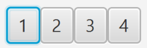

How to organize and layout your GUI components in JavaFX application.

This is the fourth article in the JavaFX series. In the previous article, I described [how to use FXML and SceneBuilder](/javafx-fxml-scene-builder) to create your user interface. Now we'll cover layouts.

<!--TODO remove this after they fix gatsby-remark-series -->
<div class="series-table-of-content">
  <div>All posts in the JavaFX series</div>
  <ol>
    <li><a href="/javafx-getting-started">JavaFX Tutorial: Getting started</a></li>
    <li><a href="/javafx-hello-world">JavaFX Tutorial: Hello world</a></li>
    <li><a href="/javafx-fxml-scene-builder">JavaFX Tutorial: FXML and SceneBuilder</a></li>
    <li class="series-current">JavaFX Tutorial: Basic layouts</li>
    <li><a href="/javafx-layouts-advanced">JavaFX Tutorial: Advanced layouts</a></li>
    <li><a href="/javafx-css">JavaFX Tutorial: CSS Styling</a></li>
    <li><a href="/javafx-spring-boot">JavaFX Weaver: Integration of JavaFX and Spring Boot applications</a></li>
  </ol>
</div>

## Layouts
Layouts, in a nutshell, are containers for components. This is useful as you can then position this container as a whole no matter what components are inside. Moreover, each scene can only hold one component, so you need a layout as a root component for your scene, so you can fit all the components you need. Of course, one layout is usually not enough, but you can nest layouts. That means you can put one layout inside another.

In addition to that, layouts also organize and position your components inside. Based on the layout used, child components can be positioned for example:
- One after another horizontally
- One after another vertically
- One on top of each other as a stack
- In grid

There are many more options. What's important is that a layout automatically updates the position of its children when it is resized. This way, you can have a consistent layout, even if your user resizes the application window.

## HBox
This is one of the most straightforward layouts available. It just puts all the items inside horizontally in a row, one after another, from left to right.


In FXML, you can use HBox like this:

```xml
<HBox>
    <Button>1</Button>
    <Button>2</Button>
    <Button>3</Button>
    <Button>4</Button>
</HBox>
```

In Java you can use this:

```java
HBox hbox = new HBox();
Button btn1 = new Button("1");
Button btn2 = new Button("2");
Button btn3 = new Button("3");
Button btn4 = new Button("4");
hbox.getChildren().addAll(btn1, btn2, btn3, btn4);
```

### Spacing
Our elements are now neatly laid out horizontally in a row, one after another:



However, it does not look very good as they are right after each other with no spacing. Fortunately, we can define the spacing between components using `spacing` property of the HBox:

```
<HBox spacing="10">
     ...
</HBox>
```

Or in Java using `setSpacing()`:

```java
HBox hbox = new HBox();
hbox.setSpacing(10);
```

### Padding
The elements are now spaced properly, however, there is still no padding between elements and the HBox itself. It can be useful to add padding to our HBox:


You can define each section of the padding separately - top, bottom, left and right.

```xml
<HBox>
    <padding>
        <Insets top="10" bottom="10" left="10" right="10"/>
    </padding>
    ...
</HBox>
```

The same thing can be achieved in Java:

```java
HBox hbox = new HBox();
hbox.setPadding(new Insets(10, 10, 10, 10));
```


## VBox
VBox is very similar to HBox, but instead of displaying the components inside horizontally in a row, it displays them vertically in a column:


You can still set the spacing and padding in the same way as with HBox.

In code, VBox is used exactly in the same way as HBox, just the name is different:

```xml
<VBox spacing="10">
    <padding>
        <Insets top="10" bottom="10" left="10" right="10"/>
    </padding>
    <Button>1</Button>
    <Button>2</Button>
    <Button>3</Button>
    <Button>4</Button>
</VBox>
```

And in Java:

```java
VBox vbox = new VBox();
vbox.setPadding(new Insets(10, 10, 10, 10));
vbox.setSpacing(10);
Button btn1 = new Button("1");
Button btn2 = new Button("2");
Button btn3 = new Button("3");
Button btn4 = new Button("4");
vbox.getChildren().addAll(btn1, btn2, btn3, btn4);
```

## StackPane
This layout is useful for stacking its components one on top of each other. The order of insertion determines the order of the items. That means the first item is on the bottom, the next is on top of it and so on.

This can be useful, for example, for having an image and then having some text or button on top of it.


The following example shows StackPane in FXML:
```xml
<StackPane>
    <ImageView>
        <Image url="/image.jpg"/>
    </ImageView>
    <Button>Click Me!</Button>
</StackPane>
```

The same example in Java:
```java
StackPane stackPane = new StackPane();
Image image = new Image(getClass().getResourceAsStream("/image.jpg"));
ImageView imageView = new ImageView(image);
Button btn = new Button("Click Me!");
stackPane.getChildren().addAll(imageView, btn);
```

### Item alignment
You can set alignment of the items in the stack to better adjust their positioning:

```xml
<StackPane alignment="BOTTOM_CENTER">
 ...
</StackPane>
```

Of course, you can do the same in Java:

```java
StackPane stackPane = new StackPane();
stackPane.setAlignment(Pos.BOTTOM_CENTER);
```

### Margin
If you want even more fine-grained control of the positioning, you can set margin for individual items in the stack:

```xml{6-8}
<StackPane alignment="BOTTOM_CENTER">
    <ImageView>
        <Image url="/image.jpg"/>
    </ImageView>
    <Button>
        <StackPane.margin>
            <Insets bottom="10"/>
        </StackPane.margin>
        Click Me!
    </Button>
</StackPane>
```

Or in Java:

```java
StackPane stackPane = new StackPane();
Button btn = new Button("Click Me!");
stackPane.getChildren().add(btn);
StackPane.setMargin(btn, new Insets(0,0,10,0));
```

## FlowPane
Flow Pane can work in two modes - either horizontal (the default) or vertical.

In horizontal mode, the items are displayed horizontally, one after another, similar to HBox. The difference is, once there is no more horizontal space available, it wraps to the next row under the first one and continues again. This way there can be many rows, not just one as with HBox.

The vertical mode is very similar, but (like VBox) it displays items vertically, from top to bottom. Once there is no more space, it adds another column and continues.

The following image illustrates these two modes:


Note that items don't necessarily have to have the same size as they do have in the image above.

Note how the position of the components is recalculated if you change the size of the container:


You can set the internal padding of this layout in the same way as for HBox and VBox. Spacing is a little bit different though. Instead of just one property for spacing, you need to have separate horizontal and vertical spacing as the items can be rendered in multiple rows/columns. For horizontal spacing use `hgap`, for vertical spacing use `vgap` instead.

```java
FlowPane flowPane = new FlowPane();
flowPane.setOrientation(Orientation.VERTICAL);
flowPane.setVgap(10);
flowPane.setHgap(10);
flowPane.getChildren().addAll(...);
```

Example of FlowPane in FXML:
```xml
<FlowPane hgap="10" vgap="10" orientation="VERTICAL">
  ...
</FlowPane>
```

## TilePane
This layout is very similar to FlowPane. The way it displays its components is almost identical. You can still have either horizontal or vertical mode and define `vgap` and `hgap`.

One crucial difference is in the sizing of the cells. FlowPane assigns only space necessary for each component. TilePane, on the other hand, makes the size of all cells the same depending on the biggest item. This way, all the controls are nicely aligned in rows/columns.


In the image above, there are the same components in the same order. You can clearly see the difference. 
- FlowPane puts controls directly one after another, no extra spacing
- TilePane puts controls into cells with the same size based on the biggest element

Constructing TilePane is no different from FlowPane except for the name.

```xml
<TilePane vgap="10" hgap="10" orientation="VERTICAL" >
```

The same in Java:

```java
TilePane tilePane = new TilePane();
tilePane.setVgap(10);
tilePane.setHgap(10);
tilePane.setOrientation(Orientation.VERTICAL);
```

## What's next
In this article, we learned how to use several of the basic layout components in JavaFX. Still, there are more layouts to choose from. We'll cover these in the [next article](/javafx-layouts-advanced).

<!--TODO remove this after they fix gatsby-remark-series -->
<div class="series-table-of-content">
  <div>All posts in the JavaFX series</div>
  <ol>
    <li><a href="/javafx-getting-started">JavaFX Tutorial: Getting started</a></li>
    <li><a href="/javafx-hello-world">JavaFX Tutorial: Hello world</a></li>
    <li><a href="/javafx-fxml-scene-builder">JavaFX Tutorial: FXML and SceneBuilder</a></li>
    <li class="series-current">JavaFX Tutorial: Basic layouts</li>
    <li><a href="/javafx-layouts-advanced">JavaFX Tutorial: Advanced layouts</a></li>
    <li><a href="/javafx-css">JavaFX Tutorial: CSS Styling</a></li>
    <li><a href="/javafx-spring-boot">JavaFX Weaver: Integration of JavaFX and Spring Boot applications</a></li>
  </ol>
</div>