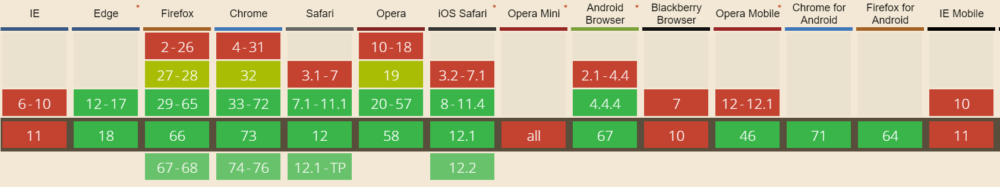

<PostHeader frontmatter={props.data.mdx.frontmatter} />

## Synchronous execution
Traditionally, the javascript code is executed synchronously. The code is executed from top to bottom, line by line. The execution flow continues to the next line only when the execution of the previous line is fully finished.

```javascript
console.log("First");
console.log("Second");
console.log("Third");
// First, second, third
```

## Callbacks
However, the model above is not suitable in all cases. Imagine you have a page loaded and need to fetch some data from the backend. If you did this synchronously, all the execution would be suspended until you receive your data. And this could take quite some time. In the meantime, the page would be unresponsive.

In this case, it would be much more convenient to call the server, but continue the execution and react to the result asynchronously whenever the response from your server arrives.

The common traditional approach would be to provide a function, which should be invoked once the server call is done. Such function is called a "callback function".

In other words, you can say: Ok, call the server, I don't care how long it takes, but when you're done, please let me know by calling back this function I provide you with.

You can do this because in javascript functions are first-class objects. You can store functions in variables or pass them as parameters to other functions.

```javascript
// server url to be requested
const targetUrl = "http://www.example.com/persons";
// Callback function to be called when done
const callbackFunction = function() {
  console.log("All Done!")  
};

// Call the backend
httpClient.get(targetUrl, callbackFunction);
// Now continue and don't wait for response
// Instead, callbackFunction will be executed for us
// When the call is finished
```

There are many other cases when callbacks can be useful. You can define a callback function to be invoked once a certain time interval passes:

```javascript
const intervalInMilliseconds = 1000;
setTimeout(function() {
  console.log("One second passed!");
}, intervalInMilliseconds);
```

Another common use case would be reacting to certain events such as button click, document loaded and so on. You don't know or care when they happen. You just want to be notified by your callback function when the event occurs.

## Callbacks and this
Be careful when using `this` keyword with callbacks. If you are using a function, which is a property of an object, `this` will refer to the parent object. But when you provide it as a callback, it will no longer point to its object, which can lead to unexpected behavior. To learn in detail about issues with `this`, check the following article:

<PostLink node={props.pageContext.links["/javascript-this-keyword"]} />

## Promises
Promises offer an alternative approach to callbacks when working with asynchronous calls.

A function can return promise object, which wraps the async call an can be used to define what should be done when the promise is finally successfully resolved. The promise object contains the `then` method, which can be used to define a function, which should be called once the promise successfully finishes. Let's look at the previous example using promises:

```javascript
// server URL to be requested
const targetUrl = "http://www.example.com/persons";
// Callback function to be called when successfully finished
const callbackFunction = function() {
  console.log("All Done!")  
};

// Call the backend. httpClient.get returns a promise
httpClient.get(targetUrl).then(callbackFunction);
```

So far it is quite similar to callbacks. Of course, something can go terribly wrong when calling the server. If your URL is not valid, you can get 404 not found, or there can be 500 internal server error. Fortunately, in addition to what happens when everything goes well, you can define another function which should be called in case the promise is not successful. You can use `catch()` and chain it after then:

```javascript
// server URL to be requested
const targetUrl = "http://www.example.com/persons";
// Callback function to be called when successfully finished
const successFunction = function() {
  console.log("All Done!")  
};

// Function to be called when there is a failure
const failureFunction = function() {
  console.log("Oh dear! Something went terribly wrong!")  
};

httpClient.get(targetUrl).then(successFunction).catch(failureFunction);
```

In case the promise is resolved successfully as expected, the function in `then()` will be called, otherwise, when there is an error, function in `catch()` will be called.

### Finally
In addition to `then()` and `catch()` there is a useful clause called `finally()`. It is run after the promise is settled, no matter whether it was successful or not. It is handy to prevent duplicated code, which would be otherwise both in `catch()` and `then()`. If you have code which should be executed after the promise finishes no matter what, it belongs to `finally()`.

```javascript{4}
httpClient.get(targetUrl)
.then(successFunction)
.catch(failureFunction)
.finally(doThisNoMatterWhatFunction);
```


## Promise state
Each promise can be in one of the following states:

- **settled**: Promise is finished, either fulfilled or rejected
- **rejected**: The action was not successful, promise failed, `catch` function is called if present. The promise is finished.
- **fulfilled**: Promise action was successful, `then` function was called. The promise is finished.
- **pending**: The promise is not finished, still in progress.

## Creating promises
You can easily create a promise object by calling `new Promise()` and supplying a single function as an input parameter. That function should have two parameters - resolve and reject.

```javascript
new Promise(function(resolve, reject) {
  ...
});
```

You should call `resolve()` and supply a return value when the promise is fulfilled. In case something goes wrong, you call `reject()` instead, and you can supply an error describing what happened.

```javascript
new Promise(function(resolve, reject) {
  if(everithingOk) {
      resolve("It works!");
  } else {
      reject(new Error("Something went horribly wrong!"))
  }
});
```

A promise constructed in this way should be returned from your function:

```javascript
function myFunctionUsingPromises(input) {
    return new Promise(function(resolve, reject) {
             if(input === 42) {
                 resolve("It works!");
             } else {
                 reject(new Error("Something went horribly wrong!"))
             }
           });
}
```

## Automatic rejection
In the example above, the promise is rejected explicitly by calling `reject()`. However, this is not the only case where promise can be rejected. When there is an error while running the promise code, the exception is automatically caught and `reject()` is called for you.

```javascript
new Promise(function(resolve, reject) {
              throw new Error("Oh dear! Something terrible happened!");
           }).catch(function(error) {
               //The error thrown is properly caught
               console.error("Error during promise:");
               console.error(error);
           });
```

As you can see, the error is properly caught and can be handled inside the `catch()` clause. So if you don't need special error handling logic directly inside the promise, you don't necessarily need to include `try-catch` in it.

## Multiple promises
So far we worked only with single promises. In some cases, it is just enough. However, often you need to work with more promises which are somehow related to each other. Let's look at specific examples.

### Serial
The most common use case is probably a scenario where you need to run multiple promises one after each other. And each of them is dependent on the last one. That is, you cannot run the second promise until the first one is resolved.

Let's say you need to fetch some data from the server and only after you receive the data, you can execute a second server call, which uses the data previously obtained.

Fortunately, this is easy with promises. All you need to do is to chain them one after another using `then`.

```javascript
new Promise(function(resolve, reject) {
    resolve(42);
}).then(function(result) {
    return result + 8;
}).then(function(result) {
    return result*2;
}).then(function(result) {
    // Result is (42 + 8)*2 = 100
    console.log("The total result is: "+result);
});
```

Easy, right? Not only easy to write, but also easy to read. Especially when you use arrow functions like this:

```javascript
new Promise((resolve, reject) => {
    resolve(42);
}).then((result) => {
    return result + 8;
}).then((result) => {
    return result*2;
}).then((result) => {
    console.log("The total result is: "+result);
}).catch(error => {
    //Error handling
});
```

As you can see in the example above, you can still use catch to handle errors. What's even better, the catch will handle errors which happen inside of ANY of the `then` blocks.

Be aware that to achieve the desired "one after another" behavior, you need to chain promises. If you just create multiple independent `then` clauses it does work differently:

```javascript
const promise = new Promise((resolve, reject) => {
    resolve(42);
});

promise.then((result) => {
    return result + 8;
});

promise.then((result) => {
    return result*2;
});

promise.then((result) => {
    console.log("The total result is: "+result);
});
```

Any guess what will happen? Instead of running promises one after another, you just provide multiple handlers to the same promise. Each of them will be executed independently after the promise resolves. The total result will still be 42.

### Parallel - all
Another scenario is when you have multiple promises, and you need to run them all. Only after ALL are done, you want to do something. However, the promises are not dependent and can run in parallel with each other.

```javascript
Promise.all([promise1, promise2, promise3]).then(doSomething);
```

You just provide an array of promises to `Promise.all()`.

More detailed example including promise declaration:

```javascript
const promise1 = new Promise(resolve => setTimeout(() => {
    console.log("Promise 1 resolved!");
    resolve(1)
}, 1000));
const promise2 = new Promise(resolve => setTimeout(() => {
    console.log("Promise 2 resolved!");
    resolve(2)
}, 500));
const promise3 = new Promise(resolve => setTimeout(() => {
    console.log("Promise 3 resolved!");
    resolve(3)
}, 1500));

Promise.all([
    promise1,
    promise2,
    promise3
]).then((results) => {
    console.log("All DONE!")
    console.log(results);
});
```

If you run the code above, you'll get the following output:

```
Promise 2 resolved!
Promise 1 resolved!
Promise 3 resolved!
All DONE!
[ 1, 2, 3 ]
```
You can see that the result is an array of the results returned by each individual promise.

What's important to note is that even though promises resolve in order `2,1,3` (because of the different timeouts set), the result array is in the same order as what you put in `Promise.all()`, that is `1,2,3`. Otherwise, it would be hard to tell which result belongs to which promise.

### Parallel - first only
The last scenario is when you want to call multiple similar promises, but you are interested just in whatever comes first.

There are two variants:

- **Promise.any()**: Is settled once first promise is successfully fulfilled or all the promises are rejected.
- **Promise.race()**: Is settled once first promise is settled, no matter whether it was fulfilled or rejected.

```javascript
let promise1 = new Promise(resolve => setTimeout(() => {
    console.log("Promise 1 resolved!");
    resolve(1)
}, 1000));
let promise2 = new Promise(resolve => setTimeout(() => {
    console.log("Promise 2 resolved!");
    resolve(2)
}, 500));
let promise3 = new Promise(resolve => setTimeout(() => {
    console.log("Promise 3 resolved!");
    resolve(3)
}, 1500));

Promise.race([
    promise1,
    promise2,
    promise3
]).then((result) => {
    console.log("All DONE!")
    console.log(result);
});
```

The result is then:

```
Promise 2 resolved!
All DONE!
2
Promise 1 resolved!
Promise 3 resolved!
```


## Compatibility
Promises are well supported in all the modern browsers as you can see in the table below:

 

Well, except for Internet Explorer, of course. For the up to date compatibility list see [this table on Can I Use](https://caniuse.com/#feat=promises).

For support in IE, you need to use a [polyfill](https://ourcodeworld.com/articles/read/316/top-5-best-javascript-promises-polyfills).

## Async await
While promises are easier to write, read and maintain than callbacks, they still have their issues, especially in more complex cases of promise chains. `Async-await` is an interesting alternative to plain promises, which allows you to have asynchronous code, which reads as synchronous code, is simple and concise. Check the following post for detailed explanation.
<PostLink node={props.pageContext.links["/javascript-async-await"]} />