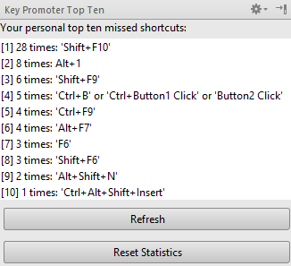

Learning shortcut keys of your favorite IDE can greatly boost your programming productivity. There is a trick to learn IntelliJ IDEA shortcuts quicker than just by memorizing them one by one.
<!--more-->

Key promoter plugin
-------------------

There is a handy plugin, which helps you to learn all the required keyboard shortcuts in IntelliJ IDEA - Key promoter. How it works? It is quite simple:

1.  Every time you click using your mouse on a button/command/menu item/\... it shows you a pop-up displaying a keyboard shortcut for that action.
2.  If you click the same action several times (can be configured), plugin suggest to set up the keyboard shortcut for given action.
3.  The statistics of you top 10 missed keyboard shortcuts are calculated, so you know which shortcuts it is worth learning first.

And that\'s it. The effect is two-fold. First, when you see a pop-up with the shortcut every time you click, sooner or later you remember the shortcut. And for your frequently clicked actions, the pop up becomes so annoying after a while, that you\'ll make anything (hopefully learn the shortcut) to avoid seeing it again. This plugin is especially useful when transitioning from a different IDE like Eclipse or NetBeans and you don\'t know any shortcuts at all.

Getting the plugin
------------------

Grab the plugin from the following Git repository. 

<https://github.com/athiele/key-promoter-fork/releases>

Although there is a version of plugin available in JetBrains plugin repository, it is an older original version by [Dmitry Kashin](https://www.linkedin.com/in/kadim), which is no longer under active development. The link provided is a fork of that original plugin by [Aimo Thiele](https://github.com/athiele). The new version additionally provides better stats management. More important is, that starting with 2016.1 version of IDEA, the original plugin settings section is no longer accessible.

To install te plugin go to the  Settings → Plugins and select \"Install Plugin from disk\". Now just choose your previously downloaded file and restart the IDE.

You can\'t remember them all
----------------------------

Knowing all the useful shortcuts is no doubt handy and a big time-saver. It does, however, take some time to learn them. In the meantime it is useful to remember some shortcuts, which can compensate your lack of knowledge of others. The first one is Find action (Ctrl+Shift+A or ⇧⌘A) dialog, which lets you search for specific actions and commands and quickly execute them.

 And of course, if everything else fails, there is always the almighty Search everywhere feature using double Shift, which also lists actions. 
 
 
