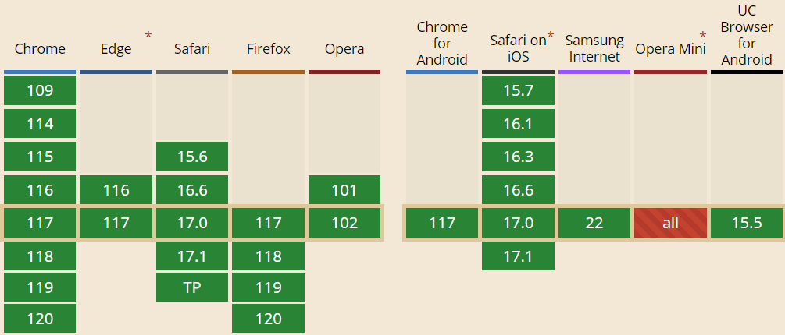

Clickjacking is an attack, where the user is tricked into performing an unwanted action by clicking on a seemingly harmless element. How to prevent it?
<!--more-->

Clickjacking
------------

Clickjacking is a type of attack, where the attacker tricks the victim into performing a malicious action by hijacking their click. This usually involves transparent iframes. The victim thinks they are clicking on the visible page but instead they are clicking on the invisible page loaded in an iframe on the top of it.

The attack scenario can be for example the following:

1.  The malicious page contains a button, which is the victim supposed to click.
2.   On top of this visible page, there is loaded another page in an iframe and it is styled as transparent.
3.  Because the victim is already authenticated with the attacked page in their current browser session, the page is successfully loaded in the frame and the user is fully authenticated.
4.  The attacked page is positioned in a way that clicking on the visible button underneath actually triggers some desired action on the attacked page.

A more specific example can be the following:

1.  Create a web page \"You just won an iPad. Claim your prize HERE\"
2.  Load my Twitter profile page in a transparent iframe on top of it
3.  Position the twitter frame in the way that when a victim means to click the \"Claim Prize\" button, they actually click the \"Follow\" button on my twitter profile.

Prevention
----------

### Framebusting

The oldest protection against clickjacking is using javascript to detect whether the page is running in a frame and then breaking the page out of that frame. For the legacy browsers, which do not support HTTP security headers mentioned later, it is the only option.

You can find various versions of frame-busting scripts, but many of them can be easily avoided. The usual implementation relies on the following:

1.  Detect that the page is running in a frame.
2.  If so, assign the page to its parent.

This, of course, has several disadvantages:

-   If the client has javascript disabled, it does not work.
-   If you wrap the page in multiple nested frames, it does not work.
-   When declaring a frame, the attacker can disable the javascript inside (by declaring sandbox attribute in chrome or security=\"restricted\" in IE) and the frame-busting script is not executed at all.

The solution is to flip the protection principle. In the header of the HTML page declare a style which hides the entire body:

```html
<style id="antiClickjack">body{display:none !important;}</style>
```

Then, still in the header, declare a script, which removes the style by its ID making the body visible again. It will make it visible only when it detects the page is not running in a frame.

```html
   <script type="text/javascript">
      if (self === top) {
          var antiClickjack = document.getElementById("antiClickjack");
          antiClickjack.parentNode.removeChild(antiClickjack);
      } else {
          top.location = self.location;
      }
   </script>
```

This is the only version of a frame-busting script recommended by the OWASP [Clickjacking defense cheat sheet](https://www.owasp.org/index.php/Clickjacking_Defense_Cheat_Sheet).

### X-Frame-Options

A website can state that it should not be rendered inside a frame or iframe by providing a special HTTP response header: X-Frame-Options. If the client\'s browser receives such header, it will respect it and not render the page. The possible values of the header are following:

-   **DENY** - Will prohibit the page from loading into a frame. Recommended option unless you actually need to use frames on your page.
-   **SAMEORIGIN** - This will allow the page to be displayed only in the frame of the same origin as the page itself. If you need frames you should stick with this one.
-   **ALLOW-FROM** - This allows you to define a trusted location from which your page can be rendered in a frame.

Please know that ALLOW-FROM option is not widely supported in the same way like DENY and SAMEORIGIN are. In case the client\'s browser is not compatible, it just ignores the header and you are left with no clickjacking protection whatsoever.

The image bellow shows the compatibility ([see more](http://caniuse.com/#feat=x-frame-options)) of the X-Frame-Options header. Dark green (IE, Edge, Firefox) represent full compatibility. Lighter green represents just DENY and SAMEORIGIN, but unsupported ALLOW-FROM.


Based on the current stats that is just 12.79% of users will have full compatibility and 82.13% will not support ALLOW-FROM. That means you should stick only with DENY and SAME-ORIGIN.

### Content-Security-Policy

While X-Frame-Options is widely supported (at least without ALLOW-FROM), it was never officially standardized. The standard, which is addressing whitelisting of frame sources, is newer Content Security Policy header. It comes in two levels - 1 and 2. Level 1 is widely supported, but it is the level 2 which adds frame-ancestors directive, which is supposed to replace X-Frame-Options. Level 2 is not widely supported [yet](http://caniuse.com/#search=Content%20security%20policy) - currently 68.65% of the clients.



Frame-ancestors specifies sources, from which elements frame, iframe, object, embed and applet can be loaded.

Specifying \'none\' is roughly equivalent to X-Frame-Options DENY.

```java
Content-Security-Policy: frame-ancestors 'none';
```

Alternatively, you can provide value \'self\', which is similar to X-Frame-Options SAMEORIGIN - it allows just the same protocol, host and port.

```java
Content-Security-Policy: frame-ancestors 'self';
```

Instead of X-Frame-Options ALLOW-FROM, you explicitly specify URI to the frame-ancestors directive:

```java
Content-Security-Policy: frame-ancestors [source] [someOtherSource];
```

Server-wide protection
----------------------

The easiest and the most robust way of adding security HTTP headers is not per application, but per server. If you know that all your applications and pages on the server will use the same framing policy, you can declare it directly on the whole server level. Most of the application and HTTP servers support that out of the box. You can easily find the configuration for your favorite server. For example - for Apache, you just need to add

```java
Header always append X-Frame-Options SAMEORIGIN
```

or for nginx:

```java
add_header X-Frame-Options SAMEORIGIN;
```

Spring Security
---------------

The good news is that if you are using Spring Security, it [automatically](http://docs.spring.io/spring-security/site/docs/current/reference/html/headers.html#default-security-headers) sends X-Frame-Options DENY with all responses. If you need to change this default, you need to configure it manually. The following example shows changing the default to SAMEORIGIN and also adding ContentSecurityPolicy headers.

To configure the headers in XML you can:

```xml
<http>
    <headers>
        <content-security-policy policy-directives="frame-ancestors 'self'"/>
        <frame-options policy="SAMEORIGIN"/>
    </headers>
</http>
```

Or using Java Config:

```java
@EnableWebSecurity
public class WebSecurityConfig extends WebSecurityConfigurerAdapter {

    @Override
    protected void configure(HttpSecurity http) throws Exception {
        http.headers().frameOptions().sameOrigin().contentSecurityPolicy("frame-ancestors 'self'");
    }
}
```

Conclusion
----------

You should make sure you apply clickjacking protection to your site. If you do not use frames, the safest measure is to provide X-Frame-Options DENY HTTP header. If you use frames, but just from your origin, you should use X-Frame-Options SAMEORIGIN. If you need to allow frames from a trusted host, the situation is a bit trickier. Due to browser compatibility issues, you need to provide both X-Frame-Options ALLOW-FROM and Content Security Policy frame-ancestors directive to make sure you cover as many client browsers as possible. Of course, legacy browsers do not support either of the HTTP headers and you will need to deploy Framebuster javascript to reduce the risk.