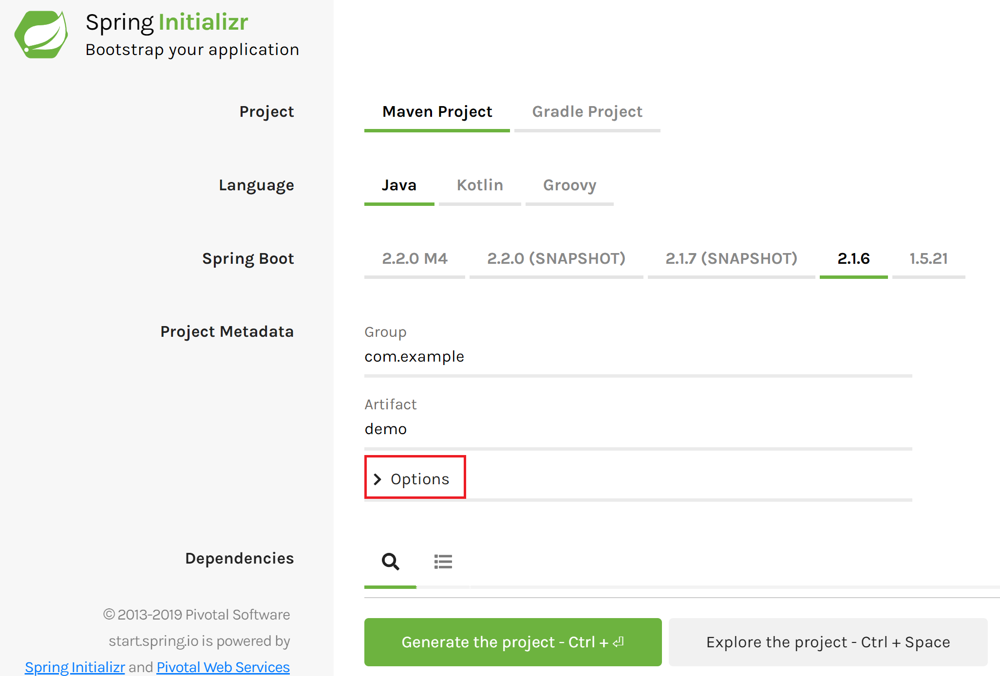

## WAR vs JAR
By default, Spring Boot applications are packaged as executable JAR files with embedded Tomcat. You can run them directly by `java -jar` command. Traditional Java web applications need a servlet container (application server) to run. You need to have such container installed, configured, and then deploy your applications to it. And you need to have it prepared for each environment. With Spring Boot, this approach is inverted as the application server is directly in your JAR. This has many advantages, but sometimes you may need to have your Spring Boot app as a traditional WAR instead. For example, if you are tied by your company policies and need to deploy to a provided app server.

In this post, we'll examine how to package Spring Boot app as WAR, without sacrificing direct executability.

## New applications
When you are creating a new app, the process is fortunately very easy. Instead of creating the application yourself, you can generate it with all the required settings and dependencies. There is an official tool called [Spring Initializr](https://start.spring.io/).

By default, all the advanced options are hidden. You can set just the basics such as Spring version, language, or build tool. And of course all the dependencies.

You need to open the `Options` section to specify packaging.



In the advanced options section, there is `Packaging` selection. By default, there is `Jar`. This means you'll be able to run the JAR directly as it contains an embedded Tomcat application server.

You cannot deploy JARs to other applications servers (Tomcat, Jetty, JBoss, ...) to run them there. They only work with WARs. To be able to deploy your app to these, you need to change the packaging to *WAR*.


What's great is such WAR is still executable on its own, which is useful. For example, it's great for local development, even if you use a regular app server in production.

After you're done with the setup, you can click `Generate project` and a zip file with your app will be downloaded.

### IDEA integration
Generating apps with Spring Initializr is way more convenient and less error-prone than creating them manually. There is still a bit of inconvenience as you need to go to an external web page, download a zip file and unpack it.

Fortunately, you can use Spring Initializr directly from your IDE. In IntelliJ IDEA you can go to:

```
File → New Project → Spring Initializr
```

Here you can specify all the options as in the web version but with less hassle.

 

## Existing applications
When you already have existing Spring Boot application packaged as JAR, the process is slightly more complicated, but still straightforward. You need to make some changes manually.

Let's convert the app to WAR, which van be deployed to an application server such as Tomcat, while still keeping it executable.

### Embedded Tomcat dependency
To make sure your embedded Tomcat dependencies are not clashing with what's already on your target Tomcat, you need to mark them as provided.

#### Maven
With Maven, simply add this dependency to your `pom.xml` file to the `dependencies` section.

```xml
<dependency>
    <groupId>org.springframework.boot</groupId>
    <artifactId>spring-boot-starter-tomcat</artifactId>
    <scope>provided</scope>
</dependency>
```

#### Gradle
With Gradle, the process is similar, just add the dependency to your `dependencies` section with provided scope.

```
providedRuntime 'org.springframework.boot:spring-boot-starter-tomcat'
```

### SpringBootServletInitializer
Now you need to make sure the app properly runs as WAR. It is as simple as adding the following class to your app.

```java
import org.springframework.boot.builder.SpringApplicationBuilder;
import org.springframework.boot.web.servlet.support.SpringBootServletInitializer;

public class ServletInitializer extends SpringBootServletInitializer {

    @Override
    protected SpringApplicationBuilder configure(SpringApplicationBuilder application) {
        return application.sources(BootWarApplication.class);
    }

}
```

`BootWarApplication.class` is the class in your app annotated with `@SpringBootApplication`.


If you prefer, instead of a separate class, you can just make your `@SpringBootApplication` class extend `SpringBootServletInitializer` class and include the same `configure` method as above. 

### Change packaging
Now the last step is to make sure your app is properly packaged as WAR instead of JAR.

#### Maven
Simply update the packaging section in your `pom.xml` file from 

```xml
<packaging>jar</packaging>
```

to WAR packaging
 
 ```xml
 <packaging>war</packaging>
```

#### Gradle
In Gradle, add `war` plugin to your plugins section.

```yaml{4}
plugins {
    id 'org.springframework.boot' version '2.1.6.RELEASE'
    id 'java'
    id 'war'
}
```

## Building the WAR
The build process stays the same, no change here, simply run `mvn package` or `gradle build` and it will generate your WAR.

Now you can deploy to an application server of your choice.

## Running the WAR
What's cool with this approach is that you can still run your WAR as an executable with embedded Tomcat. This way, you can have WAR deployment without sacrificing direct executability.

Simply run your archive as usual. Replace the last param with the real name of your WAR.

```
java -jar demo-1.0.0-SNAPSHOT.war
``` 