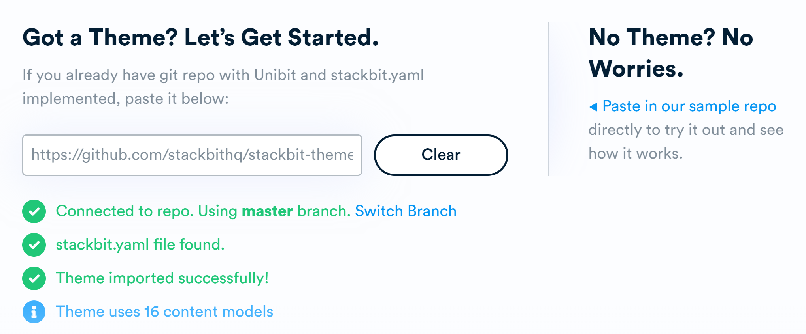
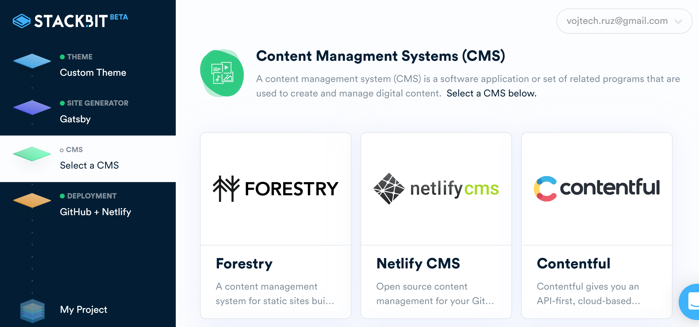
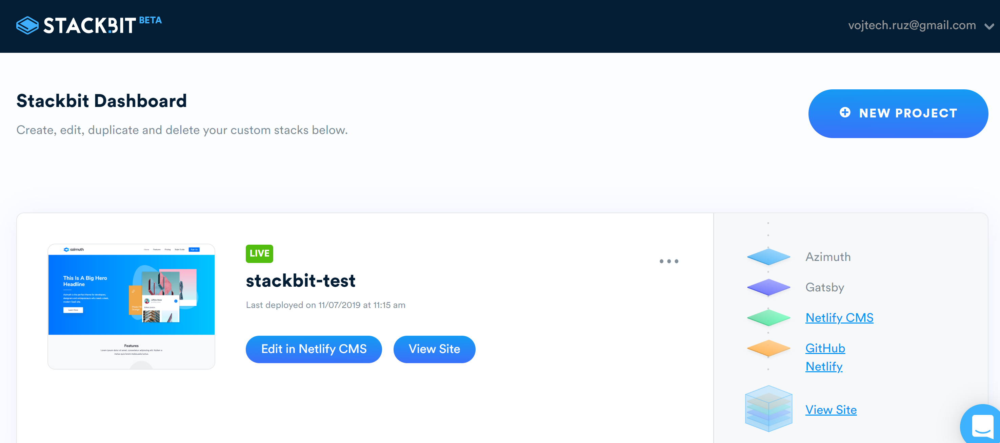
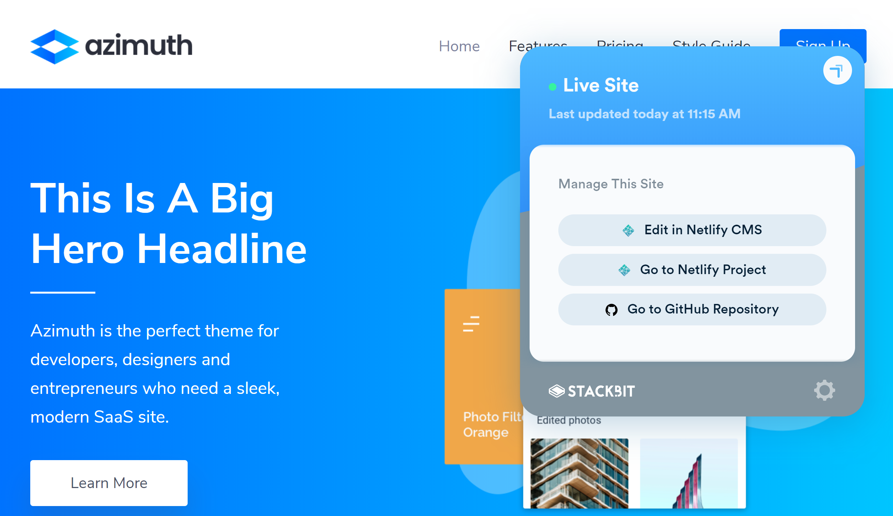

<PostHeader frontmatter={props.data.mdx.frontmatter} />

## JAMStack
JAMStack is a powerful concept of building static sites. It is an alternative to having a traditional heavyweight CMS, like WordPress, which is also responsible for dynamically creating and serving your content.

While tools like WordPress are powerful, they are much slower than static sites and can be easily hacked unless you diligently keep everything up to date.

When you build your sites statically, you can easily distribute them via a CDN for much better performance and utilize stronger caching. Since everything is static, you don't need to worry about your system being hacked as there are no moving parts. Everything is also much cheaper to run and host.

You can learn more about JAMStack and its benefits in one of my previous posts on how I migrated from WordPress to GatsbyJS:

<h4 class="front-post-title" style="margin-bottom: 0.375rem;"><a href="/gatsby-migration/" style="box-shadow: none;">Migration to GatsbyJS and JAM stack from WordPress</a></h4><small class="front-post-info">25 March, 2018
<ul><li><a href="/tags/blogging/">#Blogging</a></li><li><a href="/tags/jam-stack/">#JAMStack</a></li></ul>
</small>
<a class="front-post-image" href="/gatsby-migration/">

<picture></picture><noscript><picture></picture></noscript>
</a>How and Why I migrated from WordPress to static JAM Stack site built with Gatsby JS.

## Building Static sites
While JAMStack-powered sites have many advantages, there are drawbacks as well. The main disadvantage is that it takes much more effort to build a full-fledged site including theme, Content Management System and deployment.

With WordPress, you can have a running site in minutes with a little effort. Even non-developers can easily create and maintain a site. Not so much with JAMStack. You have to select and learn your [static site generator](https://www.staticgen.com/). Then choose a theme and make sure it works well with your generator. Then choose [one of many available CMSs](https://headlesscms.org/). Then figure how to set up your deployment pipeline. 

It takes a lot of effort for developers, and it is nearly impossible for somebody not so tech-savvy. At least it was until now.

## Stackbit
[Stackbit](https://www.stackbit.com/) is a service, which solves the biggest pain point of static sites described above. It is a wizard, which lets you build and deploy a fully functioning static site using one of the supported static generators, with a theme, CMS and a functional deployment.

## Creating a new site
New sites are created with a wizard in four simple steps.

### 1. Selecting a theme
The first step is to select a theme for your new site. There are currently 14 built-in themes, with 23 more marked as coming soon.

However, on top of built-in themes, you can [import your own](https://www.stackbit.com/blog/announcing-custom-themes-and-so-much-more/).

Traditionally, there was a problem of using themes with a static site generator as each theme is generator specific and cannot be easily shared between generators. This is where Stackbit really shines as it allows you to create universal themes independent on a generator. This way, it makes it easy to reuse a theme when migrating to a new generator.

To achieve this, Stackbit defines [Uniform theme model](https://docs.stackbit.com/uniform/) and then offers a tool called [Unibit](https://docs.stackbit.com/unibit/) to convert it from this model to a theme specific for any supported generator. This means if a new generator is introduced in the future, you can use your old theme with it.

### 2. Selecting a static site generator
The second step is selecting your generator. No matter which one you choose, it will work with your theme and CMS seamlessly.

Stackbit currently supports the following static site generators:

- Jekyll
- Gatsby
- Hugo

Two more are marked as coming soon: VuePress and Hexo. They are likely to add more generators in the future.

### 3. Selecting a CMS
With JAMStack, you don't have to use any Content Management System at all. Your articles are usually saved in your git repo in the form of Markdown files or a similar format. You can create and edit your content directly in your IDE.

However, usually, content creators are non-technical people, so you need to integrate some kind of CMS for them, so they can easily create and edit content using a nice and simple GUI.

As a third step of the project creation workflow, Stackbit allows you to choose one of the supported CMSs, which will be used to manage the content on your site.

If you don't want to use any CMS, you can skip this step. It is always possible to add a CMS later.

Stackbit currently supports:

- Forestry
- Netlify CMS
- Contentful
- DatoCMS
- Sanity

Prismic is marked as coming soon.

### 4. Deployment
The last step is to select a deployment method. That means:

1. Selecting a git repository, where your project will be created
2. Selecting a service which will be used for deployment

As a git repository hosting, you can currently use GitHub, but GitLab and Bitbucket are coming soon.

As a deployment method, there is currently offered just Netlify. It is a great service, which I currently use for my blog, you can read more details about it in this post:

<h4 class="front-post-title" style="margin-bottom: 0.375rem;"><a href="/jamstack-migration-netlify/" style="box-shadow: none;">Migration to JAM stack and Netlify from WordPress</a></h4><small class="front-post-info">21 May, 2018
<ul><li><a href="/tags/blogging/">#Blogging</a></li><li><a href="/tags/jam-stack/">#JAMStack</a></li></ul>
</small>
<a class="front-post-image" href="/jamstack-migration-netlify/">

<picture><source srcset="/linked/jamstack-migration-netlify/5e4a3/jamstack-migration-netlify.jpg 45w,
/linked/jamstack-migration-netlify/e451c/jamstack-migration-netlify.jpg 90w,
/linked/jamstack-migration-netlify/29fd0/jamstack-migration-netlify.jpg 180w,
/linked/jamstack-migration-netlify/b3ebb/jamstack-migration-netlify.jpg 270w,
/linked/jamstack-migration-netlify/8841e/jamstack-migration-netlify.jpg 360w,
/linked/jamstack-migration-netlify/2b1a3/jamstack-migration-netlify.jpg 900w" sizes="(max-width: 180px) 100vw, 180px"></picture><noscript><picture><source srcset="/linked/jamstack-migration-netlify/5e4a3/jamstack-migration-netlify.jpg 45w,
/linked/jamstack-migration-netlify/e451c/jamstack-migration-netlify.jpg 90w,
/linked/jamstack-migration-netlify/29fd0/jamstack-migration-netlify.jpg 180w,
/linked/jamstack-migration-netlify/b3ebb/jamstack-migration-netlify.jpg 270w,
/linked/jamstack-migration-netlify/8841e/jamstack-migration-netlify.jpg 360w,
/linked/jamstack-migration-netlify/2b1a3/jamstack-migration-netlify.jpg 900w" sizes="(max-width: 180px) 100vw, 180px" /></picture></noscript>
</a>How and Why I migrated from WordPress to static JAM Stack site deployed on Netlify.

GitHub Pages and GitLab pages are going to be supported soon, as well. 

Once you authorize your GitHub and Netlify access, you're done. A git repo is created for you, and the project is automatically deployed.

## Dashboard
When you finish creating your first project, it becomes available on your main dashboard, where you can see and manage all the projects. You have a single place from which you can edit your settings, navigate to your site, CMS, or git repository. 

 
 But the dashboard is not the only place you can manage your site from. If you go directly to your site and are logged in to Stackbit, you can see a special Stackbit button, where you can manage the site directly without going to your dashboard.
 
 
 
 ## Medium import
 A few years back, Medium got very popular as a blogging platform. These days, with the recent changes, many people are migrating back from Medium. Hosting your own static site for your blog is a viable alternative.
 
 With Stackbit, migration from Medium is fortunately effortless. There is a [dedicated page](https://www.stackbit.com/medium/), where you can upload your Medium export archive, and it will automatically create a new Stackbit project for you with your data.
 
 
 
 ## DEV.to integration
 Services such as Medium are no doubt convenient to use, and you can reach a much larger audience than on your own. There is one major drawback, though. You don't really own your content and your audience. When such service goes out of business or changes its pricing model, you lose your content and audience. It is much better to have your own site so that you can build a stable audience, and you're safe from any changes of third-party services.
 
It would be great if you could combine the advantages of both approaches. It turns out you can! With Stackbit and [DEV.TO](https://dev.to/) integration.

DEV.to is an excellent service, focused purely on developers, which lets you publish your content to reach a wider audience. It already offers you a possibility to automatically publish to DEV.to using your RSS feed. So you still have your content hosted on your site, and it adds a canonical URL to your original site, so you do not cannibalize your SEO.

Now with Stackbit, it is possible also the other way around. You can [publish your existing DEV.to content to your Stackbit site](https://www.stackbit.com/blog/devto-stackbit/).
 
 ## Beta
 Stackbit is already publicly available and functional, but it is still running in open beta. Not all the features may be final, and there are many more features and supported services to be added soon. Go ahead and check [their blog](https://www.stackbit.com/blog/) periodically to stay informed about the new features.
 
 ## Conclusion
 Stackbit is a very powerful tool, which lets you create a fully functional JAMStack site with all the bells and whistles just in minutes using a simple wizard. The main disadvantage of JAMStack - the high barrier of entry and accessibility to only technical people applies no more. Go ahead and give it a try!
